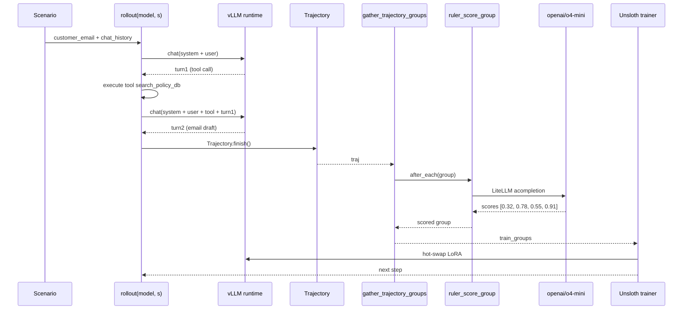

# Case 1: ART·E Email Agent

ART·E là case study nổi tiếng nhất của OpenPipe, được công bố cùng với lần ra mắt ART. Đây là một agent tự động soạn email trả lời dựa trên lịch sử hội thoại Slack-style. Bài toán không có ground-truth reward, nên RULER được dùng làm judge.

---

## 1. Bối cảnh bài toán

Một khách hàng nhận được hàng nghìn email mỗi ngày. Họ muốn train một agent:

* Đọc email đến + lịch sử chat với khách (nếu có).
* Tìm trong knowledge base (Qdrant) các chính sách liên quan.
* Soạn email trả lời ngắn gọn, đúng giọng, giải quyết vấn đề.

Tập dữ liệu gốc gồm các thread Slack thật của team support. Mỗi thread có:

* `customer_email`: nội dung email cần trả lời.
* `support_chat_history`: lịch sử chat support liên quan.
* `expected_response` (chỉ để benchmark; không dùng train).

Đây là **bài toán subjective**: không có "đáp án đúng" duy nhất, chỉ có "tốt hơn" hay "tệ hơn". Vì vậy RULER là lựa chọn tự nhiên.

---

## 2. Kiến trúc hệ thống

```mermaid
graph LR
    A[Scenario: customer_email + chat_history] --> B[Rollout function]
    B --> C[LLM call 1: search KB]
    C --> D[Qdrant vector DB]
    D --> E[LLM call 2: draft email]
    E --> F[Trajectory]
    F --> G[ruler_score_group]
    G --> H[Judge LLM: openai/o4-mini]
    H --> I[Scores 0-1 per rollout]
    I --> J[GRPO advantage]
    J --> K[Unsloth + vLLM train step]
    K --> L[New LoRA weights]
    L --> C
```



Mỗi rollout có thể có nhiều turn:

1. System prompt: "Bạn là nhân viên support. Tìm chính sách phù hợp rồi soạn email."
2. User: customer_email + chat_history.
3. Assistant (turn 1): gọi tool `search_policy_db(query)`.
4. Tool: trả về top-3 chính sách.
5. Assistant (turn 2): soạn email dựa trên chính sách tìm được.
6. User (eval): không có turn tiếp (single task).

---

## 3. Mã nguồn tối giản

```python
import art
from art.local import LocalBackend
from art.rewards import ruler_score_group
import asyncio


model = art.TrainableModel(
    name="art-e",
    project="email-agent",
    base_model="Qwen/Qwen2.5-7B-Instruct",
)


async def rollout(model, scenario):
    """Một rollout: agent đọc email, search KB, soạn email."""
    traj = art.Trajectory(
        messages_and_choices=[
            {"role": "system", "content": "Bạn là nhân viên support..."},
            {"role": "user", "content": scenario["customer_email"]},
        ],
        metadata={"scenario_id": scenario["id"]},
    )
    # Turn 1: agent gọi tool search
    turn1 = await model.chat(
        traj.messages_and_choices,
        tools=[search_policy_db_tool],
    )
    traj.messages_and_choices.extend(turn1.choices)

    # Thực thi tool (giả lập)
    search_result = search_policy_db(turn1.choices[0].message.tool_calls[0].args)
    traj.messages_and_choices.append(
        {"role": "tool", "name": "search_policy_db", "content": search_result}
    )

    # Turn 2: agent soạn email
    turn2 = await model.chat(traj.messages_and_choices)
    traj.messages_and_choices.extend(turn2.choices)

    return traj.finish()


async def train():
    backend = LocalBackend()
    await model.register(backend)

    scenarios = load_scenarios()   # list[dict]

    for step in range(40):
        train_groups = await art.gather_trajectory_groups(
            (
                art.TrajectoryGroup(
                    rollout(model, s) for _ in range(4)   # K=4 rollout per scenario
                )
                for s in scenarios[step : step + 1]
            ),
            after_each=lambda g: ruler_score_group(
                g,
                judge_model="openai/o4-mini",
                swallow_exceptions=True,
            ),
            pbar_desc="rollout + score",
            max_exceptions=0.05,
        )
        result = await backend.train(model, train_groups, learning_rate=1e-5)
        await model.log(train_groups, metrics=result.metrics, step=result.step)


asyncio.run(train())
```

Toàn bộ chương trình **dưới 80 dòng** (không tính helper). ART đã che đi tất cả phức tạp của vLLM, NCCL, Unsloth.

---

## 4. Tại sao RULER hiệu quả ở đây?

### 4.1. Phân tích từ case study gốc

OpenPipe công bố rằng ART·E (Qwen 2.5 7B) đạt **điểm benchmark tương đương GPT-4o** trên tập đánh giá nội bộ, dù chỉ train 40 step GRPO. Họ so sánh ba cấu hình:

| Reward | Pass rate |
| --- | --- |
| Không train (baseline Qwen 2.5 7B) | 22% |
| RULER (openai/o3) | 67% |
| Human reward (gold standard) | 73% |
| Rule-based reward (heuristic) | 41% |

RULER đạt 67% chỉ thua human reward (gold) 6%. Đây là bằng chứng rằng LLM-as-judge relative rất hiệu quả cho task subjective.

### 4.2. Common prefix token savings

Vì mỗi rollout cho cùng scenario bắt đầu giống hệt (system prompt + user email), common prefix có thể là 70-80% tổng token. Với K=4 rollout, RULER tiết kiệm ~60% token so với gửi full 4 lần.

### 4.3. Khi nào RULER sai?

RULER có thể "lừa" nếu judge LLM thiên vị giọng văn cụ thể. Ví dụ: nếu rollout dùng "Dear Customer" còn rollout khác dùng "Hi!", RULER có thể cho điểm cao hơn cho giọng formal dù nội dung kém hơn. Để giảm thiểu:

* Dùng rubric nhấn mạnh "chỉ chấm nội dung, không chấm giọng văn".
* So sánh RULER với `independent_reward` (nếu có) trong W&B.
* Rollout 8 thay vì 4 để giảm variance.

---

## 5. Hạ tầng: LocalBackend + Unsloth

ART·E dùng `LocalBackend` (Unsloth trainer + vLLM runtime) vì:

* Model 7B vừa với single H100 80GB.
* Iteration nhanh (mỗi step < 5 phút), phù hợp nghiên cứu.
* Không cần scale-out.

Nếu muốn train 70B, hãy dùng `MegatronBackend` (xem Bài 3); nếu không có GPU, dùng `ServerlessBackend` (xem Case 5).

---

## 6. Metric ART thu được

OpenPipe log lên W&B các metric:

* `reward/mean`: trung bình RULER score (0-1).
* `reward/std`: variance trong group (nếu cao -> RULER phân biệt rollout tốt/xấu rõ).
* `completion_tokens/mean`: số token trung bình mỗi rollout.
* `duration/mean`: thời gian rollout.
* `cost/judge/ruler`: chi phí gọi openai/o4-mini.
* `kl_policy_ref`: KL giữa policy hiện tại và reference (theo dõi drift).
* `probs_corr`: Pearson correlation giữa old và new logprobs (xem Bài 5).

Khi training thành công:

* `reward/mean` tăng dần (mục tiêu chính).
* `kl_policy_ref` tăng nhẹ (< 0.1) - policy dần lệch khỏi base.
* `probs_corr` giảm nhẹ (~0.95-0.98) - có cập nhật nhưng không drift quá nhanh.
* `cost/judge/ruler` tăng tuyến tính theo số step.

---

## 7. Sơ đồ luồng dữ liệu chi tiết



---

## 8. Khi nào nên reproduce ART·E?

* **Nghiên cứu RL agentic**: ART·E là baseline tốt để so sánh thuật toán mới.
* **Benchmark LLM-as-judge**: 40 step với cost rất thấp (~$10 cho openai/o4-mini) cho cả quá trình.
* **Customer support domain**: pattern có thể áp dụng cho nhiều tác vụ tương tự (chatbot, ticket triage, FAQ agent).

Khi **không** nên:

* Cần deterministic, reproducible 100% (dùng `seed=42` cho judge, nhưng vẫn có variance).
* Cần train với data lớn (>10K scenarios); thời gian sẽ rất lâu do mỗi rollout là multi-turn tool use.
* Production deployment với latency cứng: ART chưa tối ưu cho inference serving.

---

## 9. Bài học thiết kế

1. **Tách concerns**: rollout function, RULER callback, train step là ba khối độc lập. Bạn có thể swap từng khối (ví dụ thay RULER bằng LLM-as-judge khác, hoặc thay LocalBackend bằng ServerlessBackend).
2. **RULER + GRPO = giải phóng khỏi hand-crafted reward**: tiết kiệm hàng nghìn giờ engineer.
3. **Multi-turn tool use là pattern quan trọng**: hầu hết agent thực tế đều có turn từ 2-10. ART hỗ trợ native qua `messages_and_choices` (xem Bài 4).
4. **LocalBackend đủ cho research**: chỉ cần GPU, không cần cluster.

---

## 10. Tóm tắt

| Thành phần | Mục đích |
| --- | --- |
| `model = TrainableModel(...)` | Khai báo base model, project name |
| `LocalBackend()` | Unsloth + vLLM trên single GPU |
| `rollout(model, scenario)` | Multi-turn tool use, sinh trajectory |
| `ruler_score_group(group, "openai/o4-mini")` | LLM judge relative |
| `gather_trajectory_groups(...)` | Song song hóa + RULER callback |
| `backend.train(model, train_groups)` | Gọi Unsloth, hot-swap LoRA |
| `model.log(...)` | W&B logging, checkpoint |

Tiếp theo: [Case 2: 2048 GRPO](case_2_2048_grpo) - game đơn giản hơn, dễ hiểu hơn cho người mới bắt đầu với GRPO.
