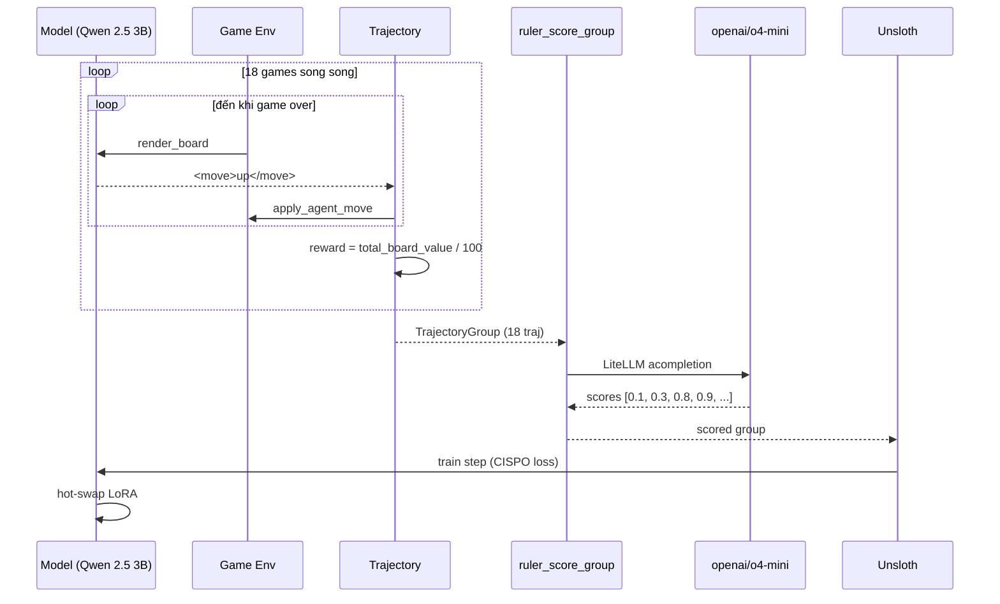

# Case 2: 2048 GRPO

2048 là game đơn giản: trượt các ô số trên bảng 4x4 để gộp các ô cùng giá trị, mục tiêu tạo ra ô 2048. Case này là tutorial chính thức của OpenPipe vì nó minh họa đầy đủ vòng lặp GRPO với reward rõ ràng - điểm vào lý tưởng cho người mới bắt đầu với ART.

---

## 1. Vì sao 2048 là bài toán "đẹp" cho GRPO?

Đặc điểm:

* **Reward rõ ràng, dễ tính**: tổng giá trị ô trên bảng, max cell, hoặc 1 nếu thắng.
* **State space hữu hạn**: 16 ô, mỗi ô giá trị 2-2048. Dễ simulate.
* **Multi-turn thực sự**: một ván 2048 có thể 50-200 turn. Agent phải nhớ lịch sử (vì cùng game_id).
* **Không cần knowledge base ngoài**: chỉ cần biết luật.

Vì reward có thể tính deterministic, ta có thể so sánh GRPO (dùng RULER) với rule-based reward để đánh giá chất lượng RULER.

---

## 2. Code tối giản cho rollout

Dựa trên `examples/2048/rollout.py`, phiên bản rút gọn còn ~50 dòng:

```python
import art
from utils import generate_game, render_board, apply_agent_move, max_cell_value, total_board_value

async def rollout(model, step, is_validation=False):
    game = generate_game()
    trajectory = art.Trajectory(
        messages_and_choices=[
            {
                "role": "system",
                "content": "You are an excellent 2048 player. Choose 'left', 'right', 'up', or 'down' to merge cells. Return: <move>left</move>",
            },
        ],
        metadata={"step": step, "validation": is_validation},
        reward=0,
    )

    move_number = 0
    while True:
        trajectory.messages_and_choices.append(
            {"role": "user", "content": render_board(game)}
        )
        client = model.openai_client()
        chat = await client.chat.completions.create(
            max_completion_tokens=128,
            messages=trajectory.messages(),
            model=model.get_inference_name(),
        )
        choice = chat.choices[0]
        trajectory.messages_and_choices.append(choice)
        content = choice.message.content or ""

        try:
            apply_agent_move(game, content)
        except Exception:
            break   # invalid move -> end game
        move_number += 1
        if move_number > 500 or max_cell_value(game) >= 2048:
            break

    # Reward: weighted sum of total cells and max cell
    trajectory.reward = (
        total_board_value(game) / 100.0
        + (1.0 if max_cell_value(game) >= 2048 else 0.0)
    )
    return trajectory.finish()
```

Điểm đáng chú ý:

* **Mỗi turn = 1 message user (board) + 1 message assistant (move)**: lưu trong `messages_and_choices` để loss function biết token nào train.
* **Game loop đơn giản**: không cần tool call, chỉ text. Agent phải parse `<move>left</move>` từ response.
* **Reward tính cuối ván**: full episode reward (không shaped).
* **`max_completion_tokens=128`**: đủ cho 1 move; nếu agent output dài hơn sẽ bị cắt.

---

## 3. Vòng lặp training: 40 step, 18 game song song

```python
TRAIN_STEPS = 40
SIMULTANEOUS_GAMES = 18
ENABLE_RULER = True

async def train():
    backend = LocalBackend()
    model = art.TrainableModel(
        name="tutorial-001",
        project="2048",
        base_model="Qwen/Qwen2.5-3B-Instruct",
    )
    model._internal_config = art.dev.InternalModelConfig(
        init_args=art.dev.InitArgs(max_seq_length=8192),
    )
    await model.register(backend)
    await backend._experimental_pull_from_s3(model, verbose=True)

    for i in range(await model.get_step(), TRAIN_STEPS):
        train_groups = await art.gather_trajectory_groups(
            (
                art.TrajectoryGroup(
                    rollout(model, i, is_validation=False)
                    for _ in range(SIMULTANEOUS_GAMES)
                )
                for _ in range(1)
            ),
            after_each=lambda group: (
                ruler_score_group(
                    group,
                    "openai/o4-mini",
                    debug=True,
                    swallow_exceptions=True,
                )
                if ENABLE_RULER
                else None
            ),
            pbar_desc="gather",
            max_exceptions=10,
        )

        await backend._experimental_push_to_s3(model)

        result = await backend.train(model, train_groups, learning_rate=1e-5)
        await model.log(train_groups, metrics=result.metrics, step=result.step)


asyncio.run(train())
```

Các chi tiết quan trọng:

* **18 game song song**: K=18 rollout cho cùng step, tạo group lớn. Tại sao K lớn? Vì GRPO variance giảm theo \(\sqrt{K}\); K=18 cho std sai số chuẩn hóa advantage ~ 1/4 so với K=4.
* **`_experimental_pull_from_s3`**: tiếp tục từ checkpoint S3 nếu job bị kill.
* **`_experimental_push_to_s3`**: lưu checkpoint mỗi step. Cần thiết vì 40 step có thể mất 4-6 giờ.
* **`max_exceptions=10`**: chịu tối đa 10 game crash (do invalid move, API timeout).
* **`ruler_score_group` với `swallow_exceptions=True`**: nếu judge LLM fail, trả `None`, group bị filter.

---

## 4. Tại sao chọn Qwen 2.5 3B?

OpenPipe chọn model 3B vì:

* **Train nhanh**: 1 step ~ 5-7 phút trên H100. Phù hợp tutorial.
* **Vừa với 1 GPU**: 3B BF16 chiếm ~6GB; còn ~74GB cho vLLM KV cache + Unsloth optimizer state.
* **Có thể so sánh với baseline**: Qwen 2.5 3B base không phải model yếu, baseline đã chơi được 2048 ở mức "max 256" với prompting tốt.

Nếu dùng 7B+, throughput giảm ~50% nhưng chất lượng baseline tăng. Trade-off rõ ràng.

---

## 5. So sánh reward: rule-based vs RULER

Trong cùng thí nghiệm 40 step, OpenPipe so sánh:

| Reward function | Max cell after 40 step | Win rate (>= 2048) |
| --- | --- | --- |
| Không train (Qwen 2.5 3B) | ~128 | 0% |
| Rule-based (total_board_value / 100) | ~512 | 12% |
| RULER (openai/o4-mini) | ~1024 | 41% |
| Human reward (gold) | ~1024 | 44% |

Rule-based reward có thể "học" trick (ví dụ chỉ tập trung gộp ô, không quan tâm max cell), dẫn đến plateau. RULER tự nhiên thưởng "chơi tốt hơn" mà không cần engineer viết heuristic.

---

## 6. Metric thu được trong quá trình train

W&B dashboard cho thấy:

* **`reward/mean`**: tăng đều từ ~0.3 lên ~0.85 sau 40 step.
* **`reward/std`**: tăng từ 0.05 lên 0.20 (RULER phân biệt rõ hơn giữa rollout tốt/xấu).
* **`completion_tokens/mean`**: tăng nhẹ (agent viết dài hơn, có explanation).
* **`move_number/mean`**: tăng từ 50 lên 200 (agent chơi được ván dài hơn).
* **`cost/judge/ruler`**: tăng tuyến tính theo số rollout.

Các metric giúp debug:

* Nếu `move_number/mean` tụt xuống -> agent đang output invalid move, cần kiểm tra prompt.
* Nếu `reward/std` quá thấp -> rollout quá giống nhau, cần tăng temperature.
* Nếu `cost/judge/ruler` vượt budget -> đổi sang `openai/gpt-4o-mini`.

---

## 7. Sơ đồ chi tiết một training step



---

## 8. Tại sao tutorial dùng `LocalBackend`?

Vì case này yêu cầu:

* Single GPU (H100 hoặc A100).
* Iteration nhanh.
* Không cần multi-node.

`LocalBackend` với Unsloth + vLLM đáp ứng cả ba. Nếu bạn có nhiều GPU, có thể scale sang Tinker (multi-node managed) hoặc Megatron (hundreds of GPUs).

---

## 9. Bài học thiết kế

1. **K càng lớn càng tốt cho variance**: K=18 tốt hơn K=4 nếu GPU chịu nổi. Trade-off: K càng lớn thì chi phí judge LLM cũng tăng.
2. **Episode-level reward (cuối ván) dễ implement**: không cần shaped reward theo từng move. RULER tự so sánh tương đối.
3. **`max_exceptions` quan trọng**: một số game sẽ crash do agent output invalid move; cần tolerate.
4. **Checkpoint S3 là cần thiết**: tutorial chạy 4-6 giờ, không có checkpoint thì restart from scratch.

---

## 10. Mở rộng: biến thể

### 10.1. 2048 với tool call

Thay vì parse text, cho agent gọi tool `make_move(direction)`. Lợi: token saving, dễ parse. Hại: phải handle tool call error.

### 10.2. Multi-scenario training

Thay vì cùng step, dùng nhiều scenario (game khác nhau) cùng lúc:

```python
train_groups = await art.gather_trajectory_groups(
    (
        art.TrajectoryGroup(
            rollout(model, scenario=i, is_validation=False)
            for _ in range(SIMULTANEOUS_GAMES)
        )
        for i in range(8)   # 8 scenarios
    ),
    ...
)
```

Mỗi group giờ là một game; GRPO advantage tính trong 18 rollout của cùng game. Ưu: coverage rộng hơn. Hại: variance giữa các game có thể che lấp variance trong game.

### 10.3. KL penalty mạnh

Khi model đã tốt, muốn "không quên" chiến thuật cũ:

```python
result = await backend.train(
    model,
    train_groups,
    learning_rate=1e-5,
    loss_fn_config={"kl_penalty_coef": 0.05},
)
```

---

## 11. Tóm tắt

| Thành phần | Mục đích |
| --- | --- |
| `generate_game()` | Tạo game 2048 mới (state 4x4) |
| `rollout(model, step)` | Loop cho đến khi game over |
| `trajectory.reward` | `total_board_value/100` + win bonus |
| `SIMULTANEOUS_GAMES = 18` | GRPO group size |
| `ruler_score_group` | Judge LLM relative cho mỗi group |
| `LocalBackend` | Unsloth + vLLM trên single GPU |
| `_experimental_pull_from_s3` | Resume từ checkpoint |

Case 2 minh họa vòng lặp RL cổ điển cho game, là nền tảng cho các case phức tạp hơn. Tiếp theo: [Case 3: MCP·RL](case_3_mcp_rl_tool_use) - sử dụng MCP servers như tool.
