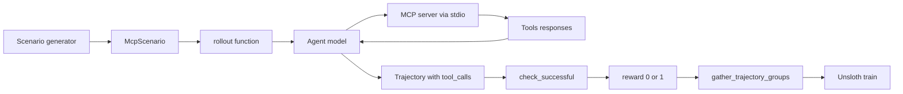
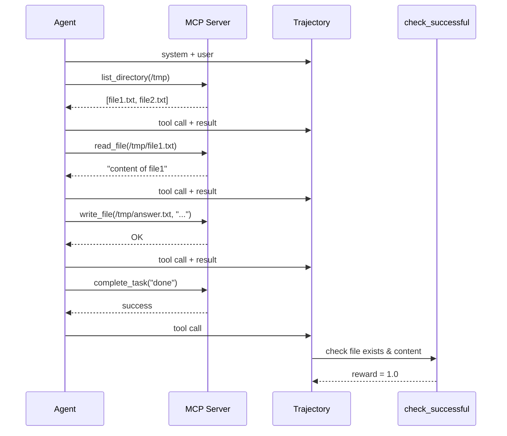

# Case 3: MCP·RL: Training models to use MCP servers

MCP (Model Context Protocol) là chuẩn mở để kết nối LLM với công cụ bên ngoài (filesystem, git, Slack, database, custom servers). Case này train một model **dùng đúng MCP server** cho từng task cụ thể - một bài toán tool use thực tế cho production agent.

---

## 1. MCP là gì và tại sao cần RL?

MCP servers cung cấp tools với schema JSON. Ví dụ MCP filesystem server có:

* `read_file(path)`
* `write_file(path, content)`
* `list_directory(path)`
* `search_files(pattern)`

Có hàng trăm MCP server cộng đồng. Một agent production phải:

* Chọn đúng tool cho task (không gọi `write_file` khi cần `read_file`).
* Điền đúng argument types (path phải là string, content phải là string).
* Xử lý tool errors (file not found, permission denied).
* Chuỗi nhiều tool calls để hoàn thành task phức tạp.

Baseline LLM (Qwen, Llama) có thể handle 1-2 tool calls, nhưng chuỗi 5+ tool calls có success rate thấp. Đây là nơi RL giúp: model học pattern "tool sequence nào dẫn đến reward cao".

---

## 2. Kiến trúc



Các thành phần chính:

* **Scenario generator** (`mcp_rl/scenario_generator.py`): sinh bài toán ngẫu nhiên từ MCP server. Ví dụ: "Tìm file lớn nhất trong /tmp và ghi tên vào /tmp/answer.txt".
* **MCP server** (`servers/python/mcp_alphavantage/`): một MCP server thật, có thể là bất kỳ server nào trong hệ sinh thái MCP.
* **Rollout function** (`mcp_rl/rollout.py`): kết nối tới MCP server qua stdio, gọi tools, build trajectory.
* **check_successful**: verify kết quả cuối cùng (file tồn tại, đúng nội dung, etc.).

---

## 3. Mã rollout tối giản

```python
"""MCP agent rollout - phiên bản rút gọn ~80 dòng."""
import asyncio
from mcp import ClientSession, StdioServerParameters
from mcp.client.stdio import stdio_client
import art

async def rollout(model, scenario, debug=False):
    traj = art.Trajectory(
        messages_and_choices=[],
        reward=0,
        metadata={"task": scenario.task_description},
        metrics={"task_completed": False, "success": False},
    )

    system_prompt = (
        "Bạn là MCP agent. Sử dụng tools để hoàn thành task. "
        "Khi xong, gọi complete_task(summary='...'). "
        f"Bạn có tối đa {scenario.max_turns} turn."
    )

    async with stdio_client(scenario.server_params) as (read, write):
        async with ClientSession(read, write) as session:
            await session.initialize()
            tools_result = await session.list_tools()

            # Convert MCP tools to OpenAI tool format
            oai_tools = [
                {
                    "type": "function",
                    "function": {
                        "name": t.name,
                        "description": t.description,
                        "parameters": t.inputSchema,
                    },
                }
                for t in tools_result.tools
            ]

            traj.messages_and_choices.append({"role": "system", "content": system_prompt})
            traj.messages_and_choices.append(
                {"role": "user", "content": scenario.task_description}
            )

            for turn in range(scenario.max_turns):
                client = model.openai_client()
                chat = await client.chat.completions.create(
                    model=model.get_inference_name(),
                    messages=traj.messages(),
                    tools=oai_tools,
                )
                choice = chat.choices[0]
                traj.messages_and_choices.append(choice)

                # Nếu assistant gọi complete_task -> kết thúc
                if choice.finish_reason == "tool_calls":
                    tool_calls = choice.message.tool_calls or []
                    for tc in tool_calls:
                        if tc.function.name == "complete_task":
                            traj.metrics["task_completed"] = True
                            break
                    if traj.metrics["task_completed"]:
                        break
                    # Thực thi các tool khác
                    for tc in tool_calls:
                        result = await session.call_tool(tc.function.name, json.loads(tc.function.arguments))
                        traj.messages_and_choices.append({
                            "role": "tool",
                            "tool_call_id": tc.id,
                            "content": result.content,
                        })
                else:
                    # Không gọi tool -> text response (sai)
                    break

    # Reward dựa trên check cuối cùng
    traj.reward = check_successful(scenario, traj)
    traj.metrics["success"] = traj.reward > 0.5
    return traj.finish()
```

Điểm cốt lõi: ART `TrainableModel` cung cấp `model.openai_client()` trả về client OpenAI đã được cấu hình để gọi local vLLM. Tất cả request đều đi qua `httpx` và được `auto_trajectory` capture tự động (xem Bài 2).

---

## 4. Khi nào nên dùng `auto_trajectory`?

Nếu rollout function dùng thư viện MCP client (như trên), ta build trajectory thủ công bằng cách `traj.messages_and_choices.append(...)`. Rõ ràng, dễ control.

Nếu rollout function dùng một agent framework có sẵn (LangGraph, LlamaIndex, custom), việc hook vào từng turn rất khó. Lúc đó `auto_trajectory` cực kỳ hữu ích:

```python
from art import capture_auto_trajectory

async def run_agent_with_arthur_observability(model, scenario):
    async def _run():
        # Code dùng httpx/openai tùy ý, không cần biết về ART
        from some_framework import AgentRunner
        await AgentRunner(model.openai_client()).run(scenario.task)

    traj = await capture_auto_trajectory(_run())
    traj.reward = compute_reward(traj)
    return traj
```

`capture_auto_trajectory` patch HTTPX để bắt **mọi** HTTP response, parse SSE, build trajectory. Xem chi tiết ở [Bài 2](../lesson_2_client_server_architecture) và [experiment 5](../experiments_deep_dive/exp_5_auto_trajectory_httpx).

---

## 5. Scenario generator: chìa khóa của curriculum

`mcp_rl/scenario_generator.py` không chỉ sinh task ngẫu nhiên; nó còn **chọn task theo độ khó tăng dần**:

```python
# Đơn giản: 1 tool call
scenario_easy = "List files in /tmp"

# Trung bình: 2-3 tool calls
scenario_medium = "Find the largest file in /tmp and report its size"

# Khó: 4+ tool calls với state management
scenario_hard = (
    "Read /tmp/secret.txt, encrypt it with the key from /tmp/key.txt, "
    "and write the result to /tmp/encrypted.txt"
)
```

Trong training loop, ta có thể dùng **curriculum learning**: bắt đầu với easy scenarios, dần chuyển sang hard khi agent master easy. ART không có built-in curriculum API, nhưng bạn có thể tự quản lý bằng cách thay đổi `scenarios` list mỗi epoch.

---

## 6. Reward function: `check_successful` thay vì RULER

Vì task có thể verify được (file tồn tại, đúng nội dung, v.v.), case này dùng **rule-based reward** thay vì RULER:

```python
def check_successful(scenario, traj) -> float:
    """Returns 1.0 nếu task hoàn thành đúng, 0.0 nếu sai."""
    if not traj.metrics.get("task_completed"):
        return 0.0
    if scenario.check_type == "file_exists":
        return 1.0 if os.path.exists(scenario.expected_path) else 0.0
    if scenario.check_type == "file_content":
        actual = open(scenario.expected_path).read()
        return 1.0 if actual == scenario.expected_content else 0.0
    return 0.0
```

Lợi ích:

* **Deterministic**: cùng rollout, cùng reward. Không có variance từ judge LLM.
* **Rẻ**: không tốn API call.
* **Dễ debug**: biết chính xác tại sao reward = 0 (file không tồn tại, content sai).

Hạn chế:

* Chỉ verify được "kết quả cuối", không verify "cách làm". Model có thể học hack (ghi file rỗng vào expected_path cho pass check).
* Cần code check riêng cho mỗi task type.

Trong GRPO, reward deterministic giúp advantage ổn định hơn. Kết hợp `check_successful` + RULER (cho subjective aspect) là pattern tốt.

---

## 7. Training loop

```python
import art
from art.local import LocalBackend
from art.rewards import ruler_score_group

async def train():
    backend = LocalBackend()
    model = art.TrainableModel(
        name="mcp-agent",
        project="mcp-rl",
        base_model="Qwen/Qwen2.5-7B-Instruct",
    )
    await model.register(backend)

    scenarios = generate_scenarios(n=200)

    for step in range(50):
        groups = await art.gather_trajectory_groups(
            (
                art.TrajectoryGroup(
                    rollout(model, s) for _ in range(4)
                )
                for s in scenarios[step*4 : (step+1)*4]
            ),
            pbar_desc=f"step {step}",
            max_exceptions=0.1,   # 10% lỗi OK
        )
        # Lưu ý: KHÔNG dùng ruler_score_group vì reward đã deterministic
        result = await backend.train(model, groups, learning_rate=1e-5)
        await model.log(groups, metrics=result.metrics, step=result.step)
```

Khi không cần RULER, bạn có thể bỏ qua `after_each` callback. Reward function `check_successful` đã set `traj.reward` rồi.

---

## 8. Sơ đồ một rollout với 5 turn



---

## 9. Khi nào dùng `auto_trajectory` thay vì manual?

| Tình huống | Dùng gì |
| --- | --- |
| Agent framework cũ, không muốn sửa code | `auto_trajectory` |
| Custom tool routing logic | `auto_trajectory` |
| Multi-sub-agent giao tiếp | `auto_trajectory` |
| Cần mask một số tool calls (không train) | Manual (control `messages_and_choices`) |
| Cần thêm custom metric per turn | Manual (`traj.metrics[...]`) |
| Multi-server MCP (gọi nhiều server) | Manual (chia `additional_histories`) |

Trong case này, vì mỗi scenario chỉ dùng 1 MCP server và flow đơn giản, manual rõ ràng hơn.

---

## 10. Metric ART thu được

* **`reward/mean`**: % task hoàn thành đúng.
* **`tool_calls_per_traj/mean`**: trung bình số tool calls mỗi rollout. Tăng theo curriculum.
* **`task_completed/mean`**: % rollout agent gọi `complete_task`. Nếu thấp -> agent không biết khi nào nên dừng.
* **`tool_error_rate`**: % tool call bị server trả error. Nếu cao -> agent điền sai args.
* **`cost/judge/ruler`**: 0 (không dùng RULER).

---

## 11. Bài học thiết kế

1. **MCP + ART = production-ready tool use**: MCP chuẩn hóa tool schema, ART chuẩn hóa training loop. Kết hợp tạo ra agent thật sự dùng được.
2. **Reward function nên deterministic khi có thể**: GRPO variance thấp hơn, debug dễ hơn.
3. **Scenario generator là curriculum learning**: không sinh task ngẫu nhiên đều; phân bố độ khó theo khả năng agent.
4. **Manual trajectory cho task đơn giản, auto_trajectory cho task phức tạp**: cả hai đều cần thiết.

---

## 12. Tóm tắt

| Thành phần | Mục đích |
| --- | --- |
| `McpScenario` | task + server params + max_turns |
| `rollout(model, scenario)` | Multi-turn với tool calls |
| `check_successful` | Verify kết quả cuối cùng |
| `generate_scenarios(n)` | Curriculum scenarios |
| `stdio_client` | Kết nối MCP qua stdio |
| `session.list_tools()` | Lấy tool schema |
| `session.call_tool(...)` | Thực thi tool |

Tiếp theo: [Case 4: LangGraph Integration](case_4_langgraph_integration) - tích hợp ART với LangGraph framework, dùng `wrap_rollout` + `init_chat_model`.
