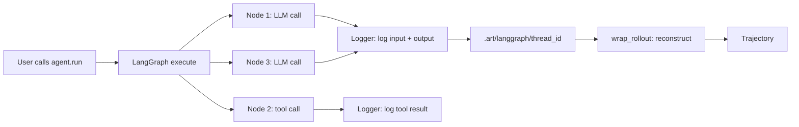
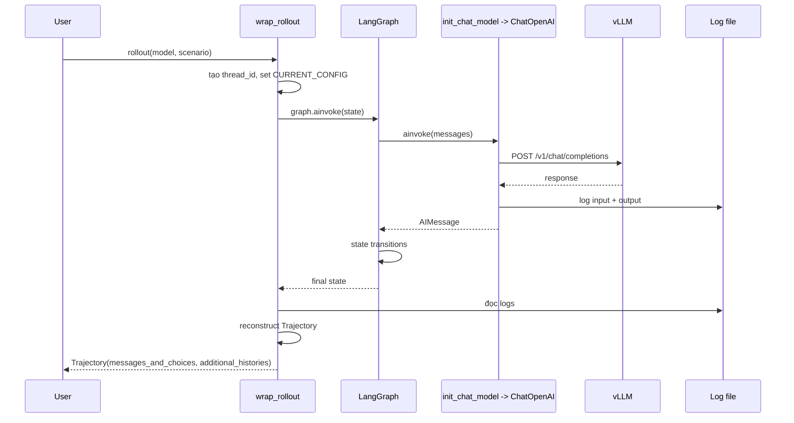

# Case 4: LangGraph Integration

LangGraph là framework phổ biến để xây dựng agent có state machine phức tạp (ví dụ ReAct, Plan-and-Execute, Multi-agent). ART cung cấp module `art.langgraph` để tích hợp LangGraph agent vào training loop mà **không cần sửa code LangGraph**.

---

## 1. Hai API quan trọng nhất

```python
from art.langgraph import wrap_rollout, init_chat_model
```

Hai hàm này là cầu nối giữa LangGraph và ART:

* **`init_chat_model()`**: trả về một wrapper LangChain `ChatOpenAI` mà ART đã cấu hình sẵn `base_url`, `api_key`, `model_name` (trỏ tới local vLLM). Quan trọng hơn, mỗi lần LLM được gọi, request và response được log vào file `.art/langgraph/<thread_id>`.
* **`wrap_rollout(model, fn)`**: bọc function rollout, đảm bảo log path được tạo trước khi rollout chạy, sau đó reconstruct `Trajectory` từ logs.

---

## 2. Tại sao phải log và reconstruct?

LangGraph agent là một đồ thị các node. Mỗi node có thể gọi LLM, tool, hoặc cả hai. Nếu ta cố "hook" vào từng node để build trajectory, ta sẽ phải:

* Sửa đổi code LangGraph.
* Phá vỡ abstraction của framework.
* Khó maintain khi LangGraph update.

Thay vào đó, ART dùng **log everything, reconstruct after**:



Logs chứa:

* `input`: prompt gửi tới LLM (LangChain `ChatPromptValue` hoặc list message).
* `output`: response từ LLM (AIMessage hoặc dict).
* `tools`: tool schema đã được bind.

Sau khi rollout xong, `create_messages_from_logs` đọc logs, merge các cuộc hội thoại (có thể có nhiều do multi-agent), build `Trajectory`.

---

## 3. Mã nguồn tích hợp tối giản

```python
"""LangGraph agent + ART - phiên bản rút gọn ~60 dòng."""
from langgraph.graph import StateGraph, END
from langchain_core.messages import HumanMessage
from art.langgraph import init_chat_model, wrap_rollout
import art


# Định nghĩa LangGraph agent
def build_agent_graph():
    llm = init_chat_model()  # dùng ART thay vì ChatOpenAI trực tiếp

    def think(state):
        response = llm.invoke(state["messages"])
        return {"messages": state["messages"] + [response]}

    def should_continue(state):
        last = state["messages"][-1]
        if hasattr(last, "tool_calls") and last.tool_calls:
            return "act"
        return END

    def act(state):
        # Thực thi tool (giả lập)
        tool_result = "tool result"
        return {"messages": state["messages"] + [
            HumanMessage(content=tool_result, role="tool")
        ]}

    graph = StateGraph(dict)
    graph.add_node("think", think)
    graph.add_node("act", act)
    graph.set_entry_point("think")
    graph.add_conditional_edges("think", should_continue, {"act": "act", END: END})
    graph.add_edge("act", "think")
    return graph.compile()


# ART rollout
@wrap_rollout
async def rollout(model, scenario) -> art.Trajectory:
    """Đây là rollout ART: wrap_rollout sẽ tự tạo Trajectory từ logs."""
    graph = build_agent_graph()
    await graph.ainvoke({"messages": [HumanMessage(content=scenario)]})
    # Không cần build trajectory thủ công; wrap_rollout lo
    return None  # wrap_rollout sẽ thay thế return value


# Training loop
async def train():
    backend = art.LocalBackend()
    model = art.TrainableModel(
        name="langgraph-agent",
        project="langgraph-rl",
        base_model="Qwen/Qwen2.5-7B-Instruct",
    )
    await model.register(backend)

    scenarios = ["What is 2+2?", "What is the capital of France?", "..."]

    for step in range(20):
        groups = await art.gather_trajectory_groups(
            (
                art.TrajectoryGroup(rollout(model, s) for _ in range(4))
                for s in scenarios[step*4 : (step+1)*4]
            ),
            after_each=lambda g: art.ruler_score_group(g, "openai/o4-mini"),
            pbar_desc="langgraph",
        )
        result = await backend.train(model, groups, learning_rate=1e-5)
        await model.log(groups, metrics=result.metrics, step=result.step)
```

Điểm mấu chốt: rollout function **return `None`**! `wrap_rollout` sẽ thay thế return value thành `Trajectory` thật, được build từ log file.

---

## 4. Bên trong `wrap_rollout` và `init_chat_model`

```python
def wrap_rollout(model, fn):
    async def wrapper(*args, **kwargs):
        thread_id = str(uuid.uuid4())
        log_path = add_thread(
            thread_id,
            model.inference_base_url,
            model.inference_api_key,
            model.inference_model_name,
        )
        result = await fn(*args, **kwargs)
        return create_messages_from_logs(log_path, result)
    return wrapper
```

Hai công việc:

1. Tạo thread_id duy nhất; gọi `add_thread` để lưu `base_url`, `api_key`, `model_name` vào `contextvars.ContextVar`. `CURRENT_CONFIG` được set.
2. Chạy rollout; sau khi xong, đọc log file và reconstruct `Trajectory`.

```python
def init_chat_model(model=None, *, model_provider=None, **kwargs):
    config = CURRENT_CONFIG.get()
    return LoggingLLM(
        ChatOpenAI(
            base_url=config["base_url"],
            api_key=config["api_key"],
            model=config["model"],
            temperature=1.0,
        ),
        config["logger"],
    )
```

`LoggingLLM` là wrapper LangChain `Runnable`:

```python
class LoggingLLM(Runnable):
    def __init__(self, llm, logger, structured_output=None, tools=None):
        self.llm = llm
        self.logger = logger
        ...

    def _log(self, completion_id, input, output):
        if self.logger:
            entry = {"input": input, "output": output, "tools": self.tools}
            self.logger.log(f"{completion_id}", entry)

    async def ainvoke(self, input, config=None, **kwargs):
        completion_id = str(uuid.uuid4())
        async def execute():
            result = await asyncio.wait_for(
                self.llm.ainvoke(input, config=config), timeout=10 * 60
            )
            self._log(completion_id, input, result)
            return result
        return await execute()
```

Mỗi `ainvoke` tạo UUID, log input + output, raise nếu timeout. Log file ghi dạng JSON Lines, dễ parse.

---

## 5. `create_messages_from_logs`: reconstruct từ logs

Đây là phần phức tạp nhất. Log file chứa nhiều entry (mỗi entry một LLM call). Trong LangGraph, các LLM call có thể có **input khác nhau** (do state thay đổi). ART phải nhóm các call có cùng input prefix thành một "conversation":

```python
def create_messages_from_logs(log_path, trajectory):
    logs = FileLogger(log_path).load_logs()
    conversations = []
    tools = []

    for log_entry in logs:
        output = log_entry[1]["output"]
        new_tools = log_entry[1]["tools"]
        raw_output = output.get("raw") if hasattr(output, "get") else output
        input_msgs = (
            log_entry[1]["input"].to_messages()
            if isinstance(log_entry[1]["input"], ChatPromptValue)
            else log_entry[1]["input"]
        )
        new_conversation = input_msgs + [raw_output]

        # Match với conversation đã có (cùng input)
        matched = False
        for idx, existing in enumerate(conversations):
            existing_non_tool = [m for m in existing if not isinstance(m, ToolMessage)]
            new_non_tool = [m for m in input_msgs if not isinstance(m, ToolMessage)]
            new_non_tool = (
                new_non_tool[:-1]
                if new_non_tool and isinstance(new_non_tool[-1], HumanMessage)
                else new_non_tool
            )
            if existing_non_tool == new_non_tool:
                conversations[idx] = new_conversation  # thay bằng bản dài hơn
                tools[idx] = new_tools
                matched = True
                break
        if not matched:
            conversations.append(new_conversation)
            tools.append(new_tools)

    for idx, conv in enumerate(conversations):
        try:
            converted = convert_langgraph_messages(conv)
            if idx == 0:
                trajectory.messages_and_choices = converted
                trajectory.tools = tools[idx]
            else:
                trajectory.additional_histories.append(
                    History(messages_and_choices=converted, tools=tools[idx])
                )
        except Exception:
            pass
    return trajectory
```

Logic quan trọng:

* **Multi-conversation**: nếu LangGraph có nhiều "sub-thread" (multi-agent), mỗi sub-thread là một conversation riêng. Conversation đầu tiên gán vào `trajectory.messages_and_choices`, các conversation sau gán vào `trajectory.additional_histories`.
* **Tool call dedup**: nếu cùng một input xuất hiện hai lần, lưu bản dài hơn. Đây là pattern phổ biến trong retry logic.
* **ToolMessage filter**: chỉ so sánh non-tool message để match (vì tool message có thể khác nhau giữa các call).
* **Fail-soft**: nếu convert fail (LangChain message lạ), skip nhưng không crash.

---

## 6. Tại sao không dùng `auto_trajectory`?

Bạn có thể thắc mắc: LangGraph cũng dùng httpx/openai, vậy `auto_trajectory` có hoạt động không?

* **Có thể**, nhưng có vấn đề:
  * LangGraph gọi LLM theo cách phức tạp (qua `ChatOpenAI` binding, retry, v.v.). HTTPX patching có thể miss một số call.
  * Khi LangGraph gọi tool, response của tool không đi qua LLM, nên `auto_trajectory` không capture được. Phải patch thêm `tool_node` của LangGraph.
  * `auto_trajectory` không biết về `additional_histories` (multi-conversation), trong khi LangGraph multi-agent có thể cần.

* **`wrap_rollout` + log-reconstruct** giải quyết gọn hơn: framework quen thuộc, không phụ thuộc HTTPX, support multi-conversation.

Kết luận: dùng `auto_trajectory` cho custom code đơn giản; dùng `wrap_rollout` cho framework phức tạp (LangGraph, LlamaIndex, custom).

---

## 7. Sơ đồ thời gian



---

## 8. Khi nào nên dùng case này

* **Production agent phức tạp**: nhiều node, multi-agent, retry, fallback.
* **Có sẵn code LangGraph**: không muốn viết lại.
* **Cần tool use với schema phức tạp**: LangGraph's `bind_tools` xử lý schema validation tốt hơn manual.

Khi **không** nên dùng:

* Agent đơn giản 1-2 turn: dùng `auto_trajectory` (Case 3).
* Không dùng LangGraph: dùng manual trajectory (Case 1, 2).
* Cần real-time streaming: hiện `LoggingLLM` chỉ log cuối, không log từng chunk.

---

## 9. Mở rộng: multi-agent với `additional_histories`

Nếu LangGraph của bạn có nhiều agent con, mỗi agent có thread riêng, logs sẽ chứa nhiều conversation. ART sẽ tự động:

* Conversation đầu tiên -> `trajectory.messages_and_choices`.
* Các conversation còn lại -> `trajectory.additional_histories` (mỗi cái là một `History`).

Điều này cho phép loss function **mask toàn bộ history phụ** (không train sub-agent) hoặc **train mỗi history riêng** (multi-task). Xem chi tiết ở [experiment 3](../experiments_deep_dive/exp_3_multiturn_tool_trajectories).

---

## 10. Bài học thiết kế

1. **Tách biệt concerns**: framework LangGraph không biết về ART, ART không can thiệp vào LangGraph execution. Giao tiếp qua log file.
2. **Log + reconstruct > hook**: ít phụ thuộc, dễ maintain.
3. **Context vars cho config**: `CURRENT_CONFIG` cho phép multi-thread an toàn (mỗi thread có thread_id riêng, context riêng).
4. **Multi-conversation qua `additional_histories`**: pattern quan trọng cho multi-agent, không phải workaround.

---

## 11. Tóm tắt

| Thành phần | Mục đích |
| --- | --- |
| `init_chat_model()` | Trả về `LoggingLLM` (Runnable LangChain) |
| `wrap_rollout(model, fn)` | Bọc function, tạo thread_id, reconstruct Trajectory |
| `LoggingLLM` | Wrapper log mỗi ainvoke vào file |
| `FileLogger` | JSON Lines log file |
| `create_messages_from_logs` | Reconstruct Trajectory + additional_histories |
| `CURRENT_CONFIG` (contextvar) | Per-thread config (base_url, api_key, logger) |

Tiếp theo: [Case 5: W&B Serverless RL](case_5_serverless_wandb) - chạy training hoàn toàn trên cloud, không cần GPU local.
