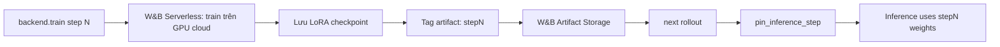
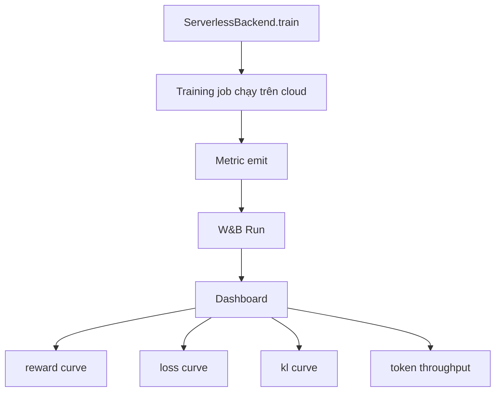
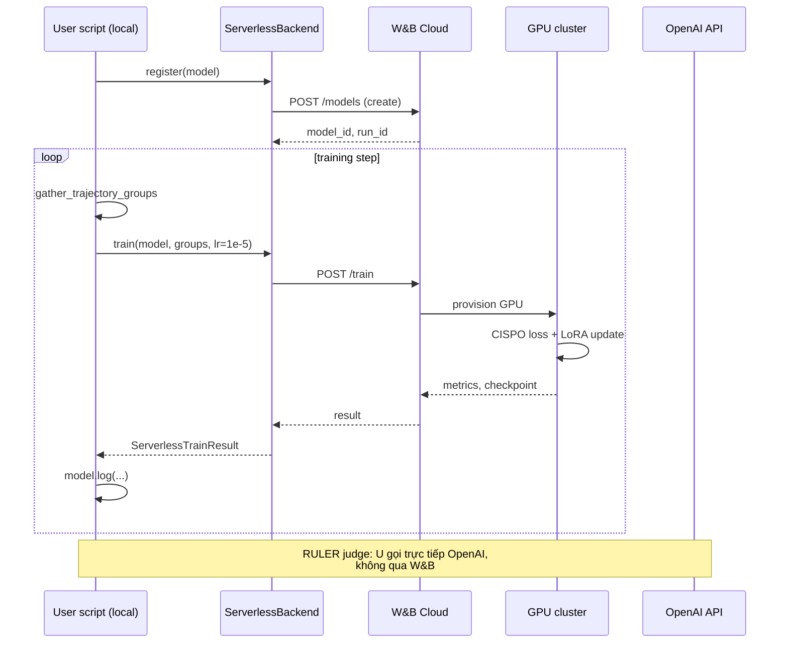

# Case 5: W&B Serverless RL

W&B Serverless RL (Weights & Biases Serverless RL) là dịch vụ cloud giúp bạn train agentic RL **mà không cần GPU local**. ART cung cấp `ServerlessBackend` để tích hợp. Đây là case study cho thấy khi nào nên "out-source" hạ tầng training.

---

## 1. ServerlessBackend vs LocalBackend

| Khía cạnh | LocalBackend | ServerlessBackend |
| --- | --- | --- |
| GPU | Bạn tự có (H100/A100) | W&B thuê cloud GPU |
| Setup | vLLM + Unsloth + NCCL | Chỉ cần `WANDB_API_KEY` |
| Chi phí | CapEx (mua GPU) hoặc reserved instance | OpEx (pay-per-step) |
| Iteration speed | 1 step ~ 5-7 phút (7B) | 1 step ~ 10-15 phút (do network + queue) |
| Quy mô mô hình | 0.5B-70B (với Megatron) | 0.5B-13B (do giới hạn dịch vụ) |
| Debug | Full control, log dễ | Qua W&B UI |
| Custom reward | Tùy ý | Tùy ý (RULER judge OK) |
| Cold start | Không | Có thể 1-2 phút |

Khi nào dùng ServerlessBackend:

* **Bạn không có GPU**: tốt nhất để thử nghiệm ban đầu.
* **Bạn muốn benchmark nhanh**: 5-10 step GRPO để xem idea có khả thi.
* **Bạn muốn chia sẻ result**: W&B UI tích hợp sẵn.
* **Production training nhỏ**: team nhỏ, train 1-2 model.

Khi nào KHÔNG dùng:

* **Train 70B+ model**: vượt giới hạn dịch vụ.
* **Yêu cầu reproducibility tuyệt đối**: cloud có thể thay đổi underlying hardware.
* **Custom backend integration** (ví dụ TensorRT-LLM): ServerlessBackend chỉ dùng được Unsloth.
* **Latency cứng cho inference**: ServerlessBackend thêm 100-500ms cho mỗi rollout.

---

## 2. Setup tối thiểu

```bash
pip install openpipe-art[serverless]
export WANDB_API_KEY=your_key_here
```

Vì `ServerlessBackend` tự quản lý tất cả (vLLM, NCCL, Unsloth, checkpoint), bạn chỉ cần:

* W&B account (free tier đủ cho ~5-10 step thử).
* W&B project (để organize models).
* Model base trên HuggingFace (Qwen, Llama, v.v.).

---

## 3. Code tối giản

```python
"""Serverless training script - phiên bản rút gọn ~50 dòng."""
import art
from art.serverless import ServerlessBackend
import asyncio


async def rollout(model, step, is_validation=False):
    """Cùng rollout function như case 2 (2048) - không cần thay đổi."""
    from examples.tic_tac_toe.rollout import TicTacToeRollout
    return await TicTacToeRollout(model, step, is_validation).run()


async def train():
    # Khởi tạo serverless backend - không cần GPU local
    backend = ServerlessBackend()

    model = art.TrainableModel(
        name="tic-tac-toe-001",
        project="tic-tac-toe",
        base_model="Qwen/Qwen2.5-3B-Instruct",
    )
    await model.register(backend)  # Tạo model trên W&B, gán model.id

    print(f"Model registered: {model.entity}/{model.project}/{model.name}")
    print(f"Model ID: {model.id}")

    for step in range(await model.get_step(), 30):
        train_groups = await art.gather_trajectory_groups(
            (
                art.TrajectoryGroup(
                    rollout(model, step, is_validation=False)
                    for _ in range(8)   # K=8 rollout per scenario
                )
                for _ in range(1)
            ),
            after_each=lambda g: art.ruler_score_group(
                g, "openai/o4-mini", swallow_exceptions=True
            ),
            pbar_desc="rollout",
            max_exceptions=0.05,
        )
        # Gọi serverless train - W&B lo tất cả
        result = await backend.train(model, train_groups, learning_rate=1e-5)
        await model.log(
            train_groups, metrics=result.metrics, step=result.step, split="train"
        )
        print(f"Step {step}: reward={result.metrics.get('reward', 0):.3f}")


asyncio.run(train())
```

Điểm khác biệt so với `LocalBackend`:

* Không có `LocalBackend()`, không có `_internal_config`.
* Không có `max_seq_length` (W&B tự chọn theo model).
* Không có `_experimental_pull_from_s3` (checkpoint lưu trên W&B artifact).
* `backend.train(...)` gọi API cloud; latency cao hơn nhưng throughput tương đương.

---

## 4. Vòng đời checkpoint trên W&B



`ServerlessBackend._get_step` (xem source) lấy step mới nhất từ W&B artifact:

```python
async def _get_step(self, model: "Model") -> int:
    if model.trainable:
        assert model.id is not None, "Model ID is required"
        async for checkpoint in self._client.models.checkpoints.list(
            limit=1, order="desc", model_id=model.id
        ):
            return checkpoint.step
    return 0
```

W&B artifact được tag `step0`, `step1`, `step2`, ... cho mỗi checkpoint. `pinned_inference_step` (từ `art.adapter_leases`) cho phép một rollout pin về step cụ thể (khi training multi-model).

---

## 5. Inference name và URL routing

```python
def _model_inference_name(self, model: "Model", step: int | None = None) -> str:
    assert model.entity is not None, "Model entity is required"
    if step is None:
        step = pinned_inference_step(model.name)
    base_name = f"wandb-artifact:///{model.entity}/{model.project}/{model.name}"
    if step is not None:
        return f"{base_name}:step{step}"
    return base_name
```

Khi ART cần inference, nó gọi W&B Serve API với URL `wandb-artifact:///...:stepN`. W&B Serve tự resolve artifact, load LoRA, serve OpenAI-compatible endpoint. Bạn không cần biết GPU nào chạy, vLLM version nào.

Cái hay: bạn có thể inference **checkpoint step 5** trong khi training **step 8** đang chạy (artifact versioning).

---

## 6. So sánh cost: Local vs Serverless

Giả sử train 2048 với Qwen 2.5 3B, 40 step, K=18:

* **Local (H100 reserved)**:
  * CapEx: ~$30K cho 1 GPU H100 80GB, hoặc $2/hr reserved cloud.
  * 40 step × 5 phút = 3.3 giờ.
  * Tổng OpEx: ~$7 (nếu cloud reserved) + electricity.

* **Serverless**:
  * W&B Serverless RL charge theo token training. Theo public pricing: ~$0.50/1M training tokens.
  * 40 step × ~5M tokens/step = 200M tokens.
  * Tổng: ~$100 + judge cost (~$10 với o4-mini) = $110.

Nếu bạn chỉ train 1 lần, serverless đắt hơn 10-15x. Nhưng nếu bạn train nhiều experiment, nhiều model, không phải maintain infrastructure, serverless rẻ hơn vì không có engineering cost.

---

## 7. Metric tự động log lên W&B

`ServerlessBackend` log các metric chuẩn lên W&B dashboard:

* `reward`: trung bình reward.
* `reward_std_dev`: std reward trong group.
* `exception_rate`: % rollout bị exception.
* `loss/train`: policy loss.
* `loss/entropy`: entropy bonus.
* `loss/kl_div`: KL divergence.
* `loss/kl_policy_ref`: KL vs reference.
* `loss/grad_norm`: gradient norm.
* `loss/learning_rate`: learning rate hiện tại.
* `data/step_num_groups_submitted`: số group đã submit.
* `data/step_num_trainable_tokens`: tổng token có gradient.

Đây là "free" observability: bạn không cần code gì để xem dashboard.



---

## 8. Khi nào nên dùng kết hợp với `LocalBackend`?

Pattern phổ biến:

1. **Prototype trên Serverless**: 5-10 step, idea validation, ~1 giờ.
2. **Production train trên Local**: khi đã biết config tốt, train 100+ step với full control.

```python
# Step 1: prototype
backend = ServerlessBackend()
...
# Step 2: switch
backend = LocalBackend()
# Cùng code, chỉ đổi backend
```

Đây là điểm mạnh của ART: code rollout function và training loop là **backend-agnostic**. Bạn không cần viết lại khi đổi backend.

---

## 9. Hạn chế và workaround

### 9.1. Cold start

Lần đầu train, W&B mất 1-2 phút để provision GPU và load model. Workaround: warmup với 1 step dummy trước khi vào loop chính.

### 9.2. Custom reward RULER judge

Judge LLM vẫn gọi qua OpenAI API (ngoài W&B). Đảm bảo `OPENAI_API_KEY` được set.

### 9.3. LoRA rank

ServerlessBackend mặc định LoRA rank 32. Nếu cần rank khác, hiện không expose config. Workaround: train trên LocalBackend với custom config, sau đó inference trên ServerlessBackend.

### 9.4. Multi-node

ServerlessBackend không hỗ trợ training > 13B (vì single GPU). Cho 70B, dùng LocalBackend + Megatron (xem Bài 3) hoặc TinkerBackend.

---

## 10. Mã đầy đủ cho tic-tac-toe (mini benchmark)

```python
"""examples/tic_tac_toe/train.py - dùng ServerlessBackend."""
import art
from art.serverless import ServerlessBackend
from rollout import TicTacToeRollout
from rewards import judge_with_ruler
import asyncio

async def train():
    backend = ServerlessBackend()
    model = art.TrainableModel(
        name="tic-tac-toe-bot",
        project="tic-tac-toe",
        base_model="Qwen/Qwen2.5-1.5B-Instruct",
    )
    await model.register(backend)

    for step in range(await model.get_step(), 50):
        train_groups = await art.gather_trajectory_groups(
            (
                art.TrajectoryGroup(
                    TicTacToeRollout(model, step).run() for _ in range(8)
                )
                for _ in range(2)   # 2 scenario mỗi step
            ),
            after_each=judge_with_ruler,
            pbar_desc=f"step {step}",
            max_exceptions=0.1,
        )
        result = await backend.train(model, train_groups, learning_rate=5e-6)
        await model.log(
            train_groups, metrics=result.metrics, step=result.step, split="train"
        )
        print(f"step={step} reward={result.metrics.get('reward', 0):.3f}")

asyncio.run(train())
```

Tic-tac-toe là game nhỏ, hoàn hảo để benchmark ServerlessBackend: ~50 step × 5 phút = 4 giờ, total cost < $50.

---

## 11. Sơ đồ end-to-end



---

## 12. Bài học thiết kế

1. **Backend-agnostic code**: viết rollout function một lần, dùng cho nhiều backend.
2. **W&B artifact versioning cho phép A/B test checkpoint**: train 5 step, inference cả 5 để xem step nào tốt nhất.
3. **ServerlessBackend phù hợp experimentation phase**: trước khi invest vào cluster.
4. **Cost transparency**: dùng `MetricsBuilder` để log cost RULER, so sánh với training cost.

---

## 13. Tóm tắt

| Thành phần | Mục đích |
| --- | --- |
| `ServerlessBackend()` | Cloud-managed RL training |
| `model.register(backend)` | Tạo model trên W&B |
| `backend.train(model, groups, lr=1e-5)` | Gọi W&B train API |
| `_model_inference_name` | wandb-artifact:///...:stepN URL |
| `pinned_inference_step` | Pin rollout về checkpoint cụ thể |
| `_get_step` | Lấy step mới nhất từ W&B artifacts |
| Auto-metric logging | W&B dashboard miễn phí |

Kết thúc 5 case studies. Tiếp theo, [theory_deep_dive](theory_deep_dive/roadmap_theory) sẽ đi sâu vào toán học của GRPO/CISPO/RULER.
