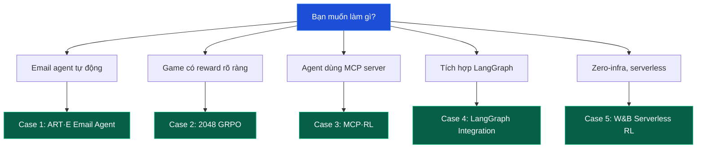
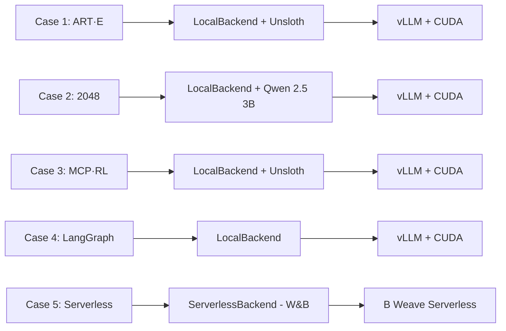
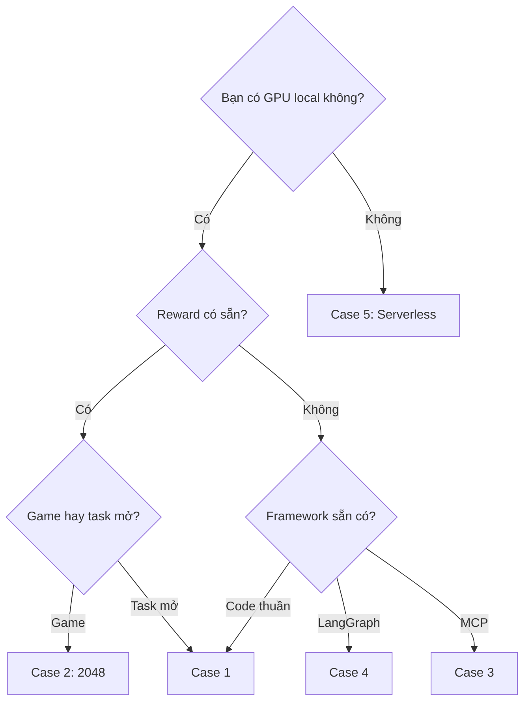

# Lộ trình Case Studies: ART trong thực chiến

Phần này trình bày **5 tình huống thực tế** mà ART đã được sử dụng để giải quyết các bài toán agentic RL cụ thể. Mỗi case study đi kèm mã nguồn tối giản, sơ đồ kiến trúc, và phân tích tại sao chọn backend/feature này.

Các case study **không theo thứ tự bắt buộc**; bạn có thể đọc theo bất kỳ thứ tự nào tùy quan tâm.

---

## Tổng quan 5 case studies

| # | Tên | Tình huống | Backend | Tính năng nổi bật |
| --- | --- | --- | --- | --- |
| 1 | ART·E Email Agent | Agent soạn email theo lịch sử hội thoại | LocalBackend (Unsloth + vLLM) | RULER judge, multi-turn tool use, Slack logging |
| 2 | 2048 GRPO | Game 2048 với reward dựa trên score | LocalBackend (Qwen 2.5 3B) | 18 simultaneous games, ruler_score_group, S3 checkpoint |
| 3 | MCP·RL | Train model dùng MCP servers (filesystem, git) | LocalBackend | OpenAI proxy + HTTPX, MCP tool calling |
| 4 | LangGraph Integration | Tích hợp ART với LangGraph agent | LocalBackend | `wrap_rollout`, `init_chat_model`, conversation reconstruction |
| 5 | W&B Serverless RL | Training zero-infra, không cần GPU local | ServerlessBackend | W&B Serverless RL, 2048 benchmark, no GPU setup |

---

## Sơ đồ so sánh backend sử dụng

* **Case 1-4** chạy local: yêu cầu GPU NVIDIA + vLLM + Unsloth (hoặc TRL/Megatron). Phù hợp khi bạn cần kiểm soát hoàn toàn.
* **Case 5** chạy serverless: không cần GPU; W&B thuê GPU từ cloud provider. Phù hợp khi bạn muốn zero-setup hoặc benchmark nhanh.

---

## Bài học rút ra từ mỗi case

* **Case 1 (ART·E)**: minh họa `ruler_score_group` + RULER judge hoạt động tốt khi task subjective, không có ground truth.
* **Case 2 (2048)**: minh họa pattern "K rollout cùng seed, tính advantage, train step" cổ điển của GRPO. Dễ hiểu nhất cho người mới.
* **Case 3 (MCP·RL)**: minh họa HTTPX patching + `auto_trajectory` capture đa agent trong suốt.
* **Case 4 (LangGraph)**: minh họa cách wrap framework khác (LangGraph) vào ART bằng logging + reconstruction.
* **Case 5 (Serverless)**: minh họa khi nào nên dùng cloud-hosted RL thay vì tự vận hành.

---

## Khi nào chọn case nào?

---

Bắt đầu với [Case 1: ART·E Email Agent](case_1_art_e_email_agent) - case study nổi tiếng nhất của OpenPipe.
