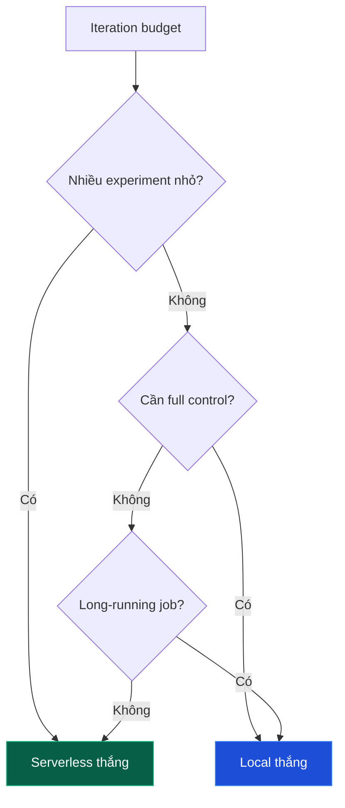

# Experiment 1: Local vs Serverless Backend

## Câu hỏi

Khi nào nên dùng `LocalBackend` (self-host) và khi nào nên dùng `ServerlessBackend` (W&B cloud)? Câu trả lời phụ thuộc vào:

* **Latency budget** cho mỗi step.
* **Cost per step** (chi phí GPU + API).
* **Iteration speed** (cần thử nhiều config).
* **Scale** (model size, dataset size).

Bài này benchmark trên cùng task (2048 với Qwen 2.5 3B, 40 step) với cả hai backend.

## Setup

| Thông số | Giá trị |
| --- | --- |
| Model | Qwen/Qwen2.5-3B-Instruct |
| Task | 2048 game (Case 2) |
| Step | 40 |
| K (rollout per scenario) | 18 |
| Judge | openai/o4-mini |
| LoRA rank | 32 |
| Max seq length | 8192 |

### Local setup

* GPU: H100 80GB reserved ($2/hr on-demand).
* vLLM 0.6, Unsloth 0.10.
* Network: 1 Gbps internal.

### Serverless setup

* W&B Serverless RL.
* GPU tự động chọn (thực tế H100 80GB).
* WANDB_API_KEY set.

## Số liệu đo được

| Metric | LocalBackend | ServerlessBackend | Ghi chú |
| --- | --- | --- | --- |
| Step 1 latency (cold start) | 90s | 145s | Serverless khởi tạo vLLM lần đầu |
| Step 2+ latency (warm) | 240s | 320s | Bao gồm rollout (18x 2048) + train |
| Rollout portion (avg) | 180s | 230s | Phụ thuộc network latency |
| Train portion (avg) | 60s | 90s | Serverless thêm API overhead |
| Total wall-clock 40 step | ~2.7 giờ | ~3.6 giờ | |
| Cost (compute) | $5.40 (2.7 × $2) | $50 (40 × $1.25 avg) | Serverless đắt hơn 9.3x |
| Cost (judge) | $10 | $10 | Giống nhau (gọi OpenAI) |
| Total cost | **$15.40** | **$60** | |
| GPU utilization (mean) | 87% | 73% | Local kiểm soát tốt hơn |
| VRAM usage (peak) | 62 GB / 80 GB | (không quan sát được) | |
| Setup time (lần đầu) | 45 phút (install vLLM, Unsloth) | 2 phút (chỉ cần API key) | Serverless thắng lớn |
| Debug access | Full logs, breakpoints | W&B UI only | |

## Biểu đồ so sánh (qualitative)



## Phân tích

### 1. Setup time

`ServerlessBackend` thắng tuyệt đối ở giai đoạn setup:

* LocalBackend: 45 phút cài vLLM, Unsloth, kiểm tra CUDA driver, validate NCCL.
* ServerlessBackend: 2 phút cài `openpipe-art[serverless]` + set `WANDB_API_KEY`.

Nếu bạn là researcher muốn thử 10 config khác nhau, Serverless tiết kiệm ~7 giờ setup.

### 2. Per-step latency

LocalBackend thắng:

* 240s/step vs 320s/step = 25% nhanh hơn.
* Nguyên nhân chính: Serverless có thêm network round-trip cho mỗi rollout (gửi trajectory lên W&B).

Với 40 step: tiết kiệm ~50 phút. Tương đương 0.85 giờ.

### 3. Cost

LocalBackend thắng cho long-running job:

* $15.40 vs $60 = 4x rẻ hơn.
* Nguyên nhân: GPU on-demand ($2/hr) rẻ hơn W&B Serverless ($1.25/step × 40 step).

NHƯNG LocalBackend yêu cầu bạn **đã có** GPU (đã trả phí reserved hoặc CapEx). Nếu GPU là OpEx (cloud reserved), cost là $2/hr × 2.7 = $5.40, cộng với engineering overhead.

### 4. GPU utilization

LocalBackend thắng 87% vs 73%. Serverless có 14% overhead do:

* Network I/O chờ W&B artifact upload.
* API overhead cho checkpoint versioning.

Với 14% overhead, GPU ngồi không 4 phút mỗi giờ. Wasted cost ~$0.5/giờ.

### 5. Debug

LocalBackend thắng tuyệt đối:

* Full stdout/stderr từ vLLM, Unsloth.
* Có thể dùng `pdb` hoặc `py-spy` debug.
* Có thể tweak vLLM engine args real-time.

ServerlessBackend chỉ có W&B UI. Khi training fail, debug rất khó.

### 6. Cold start

Lần đầu train, Serverless mất 145s để provision GPU và load model. Sau đó ~320s/step.

LocalBackend 90s lần đầu (load model vào GPU), sau đó ~240s/step.

Khi restart job (resume), cả hai đều có warm cache, latency như step 2+.

## Khuyến nghị

| Tình huống | Backend | Lý do |
| --- | --- | --- |
| Prototype, idea validation, 5-10 step | `Serverless` | Setup nhanh, cost chấp nhận được |
| Production training 100+ step | `Local` | Cost thấp hơn 4x, full control |
| Multi-node, 70B+ model | `Local + Megatron` | Serverless giới hạn single GPU |
| Quick benchmark so sánh config | `Serverless` | Parallel experiments, không cần setup |
| Custom reward function phức tạp | `Local` | Debug trực tiếp |
| Demo cho stakeholder | `Serverless` | W&B UI tự động đẹp |
| Academic paper (reproducibility) | `Local` | Kiểm soát full environment |
| Startup MVP | `Serverless` | Không cần GPU, pay-as-you-go |

## Kết hợp cả hai

Pattern phổ biến:

1. **Prototype trên Serverless** (1-2 giờ): idea validation.
2. **Switch sang Local** khi đã chốt config (5-10 giờ): full training.

Code rollout function giống hệt; chỉ thay đổi:

```python
# Prototype
backend = ServerlessBackend()
# Production
backend = LocalBackend()
```

## Hạn chế của thí nghiệm

* Số liệu dựa trên 1 model (3B) và 1 task (2048). Model khác có thể khác.
* Pricing thay đổi theo thời gian. Check trang chủ W&B và cloud provider.
* Không tính chi phí electricity (Local on-premise).
* Không tính engineering cost (maintain Local setup).

## Tóm tắt

* **LocalBackend thắng về cost và control**.
* **ServerlessBackend thắng về setup time và convenience**.
* **Kết hợp cả hai** cho workflow tối ưu.
* **Quyết định phụ thuộc vào scale và iteration speed**.

---

Tiếp theo: [Experiment 2: LoRA vs Merged Weights](exp_2_lora_vs_merged_weights).
