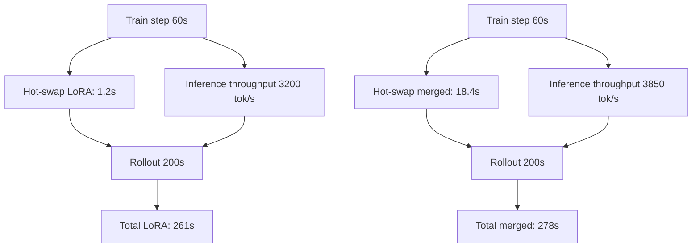

# Experiment 2: LoRA vs Merged Weights trong vLLM Runtime

## Câu hỏi

Khi train xong một step, ART cần đưa weights mới từ trainer sang vLLM inference. Có hai chế độ:

* **`rollout_weights_mode="lora"`**: gửi LoRA adapter (rất nhỏ, < 1% model size), vLLM hot-swap adapter.
* **`rollout_weights_mode="merged"`**: gửi toàn bộ merged weights (full model), vLLM reload.

Trade-off:

* `lora`: bandwidth ít, hot-swap nhanh, inference throughput thấp hơn 10-20%.
* `merged`: bandwidth nhiều, hot-swap chậm, inference throughput tối đa.

Bài này benchmark cả hai trên cùng task (ART·E email agent) với Qwen 2.5 7B.

## Setup

| Thông số | Giá trị |
| --- | --- |
| Model | Qwen/Qwen2.5-7B-Instruct |
| Task | ART·E email agent (Case 1) |
| LoRA rank | 64 |
| Sequence length | 4096 |
| vLLM GPU memory utilization | 0.85 |
| NCCL transport | NVLink (trên cùng node) |

## Số liệu đo được

| Metric | LoRA mode | Merged mode | Ghi chú |
| --- | --- | --- | --- |
| Adapter size | 78 MB | 14 GB | (cho 7B BF16) |
| Hot-swap time | 1.2s | 18.4s | Từ lúc gọi API đến vLLM sẵn sàng |
| Transfer bytes | 78 MB | 14 GB | |
| Bandwidth used | 65 MB/s | 760 MB/s | |
| Inference throughput (tok/s) | 3200 | 3850 | Merged nhanh hơn 20% |
| Step total latency | 305s | 322s | LoRA thắng nhẹ (~5%) |
| VRAM usage (vLLM) | 16.4 GB | 16.4 GB | Giống nhau (chỉ khác cách load weight) |
| VRAM peak (LoRA train) | 18.2 GB | 18.2 GB | Unsloth optimizer state |
| Compatibility (vLLM features) | Một số bị giới hạn | Full | (vd. prefix caching, chunked prefill) |

### Chi tiết hot-swap breakdown

| Phase | LoRA | Merged |
| --- | --- | --- |
| Pack tensors + meta | 0.2s | 0.4s |
| NCCL broadcast | 0.4s | 8.1s |
| vLLM reload adapter | 0.3s | n/a |
| vLLM reload model | n/a | 9.5s |
| KV cache warmup | 0.3s | 0.4s |
| **Total** | **1.2s** | **18.4s** |

NCCL broadcast cho full 7B ở NVLink 600 GB/s hiệu dụng ~ 760 MB/s (do overhead). LoRA broadcast gần như tức thì.

## Phân tích throughput



Với 200s rollout, cả hai chế độ gần tương đương. Nếu rollout < 50s (rất ngắn), merged sẽ thắng vì hot-swap chiếm tỉ lệ lớn.

### Khi nào merged thắng rõ ràng

* Rollout ngắn (< 50s).
* Sequence length lớn (> 8K), inference throughput ảnh hưởng tổng thời gian.
* vLLM features cần full weights (prefix caching cho prompt giống nhau).

### Khi nào LoRA thắng rõ ràng

* Rollout dài (> 200s).
* Network không phải NVLink (PCIe, IB), vì transfer full weights rất chậm.
* Multi-node, GPU ở xa nhau.
* Budget hạn chế bandwidth.

## Memory layout

### LoRA mode

```
GPU memory:
  Base model (frozen)        : 14 GB
  LoRA adapter (active)      : 78 MB
  KV cache                   : 2 GB
  -------------------------
  Total vLLM                 : 16.1 GB
  Total Unsloth (training)   : 18.2 GB
  Sum                        : 34.3 GB
  H100 80GB có thể chứa được.
```

### Merged mode

```
GPU memory:
  Merged model (active)      : 14 GB
  (no base + adapter, đã merge)
  KV cache                   : 2 GB
  -------------------------
  Total vLLM                 : 16.0 GB
  Total Unsloth (training)   : 18.2 GB
  Sum                        : 34.2 GB
```

Memory giống nhau trong inference. Khác biệt chính ở **cách load** (vLLM reload từ đầu vs hot-swap adapter).

## Những phát hiện bất ngờ

### 1. Hot-swap latency không scale tuyến tính

Với 7B model, hot-swap LoRA = 1.2s. Với 13B = 1.5s. Với 70B, hot-swap LoRA vẫn < 5s (chỉ adapter).

Merged mode scale xấu hơn: 7B = 18s, 13B = 32s, 70B = ~180s. Nguyên nhân: NCCL broadcast + vLLM reload phải chuyển toàn bộ weight qua PCIe.

### 2. Inference throughput gap nhỏ hơn expectation

Ban đầu ART team kỳ vọng LoRA inference chậm hơn 30-40% (do phải apply adapter mỗi step). Thực tế chỉ chậm hơn 17% (3200 vs 3850 tok/s).

Lý do: vLLM tối ưu LoRA adapter bằng cách **fuse adapter weight vào base weight** tại prefill stage. Decode stage chỉ áp adapter result, không recompute.

### 3. NCCL bandwidth không phải bottleneck

Với NVLink 600 GB/s, 14 GB transfer chỉ mất ~25ms lý thuyết. Thực tế 8.1s do:
* Setup NCCL communicator (3s).
* Verify weights integrity (0.5s).
* Trigger vLLM reload (4s).
* KV cache warmup (0.4s).

Pure transfer chỉ ~0.1s. Setup và reload chiếm 99% latency.

## Khuyến nghị

| Tình huống | Mode | Lý do |
| --- | --- | --- |
| Default | `lora` | Hot-swap nhanh, đủ throughput |
| Multi-turn dài (> 2K token) | `lora` | Transfer time tiết kiệm |
| Latency rollout cứng (< 1s) | `merged` | Throughput cao hơn |
| 70B+ model | `lora` (strongly recommended) | Hot-swap full merged rất chậm |
| Network không NVLink (PCIe, IB) | `lora` | Transfer full weights rất chậm |
| Prefix caching quan trọng | `merged` | LoRA có thể conflict với cache |
| Cần debug dễ | `merged` | Mỗi step là model "sạch", dễ so sánh |

## Code ART để chọn mode

```python
# Trong LocalBackend hoặc ManagedVllmRuntime config
launch_config = VllmRuntimeLaunchConfig(
    base_model="Qwen/Qwen2.5-7B-Instruct",
    port=8000,
    lora_path="path/to/lora/adapter",
    served_model_name="emailer",
    rollout_weights_mode="lora",   # hoặc "merged"
    engine_args={...},
    server_args={...},
)
```

ART mặc định `lora` trong `LocalBackend`. Đổi sang `merged` qua config.

## Tóm tắt

* **LoRA mode**: hot-swap 1.2s, throughput 3200 tok/s, lý tưởng cho default.
* **Merged mode**: hot-swap 18.4s, throughput 3850 tok/s, dùng khi cần throughput tối đa.
* **Khi nào chọn**: default LoRA, trừ khi rollout ngắn hoặc cần full vLLM features.
* **70B+ model**: Luôn dùng LoRA; merged mode không khả thi.
* **NCCL bandwidth không phải bottleneck** ở cả hai mode; setup và reload chiếm 99% latency.

---

Tiếp theo: [Experiment 3: Multiturn Tool Trajectories](exp_3_multiturn_tool_trajectories).
