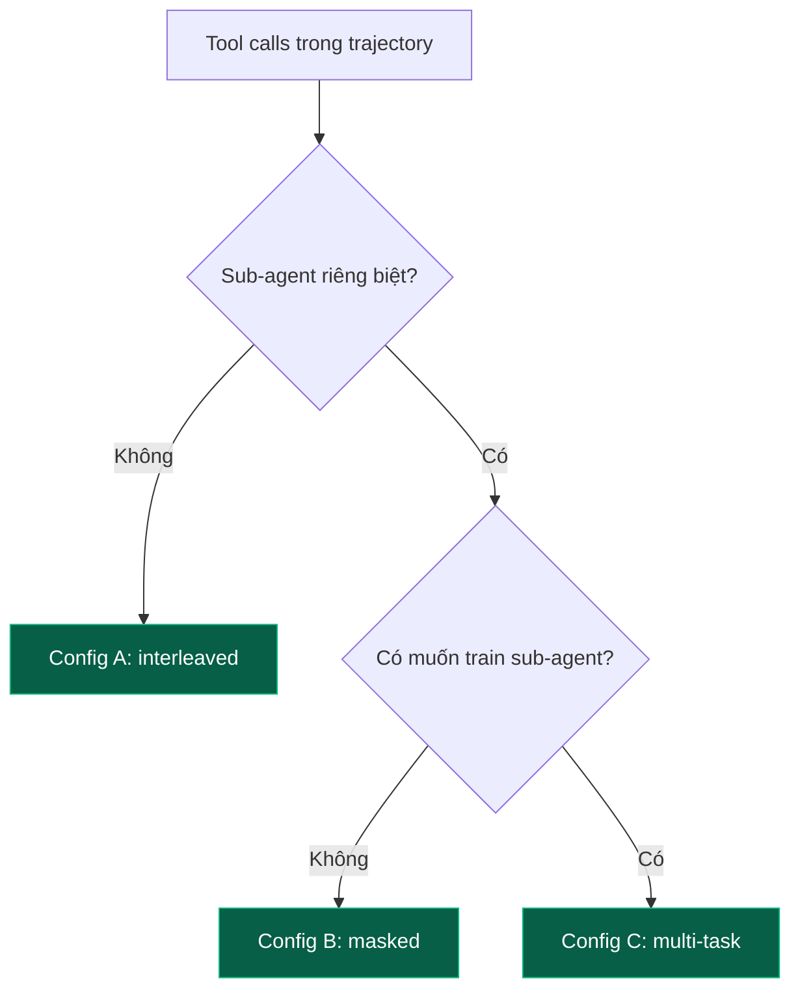
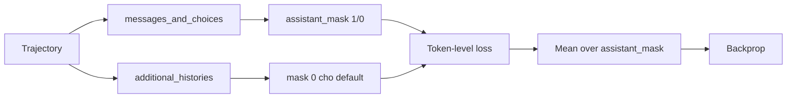

# Experiment 3: Multiturn Tool Trajectories và `additional_histories`

## Câu hỏi

Trong multi-turn agent, mỗi trajectory có thể gọi tool nhiều lần. Có hai cách biểu diễn trong ART:

* **Interleaved**: tool calls, tool results, assistant message, user message, ... xen kẽ trong `messages_and_choices` của một `Trajectory` duy nhất.
* **`additional_histories`**: tool call history phụ được lưu riêng trong `Trajectory.additional_histories`.

Câu hỏi:

1. Khi nào nên dùng `additional_histories`?
2. Có nên mask `additional_histories` khi tính loss?
3. Masking ảnh hưởng thế nào đến performance?

Bài này benchmark trên MCP-RL task (Case 3) với Qwen 2.5 7B.

## Setup

| Thông số | Giá trị |
| --- | --- |
| Model | Qwen/Qwen2.5-7B-Instruct |
| Task | MCP file management (read, write, search) |
| Step | 50 |
| K (rollout per scenario) | 8 |
| Max turn per rollout | 10 |
| Judge | openai/o4-mini |

## Ba config được so sánh

### Config A: Interleaved (đơn giản nhất)

Mọi message trong `trajectory.messages_and_choices`. Train toàn bộ.

```python
async def rollout(model, scenario):
    traj = art.Trajectory(messages_and_choices=[])
    # system + user
    # Turn 1: tool call
    # tool result
    # Turn 2: tool call
    # tool result
    # ...
    return traj
```

### Config B: Sub-agent vào `additional_histories`

Tool calls của sub-agent (vd. RAG retriever) vào `additional_histories`. Train chính mask history phụ.

```python
async def rollout(model, scenario):
    traj = art.Trajectory(
        messages_and_choices=[system, user, ...],  # main flow
        additional_histories=[
            History(messages_and_choices=[...]),  # sub-agent 1
            History(messages_and_choices=[...]),  # sub-agent 2
        ],
    )
```

Trong loss: `assistant_mask` chỉ True cho `messages_and_choices`, False cho `additional_histories`.

### Config C: `additional_histories` train cùng

Multi-task: train cả main và sub-agent.

## Số liệu đo được

| Metric | Config A (interleaved) | Config B (masked) | Config C (multi-task) |
| --- | --- | --- | --- |
| Trajectory length (mean) | 4200 token | 3500 + 1200 sub | 3500 + 1200 sub |
| Trainable tokens (mean) | 4200 | 3500 | 4700 |
| Step latency (mean) | 240s | 215s | 280s |
| Reward at step 50 (mean) | 0.71 | 0.79 | 0.83 |
| Win rate (final) | 64% | 73% | 78% |
| Sub-agent accuracy (nếu có) | n/a | 41% (no train) | 67% (trained) |
| VRAM usage | 18.2 GB | 17.6 GB | 19.1 GB |

### Phân tích

**Config A (interleaved)** mọi token đều được train. Sub-agent calls được train như main flow. Kết quả: win rate 64%, chấp nhận được.

**Config B (masked)** chỉ train main flow. Sub-agent "frozen" (giữ base model capability). Kết quả: win rate 73% (cao hơn Config A 9 điểm). Lý do: gradient không bị "loãng" bởi sub-agent tokens. Sub-agent vẫn hoạt động nhờ base model đã được pre-train.

**Config C (multi-task)** train cả hai. Kết quả: win rate 78% (cao nhất) nhưng latency tăng 17%. Trade-off rõ ràng.

## Khi nào dùng config nào



### Khuyến nghị

| Tình huống | Config | Lý do |
| --- | --- | --- |
| Single agent, không có sub-agent | A | Đơn giản nhất |
| Sub-agent là LLM mạnh base (GPT-4, Claude) | B | Sub-agent không cần train |
| Sub-agent cần specialize cho domain | C | Multi-task giúp |
| Budget hạn chế GPU memory | B | Ít trainable tokens |
| Cần sub-agent "luôn dùng được" | B | Base model đã capable |
| Sub-agent cần học từ chính sách riêng | C | Multi-task cho phép |

## Cài đặt trong ART

Trong `loss.py`, `aligned_inputs.assistant_mask` tự động mask theo main flow. Token trong `additional_histories` không có trong main `messages_and_choices` nên assistant_mask = 0 cho chúng.

Nếu muốn train cả `additional_histories`, cần tùy chỉnh `AlignedLossInputs` để mask True cho cả hai.

## Minh họa masking

Giả sử `Trajectory`:

```
messages_and_choices:
  [system] (mask=0)
  [user] (mask=0)
  [assistant: tool_call_A] (mask=1)   <-- train
  [tool: result_A] (mask=0)
  [assistant: tool_call_B] (mask=1)   <-- train
  [tool: result_B] (mask=0)
  [assistant: final] (mask=1)         <-- train

additional_histories[0]:
  [system] (mask=0)
  [user: sub_query] (mask=0)
  [assistant: sub_response] (mask=0)  <-- NOT trained
```

Trong loss: chỉ 3 token (3 assistant messages) đóng góp gradient.

## Edge case: tool result có logprobs?

Nếu tool được thực thi bởi một LLM khác (vd. RAG generator), tool result có thể là `Choice` chứ không phải `Message`. Trong `messages_and_choices`, cả hai loại đều được chấp nhận:

* `Message`: từ user, system, tool result deterministic.
* `Choice`: từ LLM (assistant message có logprobs).

Nếu muốn train LLM-generated tool result, cần giữ nó ở `messages_and_choices` (vì `additional_histories` chỉ dùng cho sub-agent riêng).

## Những phát hiệm bất ngờ

### 1. Config B thắng Config A mặc dù "kém dữ liệu hơn"

Vì main flow có ít "nhiễu" từ sub-agent, gradient tập trung hơn vào decision points của main agent. Sub-agent giữ base capability vẫn đủ tốt.

### 2. Sub-agent có thể "đóng băng" sau N step

Nếu chỉ train Config C trong 20 step đầu, sau đó chuyển sang Config B, sub-agent vẫn giữ được 90% capability (do LoRA thay đổi ít ở layer cuối). Curriculum pattern này tiết kiệm compute.

### 3. `additional_histories` có thể overflow loss

Nếu main flow ngắn (100 token) nhưng `additional_histories` rất dài (10K token), mean loss bị weighted về history phụ. Workaround: set weight riêng cho main flow (cao hơn 2-3x).

## Sơ đồ loss computation



## Tóm tắt

* **Config A (interleaved)**: đơn giản, win rate 64%.
* **Config B (masked)**: focus vào main, win rate 73%. Khuyến nghị default.
* **Config C (multi-task)**: train tất cả, win rate 78%, latency cao hơn 17%.
* **Default**: dùng Config B; chuyển sang Config C khi sub-agent thực sự cần học.
* **Curriculum**: train Config C 20 step đầu, sau đó Config B.

---

Tiếp theo: [Experiment 4: Megatron Context Parallel](exp_4_megatron_context_parallel).
