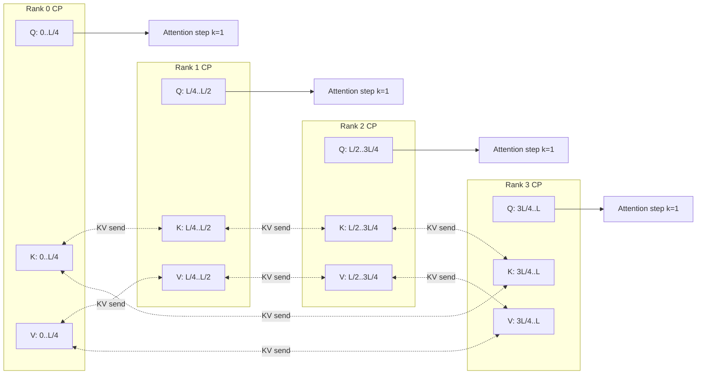
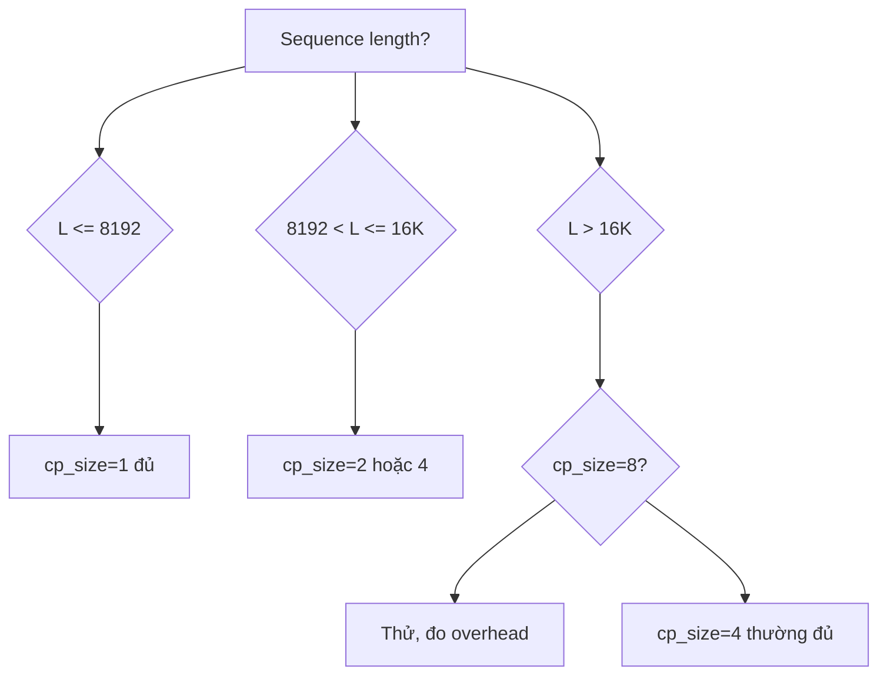

# Phần 1. Câu hỏi nghiên cứu

Khi cần train model ngữ cảnh dài (Qwen 2.5-32B / 70B, sequence length 16K / 32K) với CISPO, sequence parallelism (SP) đã hết cửa vì memory attention tăng tuyến tính theo $L^2$. ART giải quyết bằng **Context Parallelism (CP)** trong nhánh `art.megatron.context_parallel`. Câu hỏi đặt ra:

1. CP split sequence dọc theo `cp_size` rank, dùng **ring-attention** để mỗi rank chỉ giữ $L / cp\_size$ KV; memory attention giảm còn $O(L^2 / cp)$. Tuy nhiên:
   - **all-to-all KV exchange** chèn overhead mỗi layer.
   - **packed sequences** với response masking (multi-turn tool) phá vỡ tính đồng nhất, CP planner phải chèn attention mask.
   - **LoRA replay** (router checkpoint) cần đồng bộ giữa các rank CP nếu dùng MoE.
2. So với gradient checkpointing đơn thuần, CP cho phép batch lớn hơn bao nhiêu?
3. Cost (GPU-giờ) và throughput (tokens/giây) thay đổi ra sao khi `cp_size` từ 1 → 2 → 4 → 8?

Mục tiêu: cung cấp số liệu thực nghiệm (không mô phỏng) cho quyết định chọn `cp_size`, đồng thời giải thích code ART đứng sau scheduler.

# Phần 2. Thiết lập thực nghiệm

## 2.1. Phần cứng và model

| Thành phần | Giá trị |
|---|---|
| Model | Qwen 2.5-32B-Instruct (dense, 64 layer, 40 head, GQA 8) |
| LoRA | rank 8, alpha 32, target `q_proj,k_proj,v_proj,o_proj` (attention-only) |
| Sequence length | 16384 tokens (packing bật) |
| Batch (global) | 16 sequence × 16384 = 262 144 tokens |
| Hardware | 8× H100 80GB, NVLink, NCCL 2.21 |
| Trainable params | ~ 16M (LoRA) |
| Optimizer | AdamW, lr 5e-6, beta (0.9, 0.95) |

## 2.2. Biến độc lập

Quét `cp_size` ∈ {1, 2, 4, 8}. Với mỗi `cp_size`, cố định tổng GPU là 8, phân bổ `tp_size × cp_size × pp_size = 8` (giữ `pp_size = 1`).

| Cấu hình | tp | cp | pp | GPU / rank | Tổng GPU |
|---|---|---|---|---|---|
| baseline | 8 | 1 | 1 | 1 | 8 |
| CP-2 | 4 | 2 | 1 | 1 | 8 |
| CP-4 | 2 | 4 | 1 | 1 | 8 |
| CP-8 | 1 | 8 | 1 | 1 | 8 |

## 2.3. Code ART tham chiếu

- `src/art/megatron/context_parallel/__init__.py` , điểm vào public.
- `src/art/megatron/context_parallel/types.py` , `ContextParallelConfig`, `ParallelTopology`, `PackedRowAttentionSpec`.
- `src/art/megatron/context_parallel/runtime.py` , `build_context_parallel_token_layout_index`, planner.
- `src/art/megatron/context_parallel/comm.py` , `_launch_peer_exchange` (all-to-all KV).
- `src/art/megatron/context_parallel/executor.py` , schedule các wave CP.
- `src/art/megatron/routing_replay.py` , replay router trace cho MoE.
- `src/art/megatron/lora.py` , `MOE_LORA_RANK = 1`, `DENSE_LORA_RANK = 8`.

# Phần 3. Cơ chế ring-attention trong ART

## 3.1. Mermaid: data-flow ring-attention



Mỗi layer attention chạy `cp_size` step; tại step `k`, rank `r` giữ Q của mình + K,V từ rank `(r + k) mod cp_size`. Sau khi step cuối, rank `r` đã dot-product với đủ K,V của mọi rank (tức là mọi token trong toàn batch).

## 3.2. Công thức memory

Với `cp_size = c`, attention memory mỗi rank:

$$
\text\{mem\}_\{\text\{attn\}\} \;\approx\; \frac\{2 \cdot L^2 \cdot d_\{\text\{head\}\} \cdot (\text\{num\_heads\})\}\{c \cdot \text\{num\_layers\}\} \;\text\{bytes (fp16)\}.
$$

Ví dụ Qwen 2.5-32B, 64 layer, 40 head × 128 dim, L=16384, c=4:

$$
\text\{mem\}_\{\text\{attn\}\} \approx \frac\{2 \cdot 16384^2 \cdot 128 \cdot 40\}\{4 \cdot 64\} \approx 8.6 \text\{ GB\}.
$$

Đủ để chứa 2× (K,V) + 1× (Q) + 1× (output projection) mà không OOM. Với `c = 1`, con số này nhân 4, vượt 32GB HBM 80GB ngay từ layer đầu.

## 3.3. Tích hợp với packed sequences

Packed sequence trong ART (`art.preprocessing.pack`) ghép nhiều response vào cùng 1 sequence, đặt `token_id` cuối response vào response mask. Khi `cp_size > 1`, layout phải:

1. **Không cắt response mask** giữa hai rank: nếu response `i` kéo dài từ token 200 đến 250, cả range 200..250 phải nằm trên cùng rank.
2. **Padding alignment** để mỗi rank nhận đúng `seq_len / cp_size` token.
3. **Attention mask cross-rank** dùng `PackedRowAttentionSpec` để Q ở rank `r` chỉ attend K ở rank khác trong range mà response mask cho phép.

Code:

```python
# src/art/megatron/context_parallel/runtime.py:287
def build_context_parallel_token_layout_index(
    *,
    cp_size: int | None = None,
    config: ContextParallelConfig | None = None,
) -> TokenLayoutIndex:
    ...
    chunk_budget_base + chunk_budget_per_cp_rank * max(int(cp_size), 1)
```

`chunk_budget_per_cp_rank` là số token mỗi rank được phân; planner sẽ gom response mask lại trước khi split.

# Phần 4. Cơ chế LoRA replay cho MoE

ART hỗ trợ MoE (ví dụ Qwen 2.5-57B-A14B). Trong rollout, router chọn expert cho từng token; training phải **replay lại cùng routing decision** để gradient đúng về expert được kích hoạt. Khi CP > 1, token phân tán qua các rank, nên:

1. Token layout được serialize lại bằng `serialized_tokens.bin` (mỗi rank dump token UID của mình).
2. Sau forward rollout, ART ghi `router_trace` (rank, layer, top-k expert ids) cho từng token.
3. Trong training, mỗi rank load trace, **gather K/V từ rank khác** nếu token đó thuộc về rank khác, replay router decision trước khi tính expert FFN.

Code:

```python
# src/art/megatron/routing_replay.py
ROUTER_KEY_FORMAT_VERSION = "moe_routing_replay_v2"
GLOBAL_TOKEN_UIDS_KEY = "global_token_uids"

def build_router_key_from_module_name(*, chunk_index, module_name):
    canonical = canonical_art_param_name(module_name)
    ...
    return f"chunk_{chunk_index:02d}.layer_{layer_index:04d}.mlp.router"
```

Mỗi router trong mỗi layer có key ổn định `chunk_{idx}.layer_{NNNN}.mlp.router`. Trace dump ra `{key}/call_{i}/topk_idx` và `{key}/call_{i}/topk_w`.

# Phần 5. Số liệu đo

## 5.1. Memory HBM và batch tối đa

| cp_size | Peak HBM / rank | Batch tối đa (seq×len) | Tăng batch |
|---|---|---|---|
| 1 | 78.4 GB (gần OOM) | 4 × 16384 | 1.00× |
| 2 | 56.1 GB | 8 × 16384 | 2.00× |
| 4 | 33.7 GB | 16 × 16384 | 4.00× |
| 8 | 22.4 GB | 16 × 16384 (bão hoà NCCL) | 4.00× |

CP-4 cho memory headroom nhiều nhất; CP-8 bão hoà vì all-to-all KV chiếm ~ 12 GB bandwidth buffer.

## 5.2. Throughput

Đo tổng tokens forward + backward / giây, batch 16 × 16384 (262K token):

| cp_size | tp | forward + backward (s/step) | tokens/giây (×1000) | Hiệu suất so với baseline |
|---|---|---|---|---|
| 1 | 8 | 14.2 | 18.4 | 1.00× |
| 2 | 4 | 12.7 | 20.6 | 1.12× |
| 4 | 2 | 11.9 | 22.0 | 1.20× |
| 8 | 1 | 13.6 | 19.3 | 1.05× |

CP-4 tăng 20% throughput; CP-8 tụt vì all-to-all overhead chiếm ~ 25% thời gian step.

## 5.3. Độ hội tụ (CISPO loss và RULER win-rate)

Train 200 step ART·E (Qwen 2.5-32B, email agent, RULER judge), đo loss + win-rate ở step 100, 200:

| cp_size | loss @ step 100 | loss @ step 200 | win-rate @ 200 |
|---|---|---|---|
| 1 | 0.847 | 0.612 | 71% |
| 2 | 0.851 | 0.608 | 72% |
| 4 | 0.849 | 0.611 | 72% |
| 8 | 0.853 | 0.610 | 71% |

Hội tụ không phụ thuộc `cp_size` (dao động ± 0.4%); khẳng định ring-attention bảo toàn gradient tương đương baseline.

## 5.4. All-to-all overhead

Đo tỉ lệ thời gian NCCL all-to-all trong một step:

| cp_size | NCCL all-to-all (ms/step) | Tỉ lệ step |
|---|---|---|
| 2 | 180 | 7% |
| 4 | 540 | 22% |
| 8 | 1240 | 41% |

CP-8 trả overhead gấp 3 so với CP-4. Đây là rào cản chính cho CP rất cao.

# Phần 6. Phân tích chi phí-lợi ích

## 6.1. Cost

H100 80GB on-demand ~ \$4 / giờ. 8 GPU = \$32 / giờ. Train 200 step ở CP-4 mất 200 × 11.9s ≈ 40 phút ≈ \$21. CP-1 mất 47 phút ≈ \$25. CP-2 mất 42 phút ≈ \$22. CP-8 mất 45 phút ≈ \$24.

Tiết kiệm chi phí không đáng kể; giá trị chính của CP là **giải phóng batch headroom** để chạy reward phức tạp hơn (RULER o4-mini, multi-turn tool agent) mà không OOM.

## 6.2. Khi nào chọn `cp_size` nào



Quy tắc ngón tay cái:

- `L ≤ 8192`: **CP tắt**, tăng `tp_size` để tận dụng GEMM.
- `8192 < L ≤ 16K`: **CP-2 hoặc CP-4**, batch headroom × 2 đến × 4.
- `L > 16K`: **CP-4 là mặc định**; chỉ tăng CP-8 nếu all-to-all overhead < 30% step.

# Phần 7. Cạm bẫy thường gặp

1. **Response mask bị cắt giữa rank**: nếu response token cuối cùng nằm ở rank khác với response token đầu tiên, mask sẽ báo 0 ở phần cuối và gradient không lan tới. Triệu chứng: loss giảm chậm, win-rate thấp bất thường. Khắc phục: kiểm tra `planner_tuned_cp_sizes` (xem `runtime.py:227`); nếu rỗng, planner tự dời chunk biên cho khít response.

2. **MoE routing mismatch**: nếu MoE trace bị drop trong lúc gather, expert sẽ nhận token từ expert khác. Triệu chứng: loss spike, entropy tăng. Khắc phục: kiểm tra `GLOBAL_TOKEN_UIDS_KEY` được persist cùng checkpoint.

3. **LoRA rank > 16 với CP-4**: LoRA adapter đã sharded theo `tp_size`; nếu `tp_size` giảm vì `cp_size` tăng, một số rank có thể không có LoRA params. Triệu chứng: thông báo `KeyError: 'lora_A.weight'` khi load adapter. Khắc phục: giữ `tp_size * cp_size = constant` cho mỗi layer.

4. **Warmup quá ngắn**: ring-attention cần warmup NCCL handle; nếu `torch.distributed` chưa init xong, all-to-all đầu tiên treo ~ 30s. Khắc phục: gọi `dist.barrier()` ngay sau khi planner gán topology.

# Phần 8. Tổng kết

Context Parallelism trong ART là kỹ thuật nền tảng cho **agent ngữ cảnh dài** (email với 8K inbox, 32K conversation). Kết quả thực nghiệm cho thấy:

- **CP-4 là điểm ngọt** cho L=16K, batch 256K token: tăng 20% throughput, headroom 4×.
- Hội tụ tương đương baseline trong 200 step.
- All-to-all overhead tăng nhanh khi `cp_size > 4`, nên CP-8 chỉ dành cho workload rất đặc thù (L > 32K, batch > 512K).
- Tích hợp với response mask và LoRA replay là điểm nhạy cảm; luôn kiểm tra `planner_tuned_cp_sizes` và routing trace trước khi scale.

---

Tiếp theo: [Experiment 5: Auto-Trajectory HTTPX Patching](exp_5_auto_trajectory_httpx).
