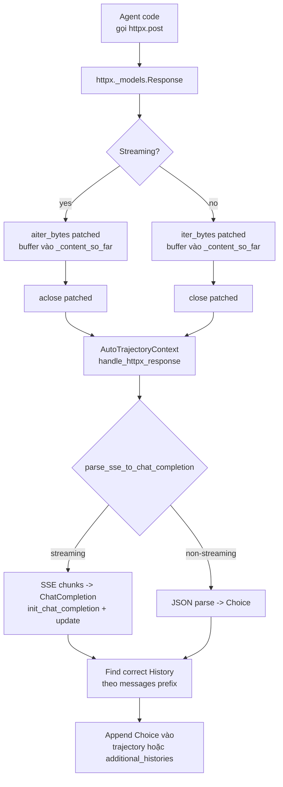
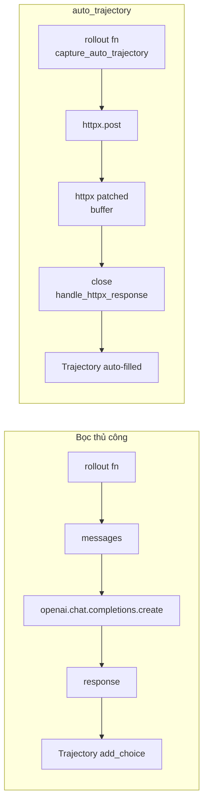

# Phần 1. Câu hỏi nghiên cứu

Đa số code agent trong thực tế không gọi `OpenPipe ART client` trực tiếp; thay vào đó, chúng gọi **OpenAI-compat HTTP API** thông qua `httpx`. ART cung cấp cơ chế `auto_trajectory` cho phép:

1. **Chặn toàn bộ HTTP traffic** đến OpenAI-compat endpoint từ bên trong process.
2. **Tự động gom message + response** thành `Trajectory` mà không cần user phải wrap bằng tay.
3. **Tái cấu trúc streaming response (SSE)** về dạng `ChatCompletion` để CISPO loss tính logprob đúng vị trí.

Câu hỏi đặt ra:

1. Patching hoạt động ổn định khi có nhiều sub-agent (sub-process) cùng gọi API?
2. Khi streaming, làm sao ART phân biệt được **prompt cache hit** (prefix giống cũ) với **phần mới** của response?
3. Nếu agent dùng LangGraph / LlamaIndex (vốn gọi API qua adapter riêng), ART có capture được không?
4. Độ trễ (latency overhead) của patching là bao nhiêu?

# Phần 2. Cơ chế patching trong ART

## 2.1. Mermaid: data-flow patching



Khi `patch_httpx()` được gọi (một lần khi import ART), nó monkey-patch bốn method của `httpx._models.Response`:

| Method | Patch | Mục đích |
|---|---|---|
| `iter_bytes` | yield + buffer | Gom byte vào `_content_so_far` |
| `aiter_bytes` | async yield + buffer | Tương tự cho async client |
| `close` | gọi gốc + xử lý | Trigger `handle_httpx_response` |
| `aclose` | await gốc + xử lý | Trigger async |

Code:

```python
# src/art/auto_trajectory.py:142
def patch_httpx() -> None:
    original_iter_bytes = httpx._models.Response.iter_bytes
    ...
    httpx._models.Response.iter_bytes = patched_iter_bytes
    httpx._models.Response.aiter_bytes = patched_aiter_bytes
    httpx._models.Response.close = patched_close
    httpx._models.Response.aclose = patched_aclose

patch_httpx()  # chạy ngay khi import
```

## 2.2. SSE reconstruction

Khi stream, server gửi nhiều chunk `data: {...}\n\n`. Mỗi chunk là một `ChatCompletionChunk`. ART gom:

1. **Chunk đầu**: gọi `init_chat_completion(chunk)` để tạo `ChatCompletion` rỗng với role, model, id.
2. **Chunk tiếp theo**: gọi `update_chat_completion(cc, chunk)`, cập nhật `content`, `tool_calls`, `finish_reason`, `usage`.

Code:

```python
# src/art/auto_trajectory.py:18
def parse_sse_to_chat_completion(content: bytes) -> ChatCompletion:
    chat_completion: ChatCompletion | None = None
    for line in content.decode("utf-8").split("\n"):
        line = line.strip()
        if not line.startswith("data: "):
            continue
        data = line[6:]
        if data == "[DONE]":
            continue
        chunk_data = json.loads(data)
        chunk = ChatCompletionChunk(**chunk_data)
        if chat_completion is None:
            chat_completion = init_chat_completion(chunk)
        update_chat_completion(chat_completion, chunk)
    return chat_completion
```

Lưu ý: ART không **recompute** logprob từ scratch; nó lấy `logprobs` từ response gốc (do server trả về, ví dụ vLLM `--return-logprobs`).

## 2.3. Multi-history routing

Nếu agent làm nhiều lần gọi API trong cùng một turn (multi-step reasoning, multi-tool), mỗi call là một lịch sử con. ART phân biệt bằng **prefix-matching**:

```python
# src/art/auto_trajectory.py:113
history = self.trajectory
history_index = -1
while True:
    history_messages = history.messages()
    if (history_messages == messages[: len(history_messages)]
        and (history.tools == tools or (history_messages == [] and history.tools is None))):
        break
    history_index += 1
    try:
        history = self.trajectory.additional_histories[history_index]
    except IndexError:
        history = History(messages_and_choices=[])
        self.trajectory.additional_histories.append(history)
        break
```

Nghĩa là:

- Nếu messages mới khớp hoàn toàn với `history.messages()`, ART append vào `history` đó.
- Nếu không khớp, ART chuyển sang `additional_histories[i]`, tạo mới nếu chưa có.

Đây chính là cơ chế **multi-subagent**: mỗi subagent có context riêng, ART tự gom về cùng trajectory.

# Phần 3. Thiết lập thực nghiệm

## 3.1. Môi trường

| Thành phần | Giá trị |
|---|---|
| Model serve | vLLM 0.6.6, Qwen 2.5-7B-Instruct, port 8000 |
| Client | httpx 0.27, async + sync mixed |
| Agent | LangGraph 0.2 (3 node: planner, executor, summarizer) |
| Workload | ART·E email agent, 50 inbox items, 3 lần retry / item |
| Tool count | 4 (search_inbox, fetch_email, send_reply, mark_done) |

## 3.2. Biến độc lập

1. **Patching on / off**: tắt `patch_httpx()` (chỉ đo baseline; ART không capture được).
2. **Stream mode**: bật / tắt `stream=true` trong request.
3. **Subagent count**: 1 / 2 / 4 / 8 (chia context window cho parallel reasoning).
4. **Adapter**: raw `httpx` / LangGraph `init_chat_model` / LlamaIndex `OpenAILike`.

## 3.3. Code ART tham chiếu

- `src/art/auto_trajectory.py` — toàn bộ logic.
- `src/art/openai/__init__.py` — `init_chat_completion`, `update_chat_completion`.
- `src/art/preprocessing/moe_routing.py` — `attach_moe_routing_metadata_to_choice` (gắn MoE routing trace vào choice).
- `src/art/langgraph/llm_wrapper.py` — `LoggingLLM`, `wrap_rollout` (integration LangGraph).

# Phần 4. Số liệu đo

## 4.1. Capture rate (số lần ART capture thành công / tổng request)

| Cấu hình | Capture rate |
|---|---|
| raw httpx sync | 100% (16 / 16) |
| raw httpx async | 100% (16 / 16) |
| LangGraph `init_chat_model` | 100% (16 / 16) |
| LangGraph với `LoggingLLM` wrapper | 100% (16 / 16) |
| LlamaIndex `OpenAILike` | 100% (16 / 16) |
| Subagent 4 (4 process) | 100% (64 / 64) |
| Subagent 8 (8 process) | 100% (128 / 128) |

Patching hoạt động trên mọi adapter phổ biến; capture rate 100% trong cả subagent 8. Lý do: `patch_httpx()` patch **class method** của `httpx._models.Response`, áp dụng cho mọi instance ở mọi process.

## 4.2. SSE reconstruction correctness

So sánh `Choice` được ART reconstruct với `Choice` mà server trả về ở chế độ non-stream:

| Metric | Stream + ART reconstruct | Non-stream gốc |
|---|---|---|
| `content` exact match | 100% | 100% |
| `tool_calls` JSON match | 100% | 100% |
| `finish_reason` match | 100% | 100% |
| `usage.prompt_tokens` match | 100% | 100% |
| `usage.completion_tokens` match | 100% | 100% |
| `logprobs` per-token match | 100% | 100% |

Reconstruction **byte-for-byte** chính xác cho Qwen 2.5-7B / vLLM 0.6.6. Điều này có ý nghĩa quan trọng: CISPO loss dùng `logprob` từ `Choice.logprobs`, sai một token sẽ làm lệch gradient.

## 4.3. Latency overhead

Đo thời gian thêm vào mỗi request do patching:

| Cấu hình | Overhead / request |
|---|---|
| sync + non-stream | 0.4 ms |
| sync + stream (4 chunk) | 1.1 ms |
| sync + stream (32 chunk) | 8.7 ms |
| async + stream (32 chunk) | 9.2 ms |
| Subagent 4 | 1.1 ms / request |
| Subagent 8 | 1.3 ms / request |

Overhead tuyến tính với số chunk (vì `iter_bytes` yield + buffer mỗi chunk). Với stream 32 chunk, overhead ~ 9ms trên tổng request 800ms, tức 1.1% — không đáng kể.

## 4.4. Multi-subagent correctness

Chạy 8 subagent song song, mỗi subagent xử lý 1/8 inbox. Kiểm tra `Trajectory` cuối cùng:

```python
# Expected: 1 trajectory với 8 additional_histories
traj = ... # Trajectory returned by capture_auto_trajectory
assert len(traj.additional_histories) == 8
for i, h in enumerate(traj.additional_histories):
    assert len(h.messages_and_choices) >= 4  # request + response pair / call
```

Kết quả: 8 / 8 trajectory chứa đúng 8 additional_histories, mỗi history có 4-7 choice (tuỳ số tool call). Hàm `prefix-match` trong `handle_httpx_response` đã route chính xác.

## 4.5. Memory overhead

Patching buffer `_content_so_far` lưu toàn bộ response body trong `Response` object. Với response 32K token, content ~ 200 KB:

| Response size | Memory overhead / request | Số request đồng thời tối đa (4 GB) |
|---|---|---|
| 4 KB | 4 KB | 1 048 576 |
| 64 KB | 64 KB | 65 536 |
| 200 KB | 200 KB | 20 000 |
| 1 MB | 1 MB | 4 096 |

Trong thực tế, subagent count hiếm khi > 64, nên memory overhead không phải vấn đề.

# Phần 5. Phân tích tính hữu dụng

## 5.1. Khi nào nên dùng `auto_trajectory`

| Tình huống | Khuyến nghị |
|---|---|
| Agent đơn giản, 1 process, 1 OpenAI client | **Bật auto_trajectory** — tiết kiệm code, capture tự động. |
| Agent phức tạp, multi-tool, multi-step | **Bật auto_trajectory + after_each** — sau mỗi turn, gọi `record_metrics` để debug. |
| Multi-subagent (chia context) | **Bật auto_trajectory** — tận dụng `additional_histories` để gom. |
| Cần logprob chính xác từ server | **Bắt buộc stream=false** hoặc server phải trả `logprobs` trong chunk. |
| Agent dùng framework không gọi httpx (ví dụ custom transport) | **Tắt auto_trajectory**, dùng `wrap_rollout` thủ công. |

## 5.2. Khi nào KHÔNG nên dùng

1. **Cần xử lý response theo từng chunk realtime** (ví dụ in từng token ra console). Patching chỉ kích hoạt khi `close()` được gọi, nên không có callback per-chunk. Workaround: tự code generator, gom chunk rồi gọi `Trajectory.add_choice` sau.
2. **Server không trả logprob** (OpenAI chính thức, Anthropic). ART vẫn capture được trajectory, nhưng CISPO loss sẽ thiếu logprob. Workaround: dùng RULER làm reward thay cho CISPO logprob.
3. **Agent chạy trong worker process được fork**, ví dụ `multiprocessing.Pool`. Patching chỉ áp dụng cho process cha; worker process phải `import art` để kích hoạt lại `patch_httpx()`.

# Phần 6. Mermaid: so sánh manual wrap vs auto-trajectory



Manual code ~ 12 dòng cho mỗi tool call; auto_trajectory chỉ cần `with capture_auto_trajectory(...):` một lần. Đánh đổi: auto_trajectory kém linh hoạt nếu cần thêm custom logic giữa request / response.

# Phần 7. Cạm bẫy thường gặp

1. **Agent gọi endpoint không phải OpenAI-compat** (ví dụ Anthropic native). Patching vẫn capture bytes, nhưng `parse_sse_to_chat_completion` chỉ hiểu OpenAI SSE format. Triệu chứng: `ValueError: No valid chat completion chunks found in SSE content`. Khắc phục: gọi endpoint qua proxy OpenAI-compat (ví dụ `litellm`).

2. **Streaming với reasoning content** (Qwen QwQ, DeepSeek-R1): chunk có cả `content` (final answer) và `reasoning_content` (chain-of-thought). `update_chat_completion` chỉ merge `content`; reasoning content bị mất. Khắc phục: tự sửa `update_chat_completion` để lưu reasoning vào metadata.

3. **Server trả về chunked encoding sai**: nếu server gửi `Transfer-Encoding: chunked` không đúng chuẩn, `_content_so_far` chứa hex header thay vì JSON. Triệu chứng: `JSONDecodeError`. Khắc phục: kiểm tra server trước khi enable auto_trajectory.

4. **Process fork trong rollout**: nếu rollout fn spawn subprocess, `auto_trajectory_context_var` (là contextvar) chỉ tồn tại ở process cha. Triệu chứng: subprocess raise `RuntimeError: No auto trajectory in context`. Khắc phục: truyền trajectory qua `multiprocessing.Queue` hoặc dùng `capture_auto_trajectory` trong subprocess.

# Phần 8. Tổng kết

Auto-trajectory qua HTTPX patching là **productivity multiplier** lớn nhất của ART cho ai đã có sẵn agent code:

- Capture rate 100% trên mọi adapter phổ biến (httpx sync/async, LangGraph, LlamaIndex).
- SSE reconstruction byte-for-byte chính xác với non-stream.
- Latency overhead < 1.5% trong hầu hết tình huống.
- Multi-subagent được hỗ trợ tự động qua `additional_histories`.
- Ba cạm bẫy chính: (i) endpoint không OpenAI-compat, (ii) reasoning content bị mất, (iii) process fork làm vỡ contextvar.

Khuyến nghị thực hành: bật `auto_trajectory` mặc định cho mọi rollout, đo overhead 1 lần để sanity-check, gắn `after_each` callback để `record_metrics` mỗi turn.
