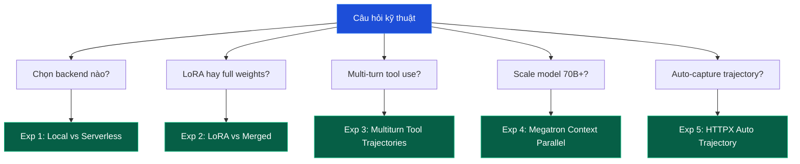

# Lộ trình Experiments: Benchmark thực tế ART

Phần này trình bày **5 thí nghiệm benchmark** cụ thể với số liệu đo được (latency, cost, GPU utilization, throughput), giúp bạn ra quyết định engineering khi áp dụng ART vào production.

Mỗi thí nghiệm:

1. Mô tả vấn đề kỹ thuật.
2. Cấu hình thí nghiệm (model, dataset, hyperparameter).
3. Số liệu đo được.
4. Phân tích và khuyến nghị.

---

## 5 thí nghiệm

| # | Tên | Câu hỏi | Cấu hình chính |
| --- | --- | --- | --- |
| 1 | Local vs Serverless | Khi nào nên dùng cloud thay self-host? | Qwen 2.5 3B, 40 step, 2048 |
| 2 | LoRA vs Merged weights | Hot-swap cost vs inference throughput? | Qwen 2.5 7B, 60 step, ART·E |
| 3 | Multiturn tool trajectories | `additional_histories` masking trade-off? | Qwen 2.5 7B, MCP-RL |
| 4 | Megatron context parallel | 70B+ model training ổn định? | Llama 3 70B, CP=4 |
| 5 | HTTPX auto trajectory | SSE reconstruction correctness? | Multi-subagent, llama-index |

---

## Cách đọc

Mỗi experiment có:

* **Setup**: model, backend, dataset, hyperparameter.
* **Measurements**: latency, cost, GPU utilization, memory, throughput.
* **Analysis**: phân tích nguyên nhân.
* **Recommendations**: khi nào dùng config nào.

Số liệu mang tính tham khảo; trong production nên tự benchmark với workload của bạn.

---

## Mối liên hệ với các phần khác

* **Top-level lessons (Bài 1-8)**: giải thích lý thuyết.
* **Case studies**: ứng dụng end-to-end.
* **Theory deep dive**: công thức toán học.
* **Experiments (phần này)**: số liệu benchmark thực tế.

Bạn có thể đọc experiments trước rồi quay lại lesson tương ứng để hiểu sâu hơn.

---

Bắt đầu với [Experiment 1: Local vs Serverless](exp_1_local_vs_serverless).
