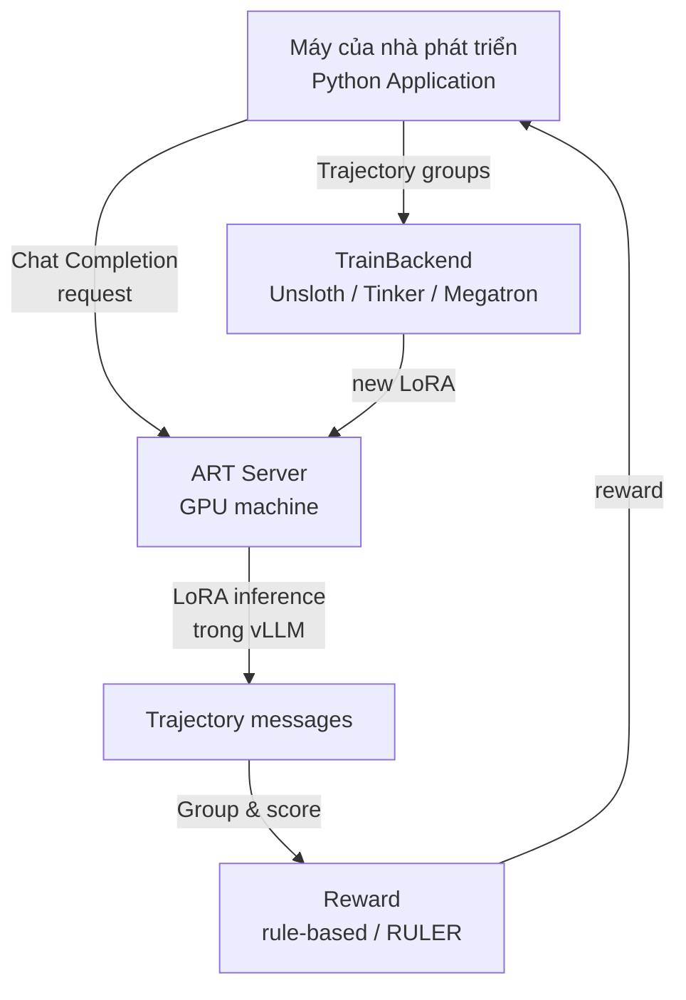
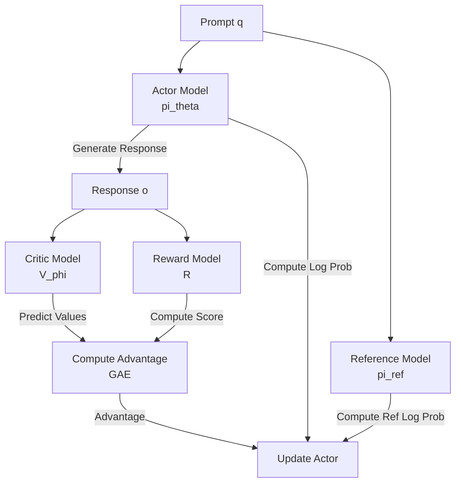

# Bài 0: Nền tảng GRPO & Agentic Reinforcement Learning

Để hiểu được lý do tại sao thư viện **ART (Agent Reinforcement Trainer)** ra đời và cách nó tối ưu hóa hệ thống cho các tác nhân LLM, trước tiên chúng ta phải nắm vững nền tảng lý thuyết về **Agentic Reinforcement Learning** (Học tăng cường cho tác nhân) và hai thuật toán RL phổ biến nhất hiện nay cho LLM: **PPO (Proximal Policy Optimization)** và **GRPO (Group Relative Policy Optimization)**. Bài học này đặt nền móng cho toàn bộ giáo trình.

---

## 1. Tại sao tác nhân (Agent) LLM cần RL?

Các mô hình ngôn ngữ lớn (LLM) sau giai đoạn tiền huấn luyện (Pre-training) chỉ đơn thuần là các máy dự đoán token tiếp theo cực mạnh. Khi được tích hợp thành các tác nhân có khả năng gọi công cụ (tool use), MCP server, hay thực hiện nhiều bước suy luận để giải quyết vấn đề phức tạp, chúng bộc lộ nhiều hạn chế:
- Tạo ra thông tin sai lệch (hallucination), đặc biệt khi gọi tool sai hoặc suy luận sai chuỗi.
- Không tận dụng được phản hồi từ môi trường (tool response, search result) một cách ổn định.
- Khó cải thiện từ trải nghiệm thực tế.

Để giải quyết vấn đề này, tác nhân cần trải qua quá trình **Alignment** thông qua ba giai đoạn phổ biến:

1. **SFT (Supervised Fine-Tuning)**: Huấn luyện mô hình bắt chước các cặp (prompt, trajectory mẫu) do con người viết sẵn. SFT đơn giản nhưng giới hạn bởi chất lượng dữ liệu mẫu.
2. **DPO (Direct Preference Optimization)**: Tối ưu hóa trực tiếp từ dữ liệu ưu tiên (tốt hơn/tệ hơn) mà không cần mạng RL. DPO dễ chạy nhưng có thể mất ổn định khi mô hình dịch chuyển xa khỏi phân phối dữ liệu ban đầu.
3. **RLHF / Agentic RL**: Huấn luyện tác nhân tự khám phá các trajectory khác nhau, nhận reward (từ rule-based, judge model, hoặc RULER) và cập nhật trọng số. Agentic RL đặc biệt mạnh cho các tác vụ tool use và multi-turn nhờ khả năng tự sửa lỗi trong chu kỳ huấn luyện.

ART tập trung mạnh vào giai đoạn 3, cung cấp một harness gọn nhẹ để biến bất kỳ ứng dụng agent Python nào thành một hệ thống RL chuẩn bị cho training.

---

## 2. Tổng quan về ART: Triết lý Client/Server

Khác với các framework RL nặng nề truyền thống (như `verl` yêu cầu Ray cluster, FSDP sharding phức tạp), ART chọn triết lý **Client/Server đơn giản**:

### 2.1. Hai thực thể chính
ART được chia thành hai phần rõ rệt:

1. **Client (Python application)**: Chạy trên máy của nhà phát lý, thậm chí là laptop không có GPU. Có nhiệm vụ:
   - Định nghĩa `TrainableModel` và gọi `model.register(backend)`.
   - Thực hiện các rollout (multi-turn, tool use) thông qua OpenAI-compatible client.
   - Gán reward cho từng Trajectory (rule-based hoặc qua RULER).
   - Gửi các `TrajectoryGroup` cho `backend.train(...)`.

2. **Server (GPU backend)**: Chạy trên máy có GPU, có nhiệm vụ:
   - Chạy vLLM với LoRA mới nhất để sinh completion.
   - Nhận các `TrajectoryGroup` từ Client, huấn luyện bằng GRPO/CISPO.
   - Lưu LoRA mới vào local directory và tải lại vào vLLM.
   - Block inference trong khi training.

### 2.2. Vòng lặp huấn luyện cốt lõi
Theo tài liệu chính thức của ART, vòng lặp huấn luyện gồm hai pha:

**Pha 1: Inference**
1. Code của bạn dùng ART client để thực hiện một agentic workflow (thường chạy song song nhiều rollout để thu thập dữ liệu nhanh hơn).
2. Các completion request được định tuyến đến ART server, server chạy LoRA mới nhất trong vLLM.
3. Khi tác nhân thực thi, mỗi message `system`, `user`, `assistant` được lưu vào một `Trajectory`.
4. Khi rollout kết thúc, code của bạn gán một `reward` cho Trajectory đó.

**Pha 2: Training**
1. Khi mỗi rollout kết thúc, các `Trajectory` được nhóm lại thành `TrajectoryGroup` và gửi đến server. Inference bị block trong khi training chạy.
2. Server huấn luyện mô hình bằng GRPO/CISPO, khởi tạo từ checkpoint mới nhất (hoặc LoRA rỗng ở iteration đầu).
3. Server lưu LoRA mới vào thư mục local và load lại vào vLLM.
4. Inference được unblock và vòng lặp tiếp tục từ bước 1.

Vòng lặp này chạy cho đến khi đạt đủ số inference và training iteration đã định.

---

## 3. Thuật toán PPO (Proximal Policy Optimization) trong RLHF

PPO là thuật toán học tăng cường dựa trên Policy Gradient, được OpenAI sử dụng để huấn luyện ChatGPT.

### 3.1. Cấu trúc 4 mô hình của PPO
Một hệ thống PPO tiêu chuẩn yêu cầu tải đồng thời 4 mô hình lớn lên GPU:

1. **Actor ($\pi_\theta$)**: Mô hình đích cần huấn luyện, sinh ra response.
2. **Reference ($\pi_{ref}$)**: Mô hình đóng băng, dùng để tính KL Divergence.
3. **Critic ($V_\phi$)**: Mạng ước lượng giá trị (Value Network), giúp giảm phương sai của Policy Gradient.
4. **Reward ($R$)**: Mô hình tính điểm thưởng (Reward Network).

### 3.2. Công thức toán học cốt lõi
Mục tiêu của PPO là tối ưu hóa hàm Surrogate Loss bị cắt (clipped surrogate objective):

$$L^{CLIP}(\theta) = \hat{\mathbb{E}}_t \left[ \min\left(r_t(\theta)\hat{A}_t, \text{clip}(r_t(\theta), 1-\epsilon, 1+\epsilon)\hat{A}_t\right) \right]$$

Trong đó:
- Tỷ lệ xác suất: $r_t(\theta) = \frac{\pi_\theta(a_t | s_t)}{\pi_{\theta_{old}}(a_t | s_t)}$
- $\hat{A}_t$ là Lợi thế (Advantage) được tính qua GAE từ Critic và Reward.
- KL Penalty: $R_{KL}(s_t, a_t) = R(s_t, a_t) - \beta \log \frac{\pi_\theta(a_t | s_t)}{\pi_{ref}(a_t | s_t)}$

---

## 4. Thuật toán GRPO (Group Relative Policy Optimization)

Được giới thiệu bởi DeepSeek, **GRPO** là một bước đột phá giúp giảm đáng kể chi phí phần cứng và cải thiện hiệu năng huấn luyện các mô hình lý luận (Reasoning models).

### 4.1. Tại sao GRPO loại bỏ Critic?
Trong PPO, mô hình Critic $V_\phi$ có dung lượng bộ nhớ lớn tương đương Actor. Việc tải đồng thời 4 mô hình lớn khiến GPU dễ bị OOM hoặc giới hạn batch size. GRPO loại bỏ hoàn toàn Critic bằng cách so sánh tương đối kết quả giữa các nhóm response. Thay vì dùng Critic, GRPO sinh ra một nhóm gồm $G$ response cho cùng một prompt và lấy điểm trung bình của nhóm làm baseline.

### 4.2. Quy trình và toán học của GRPO
Với mỗi prompt $q$:

1. Sinh ra nhóm $G$ response: $\{o_1, o_2, ..., o_G\}$ từ chính sách hiện tại $\pi_\theta$.
2. Đánh giá tất cả response bằng hàm thưởng $R$ để thu về tập điểm: $\{r_1, r_2, ..., r_G\}$.
3. Tính Lợi thế tương đối (Relative Advantage) $A_i$ bằng cách chuẩn hóa điểm số trong nhóm:

$$A_i = \frac{r_i - \text{mean}(R)}{\text{std}(R)}$$

4. Hàm mục tiêu GRPO:
$$J_{GRPO}(\theta) = \frac{1}{G} \sum_{i=1}^G \sum_{t=1}^T \left[ \min\left( \frac{\pi_\theta(o_{i,t} | q, o_{i,<t})}{\pi_{\theta_{old}}(o_{i,t} | q, o_{i,<t})} A_i, \text{clip}\left(\frac{\pi_\theta(o_{i,t} | q, o_{i,<t})}{\pi_{\theta_{old}}(o_{i,t} | q, o_{i,<t})}, 1-\epsilon, 1+\epsilon\right) A_i \right) - \beta D_{KL}(\pi_\theta || \pi_{ref}) \right]$$

Trong đó $D_{KL}$ dùng estimator xấp xỉ K3 của Schulman:
$$D_{KL}(\pi_\theta || \pi_{ref}) = \frac{\pi_{ref}(o_{i,t} | q, o_{i,<t})}{\pi_\theta(o_{i,t} | q, o_{i,<t})} - \log \frac{\pi_{ref}(o_{i,t} | q, o_{i,<t})}{\pi_\theta(o_{i,t} | q, o_{i,<t})} - 1$$

---

## 5. Bốn thực thể dữ liệu cốt lõi của ART

ART có 4 thực thể dữ liệu chính mà mọi kỹ sư phải nắm vững:

1. **TrainableModel** (`src/art/model.py`): Lớp client đại diện cho mô hình. Bao gồm `name`, `project`, `base_model`, `LoRAConfig`, và các config inference. Hỗ trợ OpenAI-compatible API để gọi inference.
2. **Trajectory** (`src/art/trajectories.py`): Một lần thực thi hoàn chỉnh của tác nhân cho một scenario. Lưu trữ `messages_and_choices` (bao gồm token logprobs), `additional_histories` (cho multi-turn), `reward`, `metrics`, `metadata`.
3. **TrajectoryGroup** (`src/art/trajectories.py`): Một nhóm các Trajectory cho cùng một scenario. Thường gồm 4-16 trajectory để GRPO tính group statistics.
4. **Backend** (`src/art/backend.py`): Protocol định nghĩa cách huấn luyện. Có nhiều hiện thực: `LocalBackend`, `ServerlessBackend`, `TinkerBackend`, `TinkerNativeBackend`, Megatron.

---

## 6. So sánh tổng quan PPO vs GRPO

| Tiêu chí | PPO (Standard) | GRPO (DeepSeek Style) |
| :--- | :--- | :--- |
| **Yêu cầu mô hình** | Actor, Reference, Critic, Reward (4) | Actor, Reference, Reward (3, không cần Critic) |
| **Hao phí VRAM** | Rất cao (Critic chiếm dung lượng lớn) | Thấp hơn khoảng 30-40% nhờ bỏ Critic |
| **Ước lượng baseline** | Sử dụng mạng neural Critic ($V_\phi$) | Trung bình reward của nhóm rollout |
| **Số lượng rollout** | Thường $N=1$ hoặc $N=2$ mỗi prompt | Lớn hơn nhiều ($G=4$ đến $G=16$) |
| **Khả năng multi-turn** | Cần masking cẩn thận observation token | Phù hợp tự nhiên, mask `assistant_mask` |
| **Áp dụng trong ART** | Hỗ trợ qua `ppo=True` flag | Mặc định (CISPO loss variant) |

Sự tinh giản của GRPO giúp ART dễ dàng tích hợp vào bất kỳ ứng dụng Python nào. Trong các bài học tiếp theo, chúng ta sẽ xem cách ART hiện thực hóa các vai trò này thông qua Client/Server split.
