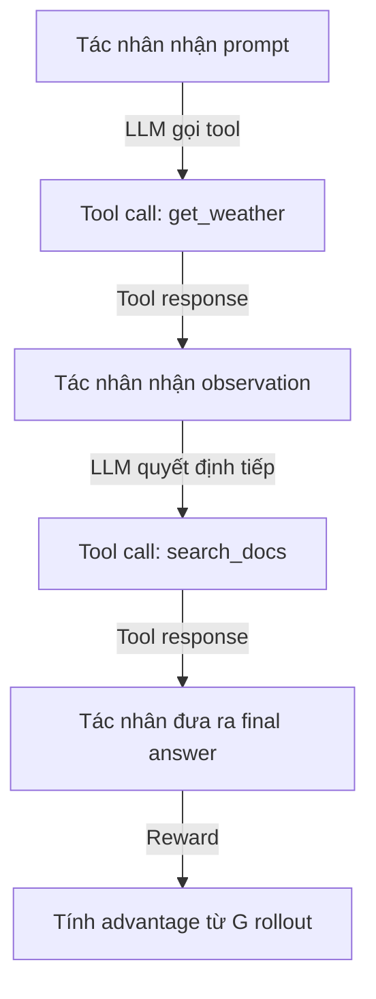
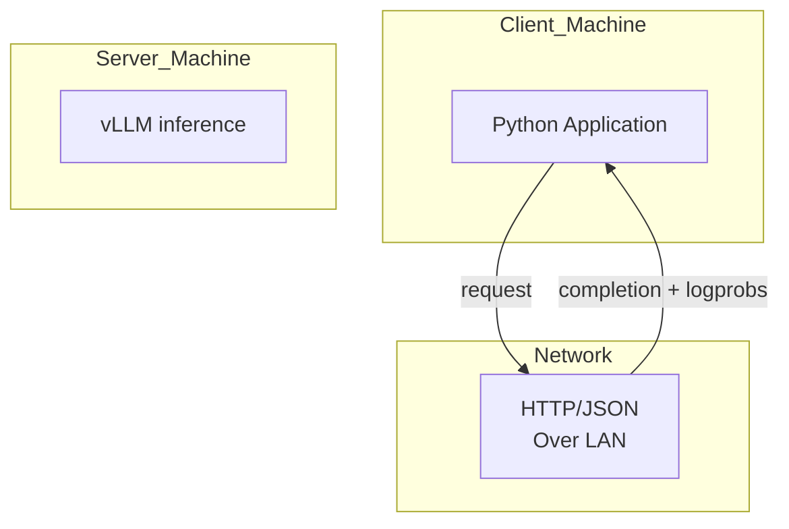
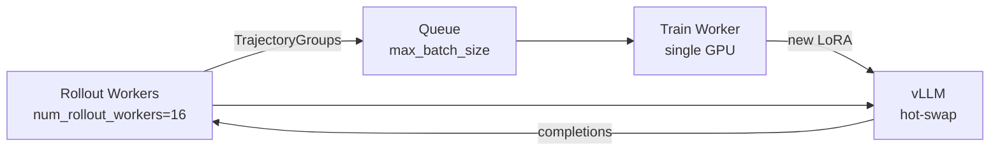

# Bài 1: Thách thức Kỹ thuật trong Agentic RL

Bài học này phân tích các thách thức hệ thống cốt lõi mà ART phải giải quyết để huấn luyện các tác nhân LLM multi-turn có sử dụng tool. Nếu bạn đã quen thuộc với các framework RL truyền thống (như `verl` hay `trl`), bạn sẽ thấy ART đưa ra những quyết định thiết kế rất khác biệt, tối ưu cho sự đơn giản và ergonomics.

---

## 1. Thách thức #1: Chu kỳ Multi-turn, Tool Use và Stateful Execution

Khác với SFT hay RL cho chatbot đơn lượt, agentic RL phải đối mặt với một vòng lặp huấn luyện phức tạp hơn rất nhiều:



Các đặc thù của multi-turn agentic RL:

1. **Stateful execution**: Tác nhân phải duy trì context qua nhiều lượt, với `messages` được nối dài liên tục. Trong ART, điều này được xử lý bởi `additional_histories` trong `Trajectory`.

2. **Tool calls không đồng bộ**: Khi tác nhân gọi tool, hệ thống phải chờ tool response (HTTP request, database query, browser navigation) trước khi tiếp tục. ART xử lý điều này thông qua `asyncio.gather` trong `gather_trajectory_groups`.

3. **Chi phí context window**: Một trajectory 10 lượt có thể tốn 5000-20000 tokens. Điều này đặt áp lực lên cả inference (KV cache) và training (memory cho long sequences).

4. **Reward thưa thớt (sparse reward)**: Hầu hết các lượt trung gian không có reward, chỉ lượt cuối mới có. GRPO giải quyết vấn đề này bằng cách gán cùng reward cho toàn bộ group, giúp advantage phân bố đều qua các lượt.

### 1.1. Hệ quả: Cần mask observation token khi tính loss
Trong training, nếu ta không che (mask) các token observation (token do tool sinh ra, không phải do LLM sinh), Actor sẽ học cách dự đoán môi trường, điều vô nghĩa. ART giải quyết bằng `assistant_mask` trong `loss.py`:

```python
# Trong LossInputs.align_inputs
assistant_mask=shift_tensor(inputs["assistant_mask"], False),
```

Chỉ các token do assistant sinh ra mới được tính vào policy loss. Các token do tool, system, user sinh ra đều được mask bằng 0.

---

## 2. Thách thức #2: Memory Bottleneck khi tải đồng thời nhiều mô hình

Trong vòng lặp RL truyền thống, hệ thống cần chạy song song 3-4 mô hình lớn:

| Thực thể | Kích thước điển hình | Vai trò |
| :--- | :--- | :--- |
| Actor (FP16) | 7B: 14 GB, 70B: 140 GB | Sinh rollout và cập nhật gradient |
| Reference (FP16) | 7B: 14 GB, 70B: 140 GB | Tính KL penalty, frozen |
| Critic (PPO only) | 7B: 14 GB, 70B: 140 GB | Ước lượng Value (bị ART bỏ qua) |
| LoRA adapter (BFloat16) | 7B LoRA r=16: ~30 MB | Adapter cho Actor trong vLLM |

Với một model 7B:
- Tải Actor + Reference + LoRA = ~28 GB VRAM
- Khi thêm Optimizer state (Adam: 2x params = 28 GB), Gradient buffer (28 GB), và Activations = trên 80 GB VRAM cần thiết.

Hầu hết GPU tiêu dùng (RTX 4090 24 GB, A6000 48 GB) không thể chứa nổi.

### 2.1. Giải pháp của ART: LoRA-first, separation of concerns
ART chọn triết lý **LoRA-first**:
- Base model được load ở FP16 trong vLLM, không cần copy.
- Reference model dùng chính base model với KL ref adapter qua `kl_ref_adapter_path` (thường là base model với adapter trống).
- Optimizer chỉ cập nhật LoRA weights (~30 MB thay vì 14 GB).

Điều này giảm VRAM xuống còn ~16 GB cho model 7B với LoRA r=16, cho phép chạy trên GPU 24 GB.

### 2.2. Khi nào cần Megatron?
Với model > 30B (như Qwen 2.5 32B, 72B), ngay cả LoRA cũng cần Context Parallelism (CP) và Tensor Parallelism (TP) để vừa VRAM. ART hỗ trợ điều này qua thư mục `src/art/megatron/` với:
- `megatron/context_parallel/` (ring-attention)
- `megatron/lora.py` (LoRA trong Megatron)
- `megatron/runtime.py` (104 KB quản lý CP execution)

---

## 3. Thách thức #3: Độ trễ mạng giữa Inference và Training

ART dùng kiến trúc Client/Server, nghĩa là Client (Python application) và Server (GPU backend) có thể chạy trên hai máy khác nhau. Điều này tạo ra một vấn đề độ trễ cổ điển:



### 3.1. Ba loại overhead
1. **HTTP serialization**: OpenAI API yêu cầu JSON encode/decode. Một completion 1000 tokens cỡ 4-8 KB.
2. **Tensor transfer**: Khi chuyển logprobs từ Server về Client để tính reward và pack thành batch, tensor lớn có thể tốn vài MB.
3. **Weight transfer ngược**: Sau khi training xong, Server phải load LoRA mới vào vLLM. Với LoRA 30 MB và băng thông PCIe 32 GB/s, đây là 1 ms. Nhưng nếu dùng NCCL broadcast (nhiều GPU), có thể là 10-100 ms.

### 3.2. Giải pháp của ART
- **`auto_trajectory` HTTPX patching** (`src/art/auto_trajectory.py`): Tự động capture mọi chat completion request qua httpx, giảm boilerplate.
- **`ManagedVllmRuntime`** (`src/art/vllm_runtime.py`): Tự động quản lý vLLM subprocess, theo dõi port, restart khi crash.
- **`TrainerNcclCommunicator`** (`src/art/weight_transfer/nccl.py`): Broadcast LoRA từ trainer process sang vLLM workers qua NCCL, đạt tốc độ gần PCIe bandwidth.
- **`packed_tensor.PackedBroadcast`**: Gộp nhiều tensor nhỏ thành buffer lớn để giảm overhead.

---

## 4. Thách thức #4: Khả năng mở rộng (Scalability)

Một pipeline agentic RL điển hình cần:

1. **Hàng nghìn rollout song song**: Một training step có thể cần 64-256 scenarios, mỗi scenario 4-16 rollout, tổng cộng 256-4096 trajectory.

2. **Reward computation không đồng bộ**: Rule-based reward nhanh, nhưng RULER (LLM-as-judge) có thể mất vài giây mỗi group.

3. **Checkpoints liên tục**: Mỗi training step tạo một LoRA checkpoint mới. Sau 1000 steps có 1000 checkpoints, tổng dung lượng có thể > 30 GB.

### 4.1. Pipeline 3 giai đoạn của ART
ART giải quyết bằng `PipelineTrainer` (`src/art/pipeline_trainer/trainer.py`) với 3 giai đoạn chạy song song:



- **Giai đoạn 1 (Rollout)**: Nhiều worker chạy song song, mỗi worker gọi vLLM để sinh completion, thu thập Trajectory, gán reward.
- **Giai đoạn 2 (Training)**: Một worker duy nhất lấy batch từ queue, gọi `backend.train()` để cập nhật LoRA.
- **Giai đoạn 3 (Evaluation)**: Định kỳ chạy eval_fn trên held-out scenarios.

Việc tách 3 giai đoạn cho phép training step không phải block hoàn toàn inference, tăng GPU utilization lên > 80%.

---

## 5. Thách thức #5: Tích hợp liền mạch vào ứng dụng hiện có

Một yêu cầu cốt lõi của ART là "Train from anywhere" - nghĩa là người dùng có thể thêm RL training vào ứng dụng Python hiện có mà không phải viết lại từ đầu.

### 5.1. OpenAI-compatible API
ART thiết kế `TrainableModel` để tương thích hoàn toàn với OpenAI Chat Completions API:

```python
import art
from openai import AsyncOpenAI

model = art.TrainableModel(
    project="my-agent",
    name="agent-v1",
    base_model="Qwen/Qwen2.5-7B-Instruct",
)

# Sử dụng như OpenAI client
client = model.openai_client()  # AsyncOpenAI instance
response = await client.chat.completions.create(
    model=model.name,
    messages=[{"role": "user", "content": "Hello!"}],
)
```

Điều này có nghĩa là bất kỳ code nào dùng OpenAI SDK đều có thể được "bọc" bằng ART với thay đổi tối thiểu.

### 5.2. Tự động capture trajectory
Để không yêu cầu người dùng viết code tracking, ART patch `httpx._models.Response.iter_bytes/aclose` để tự động capture mọi response:

```python
from art import auto_trajectory, capture_auto_trajectory

async with capture_auto_trajectory() as trajectory:
    # Bất kỳ OpenAI client call nào trong khối này
    # đều tự động được capture vào trajectory
    response = await client.chat.completions.create(...)
# trajectory giờ chứa messages + reward
```

Cơ chế này được gọi là **transparent trajectory capture** và là một trong những điểm sáng giá nhất của ART so với các framework khác.

---

## 6. Tổng hợp: Bảng so sánh ART với các framework RL khác

| Tiêu chí | verl | trl | ART |
| :--- | :--- | :--- | :--- |
| **Triết lý** | Distributed RLHF cluster | Single-GPU SFT/RL | Client/Server agentic RL |
| **Backend chính** | FSDP, Megatron-LM | Transformers | Unsloth, vLLM, Tinker, Megatron |
| **Multi-turn agent** | Hỗ trợ qua custom code | Không native | Native, first-class |
| **Tool use / MCP** | Qua custom env | Không | Native (qua `art.mcp`, `art.langgraph`) |
| **Reward design** | Rule + reward model | Rule | Rule + RULER LLM-as-judge |
| **Cấu hình** | Hydra YAML | Script args | Pydantic models |
| **Khả năng mở rộng** | Hàng trăm GPU | 1-8 GPU | 1 GPU local đến 671B qua Megatron |

Sự khác biệt cốt lõi: **ART tối ưu cho sự đơn giản và ergonomics**, trong khi `verl` tối ưu cho distributed training ở quy mô cực lớn. Nếu bạn muốn train một agent 7B trên task cụ thể với 1-2 GPU, ART là lựa chọn tốt hơn. Nếu bạn muốn train 671B MoE trên cụm 100+ GPU, bạn cần `verl` hoặc `megatron` qua ART.

Trong bài tiếp theo, chúng ta sẽ đi sâu vào kiến trúc Client/Server và cách ART đạt tính tương thích OpenAI.
