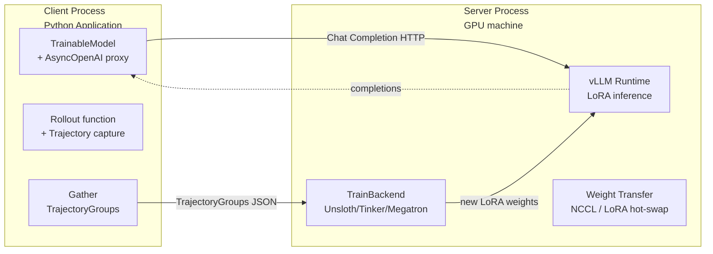
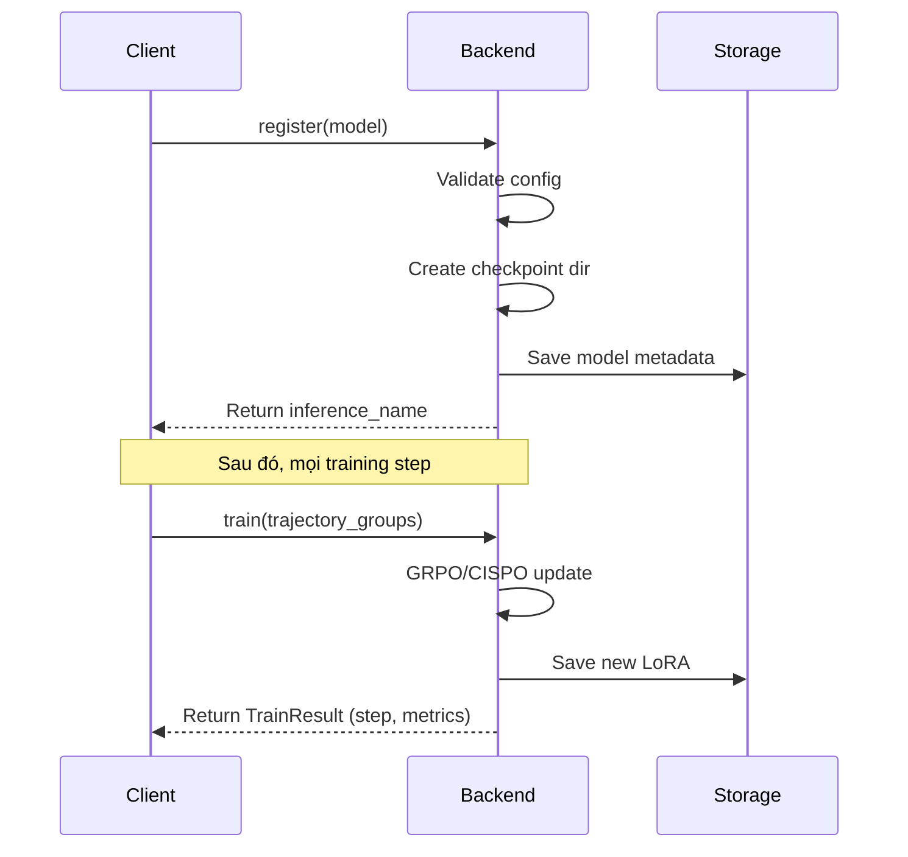

# Bài 2: Kiến trúc Client/Server & OpenAI-compatible API

Bài học này đi sâu vào triết lý thiết kế Client/Server của ART, cách `TrainableModel` hoạt động như một proxy OpenAI-compatible, và cơ chế HTTPX patching cho phép capture trajectory một cách trong suốt. Đây là nền tảng để hiểu mọi tính năng nâng cao của ART.

---

## 1. Triết lý Client/Server

ART được thiết kế với triết lý **"Train from anywhere"**: cho phép huấn luyện agent LLM từ bất kỳ máy client nào (kể cả laptop không có GPU) miễn là có thể kết nối HTTP đến một ART server.



### 1.1. Lợi ích của việc tách Client/Server
1. **Tính di động (Portability)**: Người dùng viết code Python trên laptop, chạy training trên GPU cluster từ xa.
2. **Multi-tenant**: Nhiều client có thể chia sẻ một server (qua W&B Serverless RL).
3. **Tính độc lập của logic nghiệp vụ**: Logic reward, scenario, environment tách biệt khỏi training infrastructure.
4. **Khả năng swap backend**: Đổi từ LocalBackend sang ServerlessBackend chỉ cần 1 dòng code.

### 1.2. Trách nhiệm rõ ràng của mỗi bên

**Client chịu trách nhiệm:**
- Định nghĩa `TrainableModel` (tên, base model, LoRA config).
- Viết rollout function (async, multi-turn).
- Capture Trajectory thông qua `auto_trajectory` hoặc explicit `yield_trajectory`.
- Gán reward cho mỗi Trajectory.
- Gửi `TrajectoryGroup` đến `backend.train()`.

**Server chịu trách nhiệm:**
- Khởi động vLLM với LoRA adapter tương ứng.
- Nhận OpenAI-compatible chat completion request, chạy inference.
- Nhận `TrajectoryGroup` JSON, khởi động training (block inference).
- Lưu LoRA mới, hot-swap vào vLLM.
- Unblock inference cho iteration tiếp theo.

---

## 2. TrainableModel - Lớp Client đại diện cho mô hình

`TrainableModel` được định nghĩa trong `src/art/model.py` (1271 dòng), là lớp cốt lõi phía Client. Nó kế thừa từ `Model` (chỉ inference) và bổ sung khả năng training.

### 2.1. Cấu trúc chính

```python
# src/art/model.py
class TrainableModel(BaseModel, Generic[StateType]):
    # Định danh
    project: str
    name: str
    base_model: str

    # LoRA configuration
    lora_config: LoRAConfig | None = None
    peft_args: PeftArgs | None = None

    # Training configuration
    trainer_args: TrainerArgs | None = None

    # State (cho checkpoint resumption)
    state: StateType = field(default_factory=dict)

    # OpenAI-compatible client (proxy đến ART server)
    _openai_client: AsyncOpenAI | None = None
```

### 2.2. Một số phương thức quan trọng

```python
async def register(self, backend: Backend) -> None:
    """Đăng ký model với backend, tạo checkpoint entry."""

async def openai_client(self) -> AsyncOpenAI:
    """Trả về AsyncOpenAI client trỏ đến ART server."""

async def train(
    self,
    trajectory_groups: Iterable[TrajectoryGroup],
    backend: Backend,
    **config_overrides,
) -> TrainResult:
    """Huấn luyện một step dựa trên trajectory_groups."""
```

### 2.3. Pydantic ConfigDict cho Serialization
`TrainableModel` sử dụng Pydantic `BaseModel` để serialization/deserialization. Điều này cho phép:
- Tự động chuyển đổi thành JSON khi gửi qua HTTP đến server.
- Validate kiểu dữ liệu ở cả hai phía.
- Hỗ trợ `arbitrary_types_allowed=True` cho các kiểu như `httpx.AsyncClient`.

---

## 3. OpenAI-Compatible API - Sức mạnh của Proxy Pattern

Điểm sáng giá nhất của ART là khả năng "vừa là client OpenAI, vừa là training framework". Bí mật nằm ở lớp `_OpenAIChatCompletionsProxy` trong `src/art/model.py`.

### 3.1. Cấu trúc Proxy
```python
class _OpenAIChatCompletionsProxy:
    def __init__(self, completions, record_costs, default_extra_body):
        self._completions = completions
        self._record_costs = record_costs
        self._default_extra_body = default_extra_body

    async def create(self, *, model, messages, tools=None, **kwargs):
        # 1. Inject extra body cho ART server (vd: served_model_name, lora_path)
        merged = _merge_extra_body_defaults(
            self._default_extra_body or {},
            kwargs.pop("extra_body", None),
        )
        # 2. Gọi real completions endpoint (OpenAI SDK)
        response = await self._completions.create(
            model=model, messages=messages, tools=tools,
            extra_body=merged, **kwargs,
        )
        # 3. Record costs (nếu có)
        await self._record_costs(response)
        return response
```

### 3.2. Luồng xử lý một request
Khi người dùng gọi `client.chat.completions.create(model=model.name, messages=...)`:

1. Proxy nhận request, inject ART-specific `extra_body` (ví dụ: tham chiếu đến LoRA adapter cụ thể).
2. OpenAI SDK gửi HTTP request đến ART server (vLLM đang chạy).
3. ART server nhận request, chạy inference với LoRA trong vLLM.
4. Response (completion + logprobs) trả về qua HTTP.
5. Proxy tự động record cost (nếu `MetricsBuilder` đang active).
6. HTTPX patching ở mức thấp hơn capture response vào `Trajectory`.

### 3.3. Tại sao OpenAI-compatible?
- **Hệ sinh thái rộng**: Bất kỳ code nào dùng `openai` SDK đều có thể switch sang ART chỉ với 1 dòng.
- **Streaming support**: OpenAI streaming API được support nguyên bản, ART capture qua SSE parsing.
- **Tool calling format**: JSON schema tools của OpenAI được pass-through, không cần translation.
- **Caching layer**: ART có thể chèn caching layer vào giữa (qua `pbar_total_completion_tokens`).

---

## 4. Cơ chế Backend Protocol

`src/art/backend.py` (53 dòng) định nghĩa `Backend` Protocol, là interface chung cho mọi backend:

```python
class Backend(Protocol):
    def _model_inference_name(
        self, model: AnyModel, step: int | None = None
    ) -> str: ...

    async def close(self) -> None: ...
    async def register(self, model: AnyModel) -> None: ...

    async def _get_step(self, model: AnyTrainableModel) -> int: ...
    async def _delete_checkpoint_files(
        self, model: AnyTrainableModel, steps_to_keep: list[int]
    ) -> None: ...

    async def train(
        self,
        model: AnyTrainableModel,
        trajectory_groups: Iterable[TrajectoryGroup],
        **kwargs: Any,
    ) -> TrainResult: ...

    def _train_sft(
        self, model: AnyTrainableModel, trajectories: Iterable[Trajectory],
        config: TrainSFTConfig, dev_config: dev.TrainSFTConfig,
        verbose: bool = False,
    ) -> AsyncIterator[dict[str, float]]: ...
```

Mỗi backend hiện thực Protocol này theo cách riêng. Việc dùng Protocol (structural typing) thay vì abstract class cho phép user dễ dàng tạo custom backend mà không cần kế thừa.

---

## 5. Auto Trajectory - HTTPX Patching

Đây là một trong những tính năng độc đáo nhất của ART, cho phép capture trajectory trong suốt mà người dùng không cần viết code tracking.

### 5.1. Cơ chế hoạt động
ART patch thẳng vào `httpx._models.Response`:

```python
# src/art/auto_trajectory.py
def patch_httpx() -> None:
    original_iter_bytes = httpx._models.Response.iter_bytes
    original_aiter_bytes = httpx._models.Response.aiter_bytes

    def patched_iter_bytes(self, chunk_size=None):
        for chunk in original_iter_bytes(self, chunk_size):
            setattr(self, "_content_so_far",
                    getattr(self, "_content_so_far", b"") + chunk)
            yield chunk

    def patched_close(self):
        original_close(self)
        if context := auto_trajectory_context_var.get(None):
            context.handle_httpx_response(self)

    httpx._models.Response.iter_bytes = patched_iter_bytes
    httpx._models.Response.aiter_bytes = patched_aiter_bytes
    httpx._models.Response.close = patched_close
    httpx._models.Response.aclose = patched_aclose

patch_httpx()  # Auto chạy khi import art
```

### 5.2. AutoTrajectoryContext
Khi người dùng mở `capture_auto_trajectory` context, mọi chat completion response đi qua httpx đều tự động được capture:

```python
async with capture_auto_trajectory() as trajectory:
    response = await client.chat.completions.create(
        model=model.name,
        messages=[{"role": "user", "content": "Hello!"}],
    )
# trajectory.messages_and_choices chứa user + assistant
```

### 5.3. Xử lý Streaming SSE
Đối với streaming responses, ART phải parse lại SSE bytes thành ChatCompletion:

```python
def parse_sse_to_chat_completion(content: bytes) -> ChatCompletion:
    chat_completion = None
    for line in content.decode("utf-8").split("\n"):
        line = line.strip()
        if not line.startswith("data: "):
            continue
        data = line[6:]
        if data == "[DONE]":
            continue
        chunk_data = json.loads(data)
        chunk = ChatCompletionChunk(**chunk_data)
        if chat_completion is None:
            chat_completion = init_chat_completion(chunk)
        update_chat_completion(chat_completion, chunk)
    return chat_completion
```

Điều này cho phép ART capture đầy đủ response ngay cả khi user dùng streaming, đảm bảo không mất token logprobs.

### 5.4. Multi-History Routing
Khi tác nhân multi-turn, `AutoTrajectoryContext` phải route response mới vào đúng `History` (turn):

```python
# Tìm history phù hợp dựa trên messages prefix match
while True:
    history_messages = history.messages()
    if (history_messages == messages[:len(history_messages)] and
        (history.tools == tools or (history_messages == [] and history.tools is None))):
        break
    history_index += 1
    try:
        history = self.trajectory.additional_histories[history_index]
    except IndexError:
        history = History(messages_and_choices=[])
        self.trajectory.additional_histories.append(history)
        break
```

Cơ chế này đảm bảo response của mỗi turn được nối đúng vào chuỗi hội thoại.

---

## 6. Yield Trajectory - Explicit Capture API

Ngoài `auto_trajectory`, ART cung cấp API rõ ràng hơn qua `yield_trajectory`:

```python
from art import yield_trajectory, capture_yielded_trajectory

@yield_trajectory()
async def my_rollout(model, scenario):
    # Bất kỳ logic nào trong đây đều được capture
    response = await client.chat.completions.create(...)
    trajectory.reward = 1.0 if check_answer(response) else 0.0
    return trajectory

# Sử dụng
async with capture_yielded_trajectory() as trajectory:
    await my_rollout(model, scenario)
```

API này hữu ích khi:
- Người dùng không muốn dùng OpenAI client (vd: dùng LiteLLM trực tiếp).
- Cần control chi tiết hơn về cách capture.
- Testing cần deterministic behavior.

---

## 7. Register Flow - Đăng ký Model với Backend

Khi gọi `model.register(backend)`, ART thực hiện một loạt thao tác:



### 7.1. _model_inference_name
Mỗi model được register sẽ có một tên inference unique. LocalBackend dùng format `{project}-{name}-{step}` để track từng checkpoint, còn ServerlessBackend dùng W&B artifact naming.

### 7.2. Async Register
Hàm `register` là async, cho phép backend thực hiện network call (ví dụ: tạo W&B project) trước khi trả về.

---

## 8. Tổng kết: Tại sao Client/Server Architecture là điểm mạnh của ART

| Lợi ích | Mô tả |
| :--- | :--- |
| **Tính mô-đun** | Logic rollout, training, evaluation độc lập |
| **Khả năng tái sử dụng** | Một TrainableModel có thể train trên nhiều backend |
| **OpenAI ecosystem** | Tích hợp liền mạch với hàng nghìn tools/libs |
| **Transparent capture** | HTTPX patching giảm boilerplate xuống 0 |
| **Multi-turn native** | AutoTrajectoryContext xử lý routing qua các turn |

Trong bài tiếp theo, chúng ta sẽ khảo sát chi tiết các backend cụ thể (Local, Serverless, Tinker, Megatron) và cách chọn backend phù hợp.
