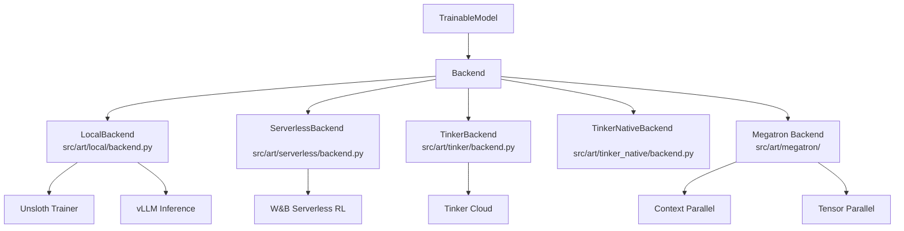

# Bài 3: Hệ thống Backend: Local, Serverless, Tinker, Megatron

Bài học này khảo sát chi tiết năm backend được ART hỗ trợ, từ `LocalBackend` cho máy đơn GPU đến Megatron cho hàng trăm GPU. Mỗi backend có triết lý, điểm mạnh và trường hợp sử dụng riêng. Hiểu rõ sự khác biệt giúp bạn chọn đúng công cụ cho bài toán của mình.

---

## 1. Tổng quan các Backend

ART hỗ trợ năm backend chính, mỗi backend hiện thực `Backend` Protocol theo cách riêng:



| Backend | Khi nào dùng | GPU cần | Chi phí |
| :--- | :--- | :--- | :--- |
| `LocalBackend` | Dev, iteration nhanh | 1 GPU | Mua/trả riêng |
| `ServerlessBackend` | Production không muốn quản infra | 0 (managed) | Per-token |
| `TinkerBackend` | Tinker platform users | 0 (managed) | Per-token |
| `TinkerNativeBackend` | Tinker native API | 0 (managed) | Per-token |
| `Megatron` | Model > 30B, MoE | Nhiều GPU | Mua/trả riêng |

---

## 2. LocalBackend - Huấn luyện tại chỗ với Unsloth + vLLM

`LocalBackend` (`src/art/local/backend.py`, 64 KB) là backend mặc định cho người dùng muốn kiểm soát hoàn toàn. Nó tự quản lý cả inference (vLLM) và training (Unsloth) trong cùng một process tree.

### 2.1. Kiến trúc
```mermaid
graph TD
    Client[Client Process] -->|HTTP| VllmProc[vLLM subprocess \n ManagedVllmRuntime]
    VllmProc -->|LoRA inference| Lora1[LoRA adapter]
    Client -->|train()| UnslothProc[Unsloth Trainer \n same GPU]
    UnslothProc -->|new LoRA| Lora1
    UnslothProc -->|save| Disk[(Local disk)]
    Lora1 -->|hot-swap| VllmProc
```

### 2.2. Thành phần chính
- **ManagedVllmRuntime** (`src/art/vllm_runtime.py`): Quản lý vLLM subprocess, theo dõi port, tự động restart khi crash.
- **Unsloth Service** (`src/art/unsloth/service.py`): Khởi động Unsloth training process.
- **Unsloth Train** (`src/art/unsloth/train.py`): GRPO/CISPO implementation với Unsloth optimizations.
- **NCCL Communicator** (`src/art/weight_transfer/nccl.py`): Broadcast LoRA từ Unsloth sang vLLM workers.

### 2.3. Workflow training step
1. Client gọi `backend.train(model, trajectory_groups)`.
2. LocalBackend chuyển trajectory_groups thành tensor batches.
3. Unsloth chạy training step (forward, backward, optimizer).
4. Sau khi optimizer step, LoRA mới được lưu vào buffer.
5. NCCL broadcast từ Unsloth process sang vLLM workers.
6. vLLM reload LoRA trong KV cache (gần như tức thì).

### 2.4. Ưu điểm
- Toàn quyền kiểm soát: log debug, custom config, custom training loop.
- Iteration cực nhanh: thay đổi code, restart, train lại.
- Phù hợp model 1B-30B trên 1-4 GPU.

### 2.5. Hạn chế
- Phải tự quản lý GPU, drivers, CUDA versions.
- Khó scale lên nhiều GPU (cần Megatron).
- Single point of failure: nếu LocalBackend crash, cả training stop.

### 2.6. Ví dụ sử dụng
```python
import art
from art.local.backend import LocalBackend

backend = LocalBackend()
model = art.TrainableModel(
    project="my-agent",
    name="agent-v1",
    base_model="Qwen/Qwen2.5-7B-Instruct",
)
await model.register(backend)

# Train step
groups = await gather_trajectory_groups(...)
result = await model.train(groups, backend=backend)
print(f"Step {result.step}: loss={result.metrics['loss']}")
```

---

## 3. ServerlessBackend - W&B Serverless RL

`ServerlessBackend` (`src/art/serverless/backend.py`, 1003 dòng) là hiện thực chính thức của W&B Serverless RL service. Đây là dịch vụ managed infrastructure do Weights & Biases cung cấp.

### 3.1. Cơ chế
- Client gửi `TrajectoryGroup` qua HTTPS đến W&B API.
- W&B Serverless RL tự động:
  - Spin up ephemeral GPU environment (cỡ 2-2000 concurrent requests).
  - Chạy training bằng infrastructure tối ưu.
  - Multiplex nhiều user trên cùng cluster (40% cost saving).
  - Tự động scale dựa trên demand.
- Mỗi training step trả về metrics qua W&B artifact.

### 3.2. Metric key canonicalization
`ServerlessBackend` chuẩn hóa tên metric từ ART sang W&B convention:

```python
_UPSTREAM_TRAIN_METRIC_KEYS = {
    "reward": "reward",
    "reward_std_dev": "reward_std_dev",
    "exception_rate": "exception_rate",
    "policy_loss": "loss/train",
    "loss": "loss/train",
    "entropy": "loss/entropy",
    "kl_div": "loss/kl_div",
    "kl_policy_ref": "loss/kl_policy_ref",
    "grad_norm": "loss/grad_norm",
    "learning_rate": "loss/learning_rate",
    "num_groups_submitted": "data/step_num_groups_submitted",
    "num_groups_trainable": "data/step_num_groups_trainable",
    "num_trajectories": "data/step_num_trajectories",
    "num_trainable_tokens": "data/step_trainer_tokens",
    "train_tokens": "data/step_trainer_tokens",
    "num_datums": "data/step_num_datums",
}
```

Điều này đảm bảo metrics từ ART hiển thị đúng trong W&B dashboard.

### 3.3. W&B Artifact cho checkpointing
Mỗi training step tạo một W&B artifact:

```python
def _extract_step_from_wandb_artifact(artifact):
    for alias in artifact.aliases:
        if alias.startswith("step"):
            try:
                return int(alias[4:])
            except ValueError:
                pass
    return None
```

Bạn có thể resume training từ bất kỳ artifact nào bằng `step` parameter.

### 3.4. Ưu điểm
- Zero infrastructure: không cần GPU local.
- Auto-scaling: từ 1 request đến hàng nghìn concurrent.
- 40% cost saving qua multiplexing.
- Tích hợp sẵn W&B logging, artifacts, sweeps.

### 3.5. Hạn chế
- Phụ thuộc W&B service (vendor lock-in).
- Có thể có cold start (vài giây đến vài phút).
- Ít control hơn LocalBackend (không tùy chỉnh training loop).

---

## 4. TinkerBackend và TinkerNativeBackend

Hai backend này dùng cho Tinker platform (dịch vụ RL training tương tự W&B Serverless RL nhưng từ một provider khác).

### 4.1. TinkerBackend (`src/art/tinker/`)
- Client tương thích cao: dùng `client.py` là wrapper của Tinker API.
- Server: `server.py` (chạy trong subprocess) xử lý training.
- `service.py` cung cấp logic training loop.
- Renderers (`cookbook_v/renderers/`): Hỗ trợ nhiều model chat templates (Qwen3, Kimi K2, GPT-OSS, Llama3, DeepSeek V3).

### 4.2. TinkerNativeBackend (`src/art/tinker_native/`)
- Dùng Tinker native API thay vì wrapper.
- `backend.py` gọi trực tiếp Tinker primitives.
- `data.py` định nghĩa cấu trúc dữ liệu training.

### 4.3. Khi nào dùng?
- Khi bạn đã có tài khoản Tinker.
- Khi cần specific model support (Tinker có thể support models W&B chưa).
- Khi muốn pricing khác với W&B.

---

## 5. Megatron Backend - Cho model cực lớn

`src/art/megatron/` (560 KB) là backend phức tạp nhất, hỗ trợ:
- Model lên tới hàng trăm tỷ tham số (DeepSeek-V3 671B, Llama 4 400B).
- Mixture of Experts (MoE) với Expert Parallelism.
- Context Parallelism (CP) cho sequence dài.

### 5.1. Các thành phần chính
```
src/art/megatron/
├── backend.py              # Entry point, dispatch đến service
├── compile_workarounds.py  # torch.compile patches cho Megatron
├── lora.py                 # 63 KB LoRA training trong Megatron
├── provider.py             # Model config provider
├── routing_replay.py       # 64 KB MoE routing replay
├── service.py              # 42 KB Megatron service (main training logic)
├── train.py                # 48 KB GRPO/CISPO training step
├── context_parallel/       # 584 KB context parallel runtime
│   ├── block_mask.py       # CP block mask construction
│   ├── builder.py          # CP schedule builder
│   ├── comm.py             # NCCL communication primitives
│   ├── core_attention.py   # Ring attention core
│   ├── executor.py         # 77 KB CP executor
│   ├── loss_inputs.py      # Loss aggregation across CP ranks
│   ├── range_ops.py        # Ring-based range operations
│   ├── runtime.py          # 105 KB main CP runtime
│   └── types.py            # CP type definitions
├── weights/                # LoRA export/merge
│   ├── adapter_export.py   # Export LoRA to safetensors
│   ├── lora_publish.py     # Publish LoRA to vLLM
│   ├── merged_weight_export.py
│   └── param_name_canonicalization.py
├── gdn/                    # Gated Delta Net (cho Qwen3.6 MoE)
├── flex_attn/              # FlexAttention integration
├── kernels/                # Custom CUDA kernels
├── model_support/          # Model-specific patches
├── runtime/                # Runtime utilities
└── training/               # Training utilities
```

### 5.2. Context Parallelism
Context Parallel (CP) chia sequence length theo chiều dọc qua nhiều GPU, sử dụng ring-attention:

```mermaid
graph LR
    R0[Rank 0 \n seq[0:N/4]] -->|K, V| R1
    R1[Rank 1 \n seq[N/4:N/2]] -->|K, V| R2
    R2[Rank 2 \n seq[N/2:3N/4]] -->|K, V| R3
    R3[Rank 3 \n seq[3N/4:N]] -->|K, V| R0
```

Mỗi rank giữ Q cho phần sequence của mình, nhưng vòng quanh K, V của các rank khác để tính attention. Communication overhead là $O(\text\{seq\_len\} \times \text\{head\_dim\} \times \text\{layers\})$.

### 5.3. LoRA trong Megatron
`megatron/lora.py` (63 KB) hiện thực LoRA trong Megatron framework:
- LoRA injection cho cả attention và MLP.
- Optimizer riêng cho LoRA params.
- Checkpoint saving/loading chỉ LoRA weights.

### 5.4. MoE Routing Replay
`megatron/routing_replay.py` (64 KB) giải quyết vấn đề MoE: expert routing có tính stochastic, train và inference có thể chọn expert khác nhau. Megatron backend dùng routing replay để đảm bảo forward pass inference khớp với forward pass training.

### 5.5. Ưu điểm
- Scale lên hàng trăm GPU.
- Hỗ trợ MoE lớn (DeepSeek-V3 671B).
- Context parallel giải quyết long sequence.

### 5.6. Hạn chế
- Setup phức tạp, cần hiểu sâu về parallelism.
- Cần nhiều GPU (ít nhất 8 cho CP=4 + TP=2).
- Code base lớn, debug khó.

---

## 6. Chọn Backend nào?

### 6.1. Decision Tree
```
Bạn có GPU local không?
├── Không → ServerlessBackend (W&B) hoặc TinkerBackend
└── Có
    ├── Model < 30B?
    │   ├── Có → LocalBackend (Unsloth + vLLM)
    │   └── Không → Megatron
    └── Cần production scale?
        ├── Có, muốn auto-scaling → ServerlessBackend
        └── Không, dev/iteration → LocalBackend
```

### 6.2. Bảng tổng hợp

| Tiêu chí | LocalBackend | ServerlessBackend | Tinker | Megatron |
| :--- | :--- | :--- | :--- | :--- |
| Setup complexity | Thấp | Thấp | Thấp | Cao |
| Iteration speed | Nhanh nhất | Chậm (network) | Chậm (network) | Chậm |
| Cost per hour | Cố định (GPU của bạn) | Pay-per-token | Pay-per-token | Cố định |
| Max model size | 30B | Không giới hạn | Không giới hạn | 671B+ |
| Multi-turn support | Tốt | Tốt | Tốt | Tốt |
| Customization | Cao | Thấp | Trung bình | Cao |
| Production ready | Cần tự setup | Có sẵn | Có sẵn | Cần tự setup |

---

## 7. Ví dụ thực tế: Chọn backend cho dự án

### 7.1. Trường hợp 1: Email Research Agent (ART·E)
- Model: Qwen 2.5 14B.
- Quy mô: 1-2 GPU local hoặc 1-3 ngày training.
- **Backend phù hợp**: `LocalBackend` (nếu có GPU) hoặc `ServerlessBackend` (nếu không).

### 7.2. Trường hợp 2: Custom MCP Server RL
- Model: Qwen 2.5 3B-7B.
- Quy mô: Dev/iteration, cần test nhiều.
- **Backend phù hợp**: `LocalBackend` cho dev, switch sang `ServerlessBackend` cho production training.

### 7.3. Trường hợp 3: Production Agent cho Khách hàng lớn
- Model: Qwen 2.5 32B hoặc Llama 3.1 70B.
- Quy mô: Cần scale, reliability cao.
- **Backend phù hợp**: `ServerlessBackend` với W&B cho zero-ops, hoặc Megatron nếu tự có cluster.

### 7.4. Trường hợp 4: Nghiên cứu về MoE Agent
- Model: DeepSeek-V3 671B hoặc custom MoE.
- Quy mô: Multi-node, cần expert parallelism.
- **Backend phù hợp**: Bắt buộc `Megatron` backend.

---

## 8. Tổng kết

Sự đa dạng backend của ART phản ánh triết lý "Train from anywhere":
- **LocalBackend**: Cho nhà phát triển muốn kiểm soát.
- **ServerlessBackend**: Cho team muốn zero-ops.
- **Tinker**: Cho người dùng Tinker platform.
- **Megatron**: Cho model cực lớn.

Trong bài tiếp theo, chúng ta sẽ khảo sát chi tiết `Trajectory` và `TrajectoryGroup`, hai thực thể dữ liệu cốt lõi được tất cả các backend sử dụng.
