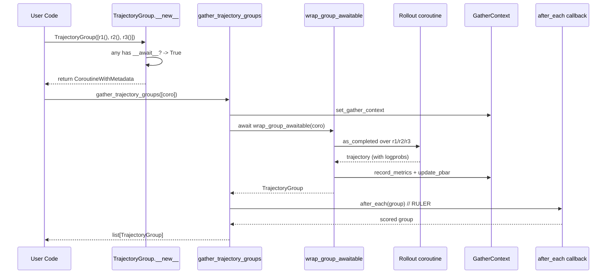

# Bài 4: Trajectory & TrajectoryGroup: Mô hình Dữ liệu Cốt lõi

Mọi framework RL đều xoay quanh ba câu hỏi: (1) mỗi "vòng tương tác" giữa agent và môi trường được biểu diễn thế nào; (2) các vòng đó được gom nhóm ra sao để tính advantage; (3) lỗi runtime phải được nuốt/raise ở đâu. Trong ART, ba câu hỏi này có câu trả lời rất gọn: `Trajectory`, `TrajectoryGroup`, và `gather_trajectory_groups`. Bài này khảo sát chi tiết mã nguồn của ba thực thể đó.

---

## 1. Tại sao cần một mô hình dữ liệu riêng cho agentic RL?

Trong SFT truyền thống, mỗi mẫu dữ liệu là một cặp `(prompt, response)` cố định. Trong agentic RL, mỗi rollout có thể:

* Sinh ra nhiều turn, trong đó các turn sau phụ thuộc ngữ cảnh (tool result, lỗi mạng, v.v.).
* Lưu nhiều "history phụ" cho các sub-agent chạy song song (multi-agent, RAG, RULER judge).
* Có metric runtime (số token completion, thời lượng, số lần retry) cần được log lại để debug.
* Có thể nổ exception bất cứ lúc nào (timeout, tool hỏng, JSON parse fail).

Nếu dùng `list[dict]` thuần, ta sẽ phải tự quản lý tất cả các trường hợp trên. ART chọn Pydantic `BaseModel` để vừa có type-safety, vừa serialize/deserialize dễ (hữu ích cho logging W&B), vừa cho phép `async` constructor "thông minh" (xem `TrajectoryGroup.__new__` ở dưới).

---

## 2. Cấu trúc `Trajectory`

Toàn bộ định nghĩa nằm trong `src/art/trajectories.py`. Phiên bản rút gọn:

```python
class Trajectory(pydantic.BaseModel):
    messages_and_choices: MessagesAndChoices = []   # Interleaved user/assistant/tool
    tools: Tools | None = None                       # Tool schema đã dùng
    additional_histories: list[History] = []         # Histories phụ (sub-agent, judge)
    reward: float = 0.0
    initial_policy_version: int | None = None
    final_policy_version: int | None = None
    metrics: dict[str, float | int | bool] = {}
    metadata: dict[str, MetadataValue] = {}
    logs: list[str] = []
    start_time: datetime = pydantic.Field(default_factory=datetime.now, exclude=True)
```

### 2.1. `messages_and_choices`: trụ cột chính

Đây là danh sách **hỗn hợp** (interleaved) hai loại phần tử:

* `Message` (dict có `role: "user" | "tool" | "system"`).
* `Choice` (OpenAI Chat Completion response object, có `.logprobs`, `.finish_reason`).

Lý do trộn hai loại: message gốc từ user/hệ thống cần được giữ lại nguyên văn, còn phần model sinh ra phải giữ `logprobs` để tính importance-sampling ratio trong loss. Hàm `messages()` gộp hai loại thành `Messages` thuần bằng cách chuyển `Choice.message` về dict:

```python
def get_messages(messages_and_choices: MessagesAndChoices) -> Messages:
    messages: Messages = []
    for message_or_choice in messages_and_choices:
        if isinstance(message_or_choice, Choice):
            # Choice -> Message
            assistant_message: Message = {
                "role": "assistant",
                "content": content,
                **({"tool_calls": [...]} if tool_calls else {}),
            }
            messages.append(assistant_message)
        else:
            # Message thuần: thêm content rỗng nếu thiếu
            msg = dict(message_or_choice)
            if msg.get("content") is None:
                msg["content"] = ""
            messages.append(msg)
    return messages
```

Điểm tinh tế: trong JSON log (xem `for_logging()`), mỗi phần tử được gắn cờ `"trainable": True/False` để downstream biết token nào sinh ra bởi policy hiện tại (đáng tính gradient) và token nào là prompt/observation (không tính gradient).

### 2.2. `additional_histories`: histories phụ

Vấn đề thực tế: một agent có thể gọi **một LLM khác** (RULER judge, RAG retriever, sub-agent planner) làm tool. LLM phụ đó cũng tiêu token, cũng có thể tối ưu, nhưng nó không phải "trajectory chính". ART giải quyết bằng `additional_histories`:

```python
class History(pydantic.BaseModel):
    messages_and_choices: MessagesAndChoices
    tools: Tools | None = None

    def messages(self) -> Messages:
        return get_messages(self.messages_and_choices)
```

Mỗi `History` là một cuộc hội thoại phụ độc lập. Khi tính loss, backend có thể tùy chọn **mask** toàn bộ phần phụ này (không cập nhật gradient cho các token từ LLM phụ) hoặc **tính loss riêng** cho nó (multi-task training). Xem chi tiết ở `exp_3_multiturn_tool_trajectories.md`.

### 2.3. `metrics`, `metadata`, `logs`

Ba trường này phục vụ observability, không tham gia loss:

* `metrics`: số, được gộp/tính trung bình tự động trong progress bar. Ví dụ `completion_tokens`, `duration`, `tool_call_count`.
* `metadata`: giá trị tùy ý (string, int, float, bool, None). Dùng cho thông tin ngữ cảnh (user id, task id, environment seed).
* `logs`: danh sách chuỗi tự do, dùng cho debug khi exception xảy ra.

Hàm `track_duration()` là một context manager tiện dụng:

```python
@asynccontextmanager
async def track_duration(self, metric_name: str) -> AsyncGenerator[None, None]:
    start_time = time.monotonic()
    try:
        yield
    finally:
        duration = time.monotonic() - start_time
        metric_key = f"{metric_name}_duration"
        self.metrics[metric_key] = self.metrics.get(metric_key, 0.0) + duration
```

Bạn có thể bọc bất kỳ đoạn code nào trong trajectory bằng `async with trajectory.track_duration("tool_search"):` và metric sẽ tự cộng dồn.

---

## 3. Cấu trúc `TrajectoryGroup`

GRPO cần so sánh **nhiều rollout cùng prompt** với nhau để tính advantage group-relative. `TrajectoryGroup` gom các `Trajectory` cùng prompt lại:

```python
class TrajectoryGroup(pydantic.BaseModel):
    trajectories: list[Trajectory]
    exceptions: list[PydanticException] = []
    metadata: dict[str, MetadataValue] = {}
    metrics: dict[str, float | int | bool] = {}
    logs: list[str] = []
```

### 3.1. Constructor "thông minh": nhận cả sync lẫn async

Đây là chi tiết quan trọng nhất của `TrajectoryGroup`. Phương thức `__new__` kiểm tra: nếu bất kỳ phần tử nào trong iterable là awaitable, nó **tự trả về một coroutine** thay vì một `TrajectoryGroup` thực thể:

```python
def __new__(cls, trajectories, *, ...):
    ts = list(trajectories)
    if any(hasattr(t, "__await__") for t in ts):
        async def _(exceptions, metadata, metrics, logs):
            from .gather import get_gather_context, record_metrics
            context = get_gather_context()
            trajectories = []
            for future in asyncio.as_completed(cast(list[Awaitable[Trajectory]], ts)):
                try:
                    trajectory = await future
                    trajectories.append(trajectory)
                    record_metrics(context, trajectory)
                    context.update_pbar(n=1)
                except BaseException as e:
                    exceptions.append(e)
                    context.metric_sums["exceptions"] += 1
                    if context.too_many_exceptions():
                        raise
            return TrajectoryGroup(
                trajectories=trajectories,
                exceptions=exceptions,
                ...
            )
        coro = _(...)
        return CoroutineWithMetadata(coro, len(ts))
    else:
        # Sync path: chỉ filter Trajectory vs BaseException
        group = super().__new__(cls)
        group.__init__(trajectories=ts, exceptions=exceptions, ...)
        return group
```

Nghĩa là bạn có thể viết cả hai kiểu mà không cần thay đổi call site:

```python
# Sync: list các Trajectory đã hoàn thành
group = TrajectoryGroup(trajectories=[t1, t2, t3])

# Async: list các coroutine. ART sẽ tự gather với progress bar + metric
group = await TrajectoryGroup(trajectories=[rollout1(), rollout2(), rollout3()])
```

Sự tinh tế: trong nhánh async, ART dùng `asyncio.as_completed` (không phải `gather`) để **update progress bar ngay khi từng rollout xong**, đồng thời đếm exception real-time. Khi `max_exceptions` vượt ngưỡng, nó raise ngay lập tức thay vì tiếp tục nuốt lỗi.

### 3.2. `__copy__` và `__deepcopy__` thủ công

Vì Pydantic mặc định dùng `copy.copy`/`deepcopy` dựa trên model fields, ART override lại để đảm bảo copy cả `PydanticException` (mà Pydantic không tự deep-copy đúng cách vì nó chứa string traceback). Đây là chi tiết nhỏ nhưng quan trọng nếu bạn muốn chấm điểm rollout mà không lo race condition trên shared state.

---

## 4. `gather_trajectory_groups`: vòng lặp song song chính

Trong khi `TrajectoryGroup` xử lý một group, `gather_trajectory_groups` xử lý **nhiều group cùng lúc** (đó mới là lệnh được gọi nhiều nhất trong training loop).

```python
async def gather_trajectory_groups(
    groups: Iterable[Awaitable[TrajectoryGroup]],
    *,
    pbar_desc: str | None = "gather",
    pbar_total_completion_tokens: bool = False,
    max_exceptions: int | float = 0,
    max_metrics: int | None = None,
    after_each: Callable[
        [TrajectoryGroup], Awaitable[TrajectoryGroup | None | list[TrajectoryGroup]]
    ] | None = None,
) -> list[TrajectoryGroup]:
```

Các tính năng chính:

### 4.1. Tích hợp `after_each` callback

```python
async def group_forward(g: Awaitable[TrajectoryGroup]):
    group = await wrap_group_awaitable(g)
    if group is None or after_each is None:
        return group
    return await after_each(group)
```

Callback `after_each` chạy **ngay khi group hoàn thành** (không phải đợi tất cả group xong). Đây là điểm ART cắm RULER vào: ngay khi một group rollout xong, ta có thể gọi judge LLM để tính relative reward mà không phải đợi các group khác. Cũng là chỗ cắm `train_step` nếu bạn muốn pipeline aggressive (xem `pipeline_trainer/trainer.py`).

`after_each` có thể trả về:

* `None`: bỏ qua group này (lỗi đã được nuốt).
* Một `TrajectoryGroup` mới (đã chấm điểm).
* Một list các `TrajectoryGroup` (nếu muốn split thành nhiều sub-group, ví dụ tách theo thành công/thất bại).

### 4.2. `GatherContext` và progress bar

```python
@dataclass
class GatherContext:
    pbar: tqdm.tqdm | None = None
    metric_sums: Counter[str] = field(default_factory=Counter)
    metric_divisors: Counter[str] = field(default_factory=Counter)
    max_metrics: int | None = None
    max_exceptions: int | float = 0
    increment_pbar: bool = True
```

`GatherContext` được lưu trong `contextvars.ContextVar` (`gather_context_var`), nghĩa là:

* Mỗi task asyncio có context riêng: hai training loop chạy song song không đè metric lên nhau.
* Mọi `Trajectory` được tạo bên trong context tự động được `record_metrics` ghi nhận (xem `TrajectoryGroup.__new__` nhánh async ở trên).
* Progress bar tự cập nhật với `set_postfix(metric=mean)`.

```python
def update_pbar(self, n: int) -> None:
    if self.pbar is None:
        return
    if self.increment_pbar:
        self.pbar.update(n)
    postfix = {}
    included_metrics = self.metric_sums.keys()
    if self.max_metrics is not None:
        included_metrics = list(self.metric_sums.keys())[: self.max_metrics]
    for metric in included_metrics:
        sum = self.metric_sums[metric]
        divisor = max(1, self.metric_divisors[metric])
        postfix[metric] = sum / divisor
    self.pbar.set_postfix(postfix)
```

### 4.3. `max_exceptions` hai chế độ

```python
def too_many_exceptions(self) -> bool:
    if (
        0 < self.max_exceptions < 1
        and self.pbar is not None
        and self.metric_sums["exceptions"] / self.pbar.total <= self.max_exceptions
    ) or self.metric_sums["exceptions"] <= self.max_exceptions:
        return False
    return True
```

Hai cách hiểu tham số:

* `max_exceptions` là **số nguyên** (ví dụ 5): raise khi tổng số exception vượt 5.
* `max_exceptions` là **phân số** trong `(0, 1)` (ví dụ 0.05): raise khi tỷ lệ exception/tổng rollout vượt 5%.

Chế độ phân số rất hữu ích khi train trên dataset lớn mà bạn không muốn job bị fail chỉ vì 5 con rollout timeout.

---

## 5. Pseudocode: một vòng rollout điển hình

```python
async def collect_one_group(prompt: str, group_id: int) -> TrajectoryGroup:
    """Rollout K lần cùng một prompt để tạo group."""
    coros = [rollout(prompt, seed=s) for s in range(K)]
    return TrajectoryGroup(trajectories=coros)


async def main():
    prompts = [...]
    groups = [collect_one_group(p, i) for i, p in enumerate(prompts)]
    result = await gather_trajectory_groups(
        groups,
        pbar_desc="rollout",
        max_exceptions=0.05,
        after_each=score_with_ruler,   # judge LLM chạy từng group
    )
    # result: list[TrajectoryGroup] đã có reward
    for g in result:
        advantages = compute_group_advantages(g.trajectories)  # zero-mean + std
        await train_step(g.trajectories, advantages)
```

---

## 6. Sơ đồ luồng dữ liệu



---

## 7. Những điểm dễ nhầm và khuyến nghị vận hành

* **Đừng khởi tạo `TrajectoryGroup` với `await` thủ công** khi truyền list coroutine. ART tự lo; `await` thêm sẽ thành await một giá trị đã sẵn sàng.
* **`exceptions` không raise tự động nếu `max_exceptions=0`**. Nó chỉ đếm; bạn phải tự kiểm tra `group.exceptions` sau khi gather xong và quyết định continue/abort.
* **`metadata` không được truyền vào Pydantic nếu chứa object lạ**. Chỉ float/int/str/bool/None được phép. Cần log object phức tạp, hãy tự serialize rồi nhét vào `metadata["my_obj"] = json.dumps(...)`.
* **`for_logging()` trả về dict sẵn sàng cho W&B Tables** nhưng kích thước có thể rất lớn (mỗi message được copy). Với rollout dài (vài nghìn turn), hãy log `for_logging()` một cách lấy mẫu.
* **`__copy__` được implement thủ công**. Nếu bạn fork `TrajectoryGroup` và thêm field mới, đừng quên cập nhật `__copy__/__deepcopy__` để tránh chia sẻ list.

---

## 8. Tóm tắt

| Thực thể | Mục đích | Đặc tính chính |
| --- | --- | --- |
| `Trajectory` | Một rollout đơn lẻ | Interleaved messages+choices, additional_histories, metrics, metadata |
| `TrajectoryGroup` | K rollout cùng prompt (cho GRPO) | Constructor auto-detect sync/async, tự gather với progress bar |
| `GatherContext` | Trạng thái chung cho một lần gather | contextvar scope, pbar, metric sums/divisors |
| `gather_trajectory_groups` | Song song hóa N group | `after_each` callback, `max_exceptions` (int hoặc phân số) |

Trong [Bài 5](lesson_5_grpo_cispo_loss), chúng ta sẽ thấy các `TrajectoryGroup` này được đưa vào hàm loss như thế nào, cụ thể là cách GRPO tính advantage và CISPO áp importance-sampling weight.
