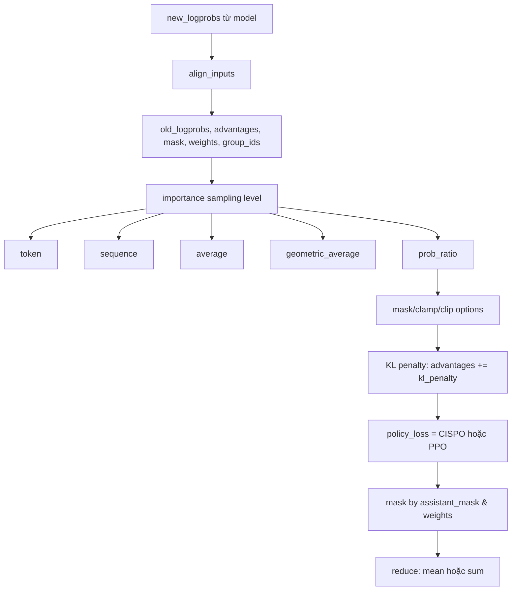

# Bài 5: GRPO & CISPO Loss: Toán học và Hiện thực

ART mặc định dùng **CISPO** (Clipped IS-weight Policy Optimization) thay cho PPO, kết hợp với **GRPO** (Group Relative Policy Optimization) để tính advantage. Hai lựa chọn này tưởng chừng nhỏ nhưng thực tế thay đổi đáng kể gradient, throughput và tính ổn định của training. Bài này bóc tách `src/art/loss.py` để hiểu rõ từng dòng.

---

## 1. Hai "vũ khí" chính: GRPO và CISPO

### 1.1. GRPO

GRPO do DeepSeek đề xuất trong bài báo DeepSeekMath. Ý tưởng cốt lõi: thay vì dùng Critic/value network như PPO, hãy **lấy K rollout cùng prompt**, tính reward cho từng rollout, rồi chuẩn hóa trong group:

$$
\hat\{A\}_i = \frac\{r_i - \text\{mean\}(r_1, \dots, r_K)\}\{\text\{std\}(r_1, \dots, r_K)\}.
$$

Trong ART, group này là `TrajectoryGroup`; hàm chuẩn hóa được tính bên ngoài `loss.py` (xem `compute_group_advantages` ở mỗi backend), nhưng **kết quả** (`advantages` tensor) đã được chuẩn hóa trước khi đi vào `loss_fn`.

### 1.2. CISPO

Trong PPO chuẩn, mục tiêu là:

$$
L^\{\text\{PPO\}\} = -\mathbb\{E\}_t \big[\min(\rho_t \hat\{A\}_t,\; \text\{clip\}(\rho_t, 1-\varepsilon, 1+\varepsilon) \hat\{A\}_t)\big]
$$

với $\rho_t = \pi_\theta(a_t|s_t) / \pi_\{\theta_\{\text\{old\}\}\}(a_t|s_t)$. Hàm `min` ở đây **tính gradient** trên cả `prob_ratio` (vì nó nằm trong clip range hoặc ngoài clip range). CISPO sửa lại:

$$
L^\{\text\{CISPO\}\} = -\mathbb\{E\}_t \big[\text\{clip\}(\rho_t, 1-\varepsilon, 1+\varepsilon) \cdot \hat\{A\}_t \cdot \log \pi_\theta(a_t|s_t)\big].
$$

Điểm khác biệt cốt lõi: **clip áp dụng trên $\rho_t$ đã `detach()`**, và gradient chỉ chảy qua `log π_θ`. Nghĩa là `prob_ratio` chỉ đóng vai trò **trọng số** cho từng token, không bị nó kéo gradient lệch.

Trong `loss.py` (nhánh `if ppo: ... else:`):

```python
if ppo:
    policy_loss = -torch.min(
        prob_ratio * advantages,
        torch.clip(prob_ratio, 1 - epsilon, 1 + epsilon_high) * advantages,
    )
else:
    # Modified REINFORCE or Clipped IS-weight Policy Optimization (CISPO)
    policy_loss = -(
        torch.clip(prob_ratio.detach(), 1 - epsilon, 1 + epsilon_high)
        * advantages
        * new_logprobs
    )
```

Hai hệ số `epsilon` (clip thấp, mặc định 1.0 cho GRPO) và `epsilon_high` (clip trên, mặc định 4.0) có thể chỉnh qua `experimental_config.get("epsilon", ...)` và `experimental_config.get("epsilon_high", ...)`. Giá trị 1.0/4.0 rộng hơn nhiều so với 0.2 của PPO vì CISPO detach ratio, nên không cần clip chặt để ổn định.

---

## 2. Pipeline một lần forward trong `loss_fn`



### 2.1. Bước `align_inputs`

`LossInputs.align_inputs()` dịch chuyển tất cả tensor sang phải 1 vị trí, vì logprob tại token `t` dự đoán token `t+1`. Hàm `shift_tensor` là:

```python
def shift_tensor(tensor: torch.Tensor, pad):
    return torch.nn.functional.pad(tensor[:, 1:], (0, 1), value=pad)
```

Vì sao pad với `nan` cho `old_logprobs`? Ở vị trí cuối cùng, ta không có logprob cũ; nếu lỡ gặp, dòng sau sẽ thay bằng `new_logprobs.detach()` (giả định rollout được sinh dưới policy hiện tại):

```python
old_logprobs = torch.where(
    torch.isnan(old_logprobs),
    new_logprobs.detach(),
    old_logprobs,
)
```

### 2.2. Bốn cấp importance sampling

Một trong những điểm "lạ" nhất của ART là cho phép **gộp importance ratio theo 4 kiểu**:

```python
importance_sampling_level = experimental_config.get("importance_sampling_level", "token")
prob_ratio = torch.exp(logprob_diff)
if importance_sampling_level != "token":
    sequence_prob_ratio = torch.exp(
        aligned_inputs.group_mean(
            logprob_diff,
            by=aligned_inputs.group_ids * assistant_mask,
        )
    )
    if importance_sampling_level == "sequence":
        prob_ratio = sequence_prob_ratio
    elif importance_sampling_level == "average":
        prob_ratio = (prob_ratio + sequence_prob_ratio) / 2
    elif importance_sampling_level == "geometric_average":
        prob_ratio = (prob_ratio**0.5) * (sequence_prob_ratio**0.5)
```

| Level | Công thức | Đặc tính |
| --- | --- | --- |
| `token` | $\rho_t = \exp(\log\pi_\theta - \log\pi_\{\text\{old\}\})$ | Phổ biến, variance cao cho rollout dài |
| `sequence` | $\rho_\{\text\{seq\}\} = \exp(\frac\{1\}\{|T|\}\sum_t (\log\pi_\theta - \log\pi_\{\text\{old\}\}))$ | Variance thấp hơn, nhưng mất tín hiệu theo token |
| `average` | $(\rho_t + \rho_\{\text\{seq\}\})/2$ | Trung hòa |
| `geometric_average` | $\sqrt\{\rho_t \cdot \rho_\{\text\{seq\}\}\}$ | Trung hòa theo log |

Mặc định ART dùng `token`. Lý do khi nào nên đổi: nếu rollout ngắn (< 50 token) thì 4 level gần như tương đương; nếu rollout dài (> 500 token) thì `sequence` giảm variance rõ rệt. Bài [theory_3_is_levels.md](theory_deep_dive/theory_3_is_levels) sẽ phân tích bias-variance trade-off.

### 2.3. Các tùy chọn điều chỉnh quan trọng

```python
if max_negative_advantage_importance_sampling_weight := experimental_config.get(
    "max_negative_advantage_importance_sampling_weight", None
):
    prob_ratio = torch.clamp(
        prob_ratio, max=max_negative_advantage_importance_sampling_weight
    )
```

Cái này chỉ áp dụng cho **token có advantage âm** (vì clamp max). Ý nghĩa: nếu rollout được đánh giá tệ nhưng lại có prob_ratio rất lớn (model "tự tin" theo hướng sai), ta không muốn gradient từ token đó "kéo" mạnh. ART đặt trần prob_ratio cho token âm để chặn.

```python
if experimental_config.get("mask_prob_ratio", False):
    prob_ratio = torch.where(
        (prob_ratio > 1 - epsilon) & (prob_ratio < 1 + epsilon_high),
        prob_ratio,
        0.0,
    )
```

`mask_prob_ratio=True` triệt tiêu hoàn toàn token nằm ngoài dải clip, biến nó thành 0 (không đóng góp gradient). Đây là chế độ "hard mask", mạnh hơn "soft clip" mặc định.

```python
if tau := experimental_config.get("kimi_k2_tau", None):
    advantages = advantages - tau * logprob_diff.detach()
```

`kimi_k2_tau` (tên gọi theo KIMI K2 paper) là một **KL-like penalty nội tại**: nếu prob_ratio lệch xa 1 (logprob_diff lớn), advantage bị trừ đi. Khác với KL policy-ref (dùng reference model cố định), tau này dùng chính `old_logprobs` (snapshot policy) làm tham chiếu. Rẻ hơn vì không cần forward qua ref model.

---

## 3. KL penalty: estimator `(new - ref) * mask`

Đoạn này nằm ngay trước khi tính policy loss:

```python
kl_penalty_coef = experimental_config.get("kl_penalty_coef", 0.0)
if kl_penalty_coef > 0 and ref_logprobs is not None:
    kl_per_token = (new_logprobs - ref_logprobs).detach() * assistant_mask
    avg_kl = aligned_inputs.masked_mean(kl_per_token, assistant_mask)
    kl_penalty = kl_penalty_coef * (avg_kl - kl_per_token) * assistant_mask
    advantages = advantages + kl_penalty
    kl_policy_ref = avg_kl
```

Công thức tương đương với:

$$
\hat\{A\}_t^\{\text\{KL\}\} = \hat\{A\}_t + \beta \big( \overline\{KL\} - (\log\pi_\theta(a_t|s_t) - \log\pi_\{\text\{ref\}\}(a_t|s_t)) \big).
$$

Đây là dạng **k3 estimator** (theo Schulman): $k_3 = -\log r$ với $r = \pi/\pi_\{\text\{ref\}\}$. So với các estimator khác:

| Estimator | Công thức | Bias | Variance |
| --- | --- | --- | --- |
| k1 | $\log r$ | Thấp | Cao |
| k2 | $0.5 (\log r)^2$ | Trung bình | Trung bình |
| k3 | $-\log r$ | Trung bình | Thấp |
| tito (token-ITO) | $(r-1) - \log r$ | Thấp | Trung bình |

ART mặc định dùng **k3** vì detach `kl_per_token` nên nó chỉ ảnh hưởng advantage, không ảnh hưởng gradient qua `log π_θ`. Cấu trúc `avg_kl - kl_per_token` là một "subtract mean" trick: token nào có KL lớn hơn trung bình bị phạt nặng hơn, token nào có KL nhỏ hơn trung bình thậm chí được thưởng. Điều này giảm variance so với việc cộng thẳng `kl_per_token` vào advantage.

---

## 4. Truncated Importance Sampling (TIS)

Đoạn cuối của `loss_fn` có một lớp "cảnh báo" nữa:

```python
if upper_bound := experimental_config.get("truncated_importance_sampling", None):
    if aligned_inputs.original_logprobs is not None:
        original_logprobs = aligned_inputs.original_logprobs
        original_logprobs = torch.where(
            torch.isnan(original_logprobs),
            new_logprobs.detach(),
            original_logprobs,
        )
        logprob_diff = old_logprobs - original_logprobs
        prob_ratio = torch.exp(logprob_diff)
    policy_loss *= torch.clamp(prob_ratio, max=upper_bound).detach()
```

`original_logprobs` là logprob tại thời điểm rollout ban đầu (policy v0). Nếu ta train multi-step trên cùng một batch (vì free GPU time), ratio giữa `old` và `original` sẽ lệch. TIS trần ratio này ở `upper_bound` (thường là 2.0 hoặc 5.0) để tránh gradient nổ. Đây là trick phổ biến trong RLHF paper gần đây.

---

## 5. Tính `probs_corr` (Pearson correlation logprob)

```python
def compute_probs_corr(old_logprobs, new_logprobs) -> torch.Tensor:
    old_logprobs_mask = ~torch.isnan(old_logprobs)
    old_probs = torch.exp(old_logprobs[old_logprobs_mask])
    new_probs = torch.exp(new_logprobs[old_logprobs_mask])
    if old_probs.numel() < 2:
        return new_logprobs.new_zeros(())
    old_std = old_probs.std(unbiased=False)
    new_std = new_probs.std(unbiased=False)
    if (
        not torch.isfinite(old_std).item()
        or not torch.isfinite(new_std).item()
        or old_std.item() == 0.0
        or new_std.item() == 0.0
    ):
        return new_logprobs.new_zeros(())
    return torch.corrcoef(torch.stack([old_probs, new_probs]))[0, 1]
```

Giá trị này **không tham gia loss**, nó chỉ được trả về trong `Loss.probs_corr` để logging. Ý nghĩa: đo mức độ policy mới lệch khỏi policy cũ trong không gian xác suất. Nếu `probs_corr` giảm mạnh (ví dụ < 0.9) thì tốc độ học đang quá nhanh; nên giảm lr hoặc tăng `epsilon`.

---

## 6. Ví dụ config tối ưu

```python
from art import dev
config = dev.TrainConfig(
    importance_sampling_level="sequence",   # rollout dài, muốn variance thấp
    epsilon=1.0,                            # giữ mặc định
    epsilon_high=4.0,
    max_negative_advantage_importance_sampling_weight=2.0,  # chặn token âm
    kl_penalty_coef=0.01,                   # kéo policy về ref một chút
    ppo=False,                              # CISPO, không phải PPO
    truncated_importance_sampling=2.0,      # multi-step thì bật
    kimi_k2_tau=None,                       # để None khi đã có kl_penalty_coef
)
```

---

## 7. Các hyperparameter cần tránh

* **Đừng bật `ppo=True` trừ khi đã có Critic riêng.** PPO cần value network mà ART không cung cấp mặc định; nếu bật thì `advantages` sẽ được nhân với clip khác hẳn, dễ gây gradient explosion.
* **Đừng để `epsilon_high=None`**. Mặc định ART raise error nếu `ppo=True` và `epsilon_high=None` không được set; với CISPO thì ART tự gán `epsilon_high = epsilon` (an toàn).
* **Đừng tăng `kl_penalty_coef > 0.1`** nếu chưa chuẩn hóa `ref_logprobs`. KL lớn buộc model phải "kẹp" gần ref, triệt tiêu tín hiệu advantage.

---

## 8. Tóm tắt

| Khối | Trong `loss.py` | Mục đích |
| --- | --- | --- |
| `align_inputs` | `LossInputs.align_inputs` | Shift + pad tensor về cùng shape |
| 4 IS levels | Nhánh `if importance_sampling_level != "token"` | Cân bằng bias-variance |
| `compute_probs_corr` | Helper | Log độ lệch policy cũ/mới |
| KL penalty | Khối `if kl_penalty_coef > 0` | k3 estimator, detach |
| CISPO loss | Nhánh `else` của `if ppo` | Clip ratio (detached) × advantage × log π |
| TIS | Nhánh `if upper_bound` | Trần ratio giữa old và original |
| Reduction | Cuối hàm | `mean` (chia mask) hoặc `sum` |

Trong [Bài 6](lesson_6_vllm_runtime_and_weight_transfer), ta sẽ rời khỏi loss để xem hạ tầng chạy vLLM + NCCL weight transfer kết nối model đã train với rollout tiếp theo như thế nào.
