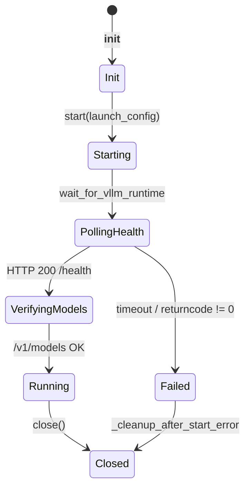
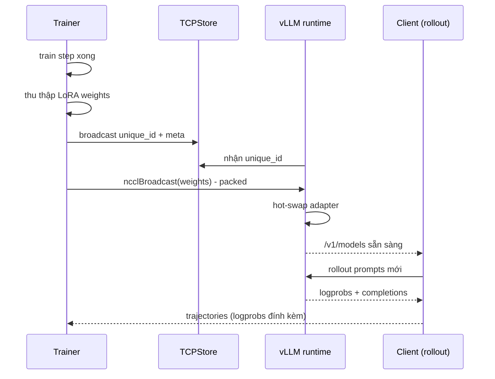

# Bài 6: vLLM Runtime, NCCL Weight Transfer & LoRA Hot-Swap

Vòng lặp ART (rollout -> train -> rollout) đặt ra một câu hỏi hạ tầng quan trọng: làm sao đưa trọng số vừa train xong từ GPU training sang GPU inference **mà không kill vLLM và không sao chép toàn bộ checkpoint ra disk**? Bài này đi vào hai file then chốt: `src/art/vllm_runtime.py` (618 dòng) và `src/art/weight_transfer/nccl.py` (424 dòng).

---

## 1. Tại sao cần runtime vLLM riêng?

vLLM upstream mặc định chạy như một server OpenAI-compatible độc lập, *không* hỗ trợ:

1. Nhận trọng số mới qua kênh NCCL trong khi server đang phục vụ rollout.
2. Khóa manifest về phiên bản `art-vllm-runtime` đi kèm với phiên bản `openpipe-art` (vì training loop và inference loop phải khớp API).
3. Tự động tải về/install runtime wheel phù hợp với CUDA driver hiện tại.

Vì vậy ART đóng gói một wheel riêng (`art-vllm-runtime`) và quản lý nó như một **subprocess** có vòng đời rõ ràng.

---

## 2. `VllmRuntimeManifest` và SHA256 chain-of-trust

```python
class VllmRuntimeManifest(BaseModel):
    model_config = ConfigDict(extra="forbid")
    art_package: str = "openpipe-art"
    art_version: str
    runtime_package: str = RUNTIME_PACKAGE
    runtime_version: str
    protocol_version: int = RUNTIME_PROTOCOL_VERSION
    python: str
    runtime_wheel: str
    runtime_wheel_sha256: str
    pyproject: str = "pyproject.toml"
    pyproject_sha256: str
    lockfile: str = "uv.lock"
    lockfile_sha256: str
```

Mỗi khi khởi động, ART:

1. Tính SHA256 của `runtime_wheel`, `pyproject.toml`, `uv.lock`.
2. So sánh với manifest (đã ship trong wheel `openpipe-art`).
3. Nếu khớp, symlink tới thư mục cache `~/.cache/art/vllm_runtime/<manifest_hash>/`. Thư mục cache được đặt tên **bằng SHA256 của manifest**, đảm bảo hai phiên bản ART khác nhau không share runtime.
4. Nếu runtime chưa tồn tại, `_install_managed_runtime` dùng `uv sync` để tạo venv, sau đó `uv pip install --no-deps <wheel>`.
5. Sau khi install thành công, ghi `install.json` (marker) chứa các hash đã verify, để lần sau ART không phải hash lại.

```python
def _is_managed_runtime_dir(runtime_dir, *, cache_root, expected_hash=None):
    if not runtime_dir.is_dir():
        return False
    if runtime_dir.resolve().parent != cache_root.resolve():
        return False
    if len(runtime_dir.name) != 64 or any(
        c not in "0123456789abcdef" for c in runtime_dir.name
    ):
        return False
    if expected_hash is not None and runtime_dir.name != expected_hash:
        return False
    marker = _read_install_marker(runtime_dir)
    if marker is None:
        return False
    if marker.managed_by != RUNTIME_INSTALL_MARKER:
        return False
    if marker.manifest_hash != runtime_dir.name:
        return False
    if marker.cache_root != str(cache_root.resolve()):
        return False
    if not (runtime_dir / ".venv" / "pyvenv.cfg").exists():
        return False
    return True
```

Các invariant bảo vệ:

* Tên thư mục = SHA256 hex 64 ký tự: chỉ chấp nhận thư mục do ART tạo.
* `cache_root` phải khớp: tránh symlink attack.
* `manifest_hash` phải khớp tên thư mục: tránh thay đổi nội dung marker.
* `.venv/pyvenv.cfg` phải tồn tại: tránh thư mục rỗng.

Sau khi `start()` thành công, ART xóa các runtime cũ (trừ `keep_hash` hiện tại) trừ khi `ART_VLLM_RUNTIME_KEEP_OLD=1`. Điều này tránh disk fill khi user upgrade ART thường xuyên.

---

## 3. Vòng đời `ManagedVllmRuntime`



Các điểm cần lưu ý:

* `start()` dùng `subprocess.Popen(managed_process_cmd(cmd), start_new_session=True)`. Từ khóa `start_new_session` tạo process group mới; khi parent Python chết, signal `SIGTERM` được gửi tới cả group, dọn dẹp cả vLLM worker pool.
* `wait_for_vllm_runtime` poll `/health` mỗi 0.5s, tối đa `ART_DEDICATED_VLLM_TIMEOUT` (mặc định 1200s). Nếu vLLM exit với code != 0 trong lúc poll, raise `RuntimeError` ngay (đỡ phải đợi timeout).
* Sau khi `/health` OK, ART verify thêm `/v1/models` để chắc chắn OpenAI-compatible server đã sẵn sàng.
* `child_processes.watch_popen` (từ `utils/lifecycle.py`) theo dõi process; nếu process tự crash khi đang chạy, parent sẽ raise.

```python
self.process = subprocess.Popen(
    managed_process_cmd(cmd),
    cwd=str(get_vllm_runtime_working_dir()),
    env=os.environ.copy(),
    stdout=self.log_file,
    stderr=subprocess.STDOUT,
    bufsize=1,
    start_new_session=True,
)
```

`managed_process_cmd` (xem `utils/lifecycle.py`) prepend `exec` để thay thế shell process, tránh trường hợp shell cha ở lại "kẹt" nếu runtime bị kill.

---

## 4. `rollout_weights_mode`: `lora` vs `merged`

Đây là lựa chọn kỹ thuật quan trọng nhất của mỗi rollout:

* `lora`: vLLM serve base model + adapter LoRA. Khi train xong, ART chỉ gửi **adapter weights** (rất nhỏ, thường < 1% kích thước full model). Tốn ít bandwidth, hot-swap cực nhanh (< 1s), nhưng throughput inference thấp hơn ~10-20% vì phải áp adapter mỗi bước.
* `merged`: vLLM serve base model với weights đã merge. Khi train xong, ART gửi **toàn bộ weights** qua NCCL. Bandwidth cao, hot-swap chậm hơn (5-30s với 7B model), nhưng inference throughput đạt tối đa.

Trong `ManagedVllmRuntime.start`, ta thấy:

```python
self.nccl_so_path = (
    str(get_vllm_runtime_nccl_so_path())
    if launch_config.rollout_weights_mode == "merged"
    else None
)
```

Chỉ ở chế độ `merged` mới ART mới cần load `libnccl.so.2` từ runtime wheel. Nếu chọn `lora`, NCCL transport không cần thiết; ART chỉ cần ghi adapter xuống disk (`lora_path`) và bảo vLLM reload.

### 4.1. So sánh hai mode

| Tiêu chí | `lora` | `merged` |
| --- | --- | --- |
| Kích thước transfer | < 100 MB cho 7B | ~14 GB cho 7B BF16 |
| Thời gian hot-swap | < 1 s | 5-30 s (qua NVLink) |
| Inference throughput | 80-90% baseline | 100% baseline |
| Số lần phải copy weights | 1 (xuống disk) | 2 (in-memory + remote) |
| Phù hợp với | Qwen 0.5B-7B, iteration nhanh | Llama 70B, throughput tối đa |

Mẹo: với multi-turn agent dài (> 2000 token), inference thời gian chiếm phần lớn wall-clock. Nếu batch size rollout nhỏ (< 32), `lora` rẻ hơn do hot-swap tiết kiệm. Nếu batch size lớn (> 128), `merged` thắng.

---

## 5. NCCL transport ở trainer: `TrainerNcclCommunicator`

`src/art/weight_transfer/nccl.py` chứa một phiên bản rút gọn của NCCL collective primitives, lấy cảm hứng từ code upstream của vLLM. Lý do tự viết: vLLM NCCL APIs không public và phụ thuộc internal state; ART cần một giao diện nhỏ, ổn định cho training loop.

### 5.1. Bootstrap bằng TCPStore

```python
class _BootstrapGroup:
    def __init__(self, *, host, port, rank, world_size, store_timeout=300):
        launch_server = rank == 0
        listen_socket = None
        listen_fd = None
        if launch_server:
            listen_socket = socket.socket(socket.AF_INET, socket.SOCK_STREAM)
            listen_socket.setsockopt(socket.SOL_SOCKET, socket.SO_REUSEADDR, 1)
            listen_socket.bind((host, port))
            listen_socket.listen()
            listen_fd = listen_socket.fileno()
        self.rank = rank
        self.world_size = world_size
        self.socket = listen_socket
        self.store = TCPStore(
            host_name=host,
            port=port,
            world_size=world_size,
            is_master=launch_server,
            timeout=timedelta(seconds=store_timeout),
            use_libuv=False,
            master_listen_fd=listen_fd,
        )
```

Vì trainer và inference engine (vLLM) chạy ở hai process khác nhau, chúng cần chia sẻ NCCL `unique_id` 128-byte. `TCPStore` từ `torch.distributed` cho phép truyền một object Python qua key-value store rất nhỏ.

```python
def broadcast_obj(self, obj, *, src):
    if self.rank == src:
        key = f"broadcast_from/{src}/{self._broadcast_send_counter}"
        self.store.set(key, pickle.dumps(obj))
        self._broadcast_send_counter += 1
        return obj
    key = f"broadcast_from/{src}/{self._broadcast_recv_counter[src]}"
    received = pickle.loads(self.store.get(key))
    self._broadcast_recv_counter[src] += 1
    return received
```

Một điểm tinh tế: `broadcast_obj` dùng **counter** thay vì tên cố định, nên có thể gọi nhiều lần (ví dụ broadcast unique_id rồi broadcast thêm metadata) mà không đè key.

### 5.2. Khởi tạo NCCL communicator

```python
self._nccl = _NcclLibrary(nccl_so_path)
unique_id_bytes = (
    _nccl_unique_id_to_bytes(self._nccl.get_unique_id()) if rank == 0 else None
)
unique_id = _nccl_unique_id_from_bytes(
    bootstrap_group.broadcast_obj(unique_id_bytes, src=0)
)
with torch.cuda.device(self.device):
    self._comm = self._nccl.init_rank(world_size, unique_id, rank)
    stream = torch.cuda.current_stream(self.device)
    warmup = torch.zeros(1, device=self.device)
    self.all_reduce(warmup, stream=stream)
    stream.synchronize()
```

Hai chi tiết quan trọng:

1. Chỉ rank 0 sinh `unique_id`; các rank khác nhận qua `bootstrap_group`. Đây là pattern NCCL chuẩn.
2. Sau khi init, gọi `all_reduce` trên tensor zero 1 phần tử để **warmup** NCCL (xác nhận communicator đã sẵn sàng). Nếu warmup fail, exception sẽ raise ngay tại `__init__`, không phải sau khi ta đã train mất 5 phút.

### 5.3. `_NcclLibrary`: ctypes wrapper

```python
class _NcclLibrary:
    def __init__(self, so_file: str | None = None):
        self._lib = ctypes.CDLL(so_file or _find_nccl_library())
        self._configure("ncclGetErrorString", ctypes.c_char_p, [_nccl_result_t])
        self._configure("ncclGetUniqueId", _nccl_result_t, [ctypes.POINTER(_NcclUniqueId)])
        self._configure(
            "ncclCommInitRank", _nccl_result_t,
            [ctypes.POINTER(_nccl_comm_t), ctypes.c_int, _NcclUniqueId, ctypes.c_int],
        )
        self._configure("ncclCommDestroy", _nccl_result_t, [_nccl_comm_t])
        # ... AllReduce, Broadcast
```

`_find_nccl_library()` ưu tiên `VLLM_NCCL_SO_PATH` (cho custom build), nếu không thì tìm trong `nvidia.nccl/lib/libnccl.so.2`. Trên ROCm, fallback `librccl.so.1`.

Đây là cách ART tránh phụ thuộc vào `torch.distributed.nccl` (vốn đôi khi kén phiên bản). Bằng cách tự `ctypes.CDLL`, ART có thể swap NCCL wheel dễ dàng.

---

## 6. Packed broadcast: gửi LoRA cực nhanh

```python
def trainer_send_weights(
    iterator: Any,
    trainer_args: dict[str, Any] | TrainerNcclSendWeightsArgs,
) -> None:
    args = (
        TrainerNcclSendWeightsArgs(**trainer_args)
        if isinstance(trainer_args, dict)
        else trainer_args
    )
    post_iter_func = args.post_iter_func or (lambda item: item[1])
    if args.packed:
        packed_broadcast_producer(
            iterator=iterator,
            group=args.group,
            src=args.src,
            post_iter_func=post_iter_func,
            buffer_size_bytes=args.packed_buffer_size_bytes,
            num_buffers=args.packed_num_buffers,
        )
        return
    for item in iterator:
        tensor = post_iter_func(item)
        args.group.broadcast(
            tensor,
            src=args.src,
            stream=args.stream or torch.cuda.current_stream(tensor.device),
        )
```

Có hai chế độ:

* **Unpacked** (`packed=False`): broadcast từng tensor một. Mỗi `ncclBroadcast` block cho đến khi toàn bộ tensor được gửi xong. Dễ hiểu, dễ debug.
* **Packed** (`packed=True`): gom nhiều tensor nhỏ vào một buffer lớn, dùng cơ chế double-buffer để overlap compute và transfer. Bandwidth sử dụng tối đa, latency thấp hơn nhiều khi số tensor lớn (LoRA có hàng vạn tensor nhỏ).

`packed_broadcast_producer` (trong `packed_tensor.py`) dùng hai buffer xoay vòng:

* Producer thread đổ tensor mới vào buffer A.
* Consumer thread gọi `ncclBroadcast` từ buffer B.
* Khi cả hai xong, đổi vai.

Đây là pattern kinh điển trong NCCL optimization; nếu bạn từng đọc source DeepSpeed hoặc Megatron-LM sẽ thấy cùng triết lý.

---

## 7. Sơ đồ end-to-end: train -> rollout



---

## 8. Khi nào chọn `lora` vs `merged`: công thức heuristic

Một ước lượng đơn giản cho thời gian hot-swap:

\[
T_{\text{swap}} = \frac{N_{\text{bytes}}}{B_{\text{eff}}} + T_{\text{setup}}
\]

với:

* \(N_{\text{bytes}}\): lượng dữ liệu cần gửi (adapter nhỏ, full model lớn).
* \(B_{\text{eff}}\): bandwidth hiệu dụng (NVLink ~ 600 GB/s, IB ~ 50 GB/s).
* \(T_{\text{setup}}\): thời gian vLLM reload model + warm up KV cache (5-10s cho 7B).

Ví dụ: 7B model BF16 = 14 GB, NVLink 600 GB/s. \(T_{\text{transfer}} = 14 / 600 \approx 0.023s\). Nghe nhỏ, nhưng thực tế **TCPStore + ctypes overhead** đẩy lên 1-2s. Với LoRA 64-rank = ~50 MB, transfer gần như tức thì.

Nếu training step trung bình của bạn > 30s, overhead hot-swap 1-2s không đáng kể. Nếu training step < 5s, hãy dùng `lora` để tránh bottleneck.

---

## 9. Lỗi thường gặp

* **`vLLM runtime exited with code != 0`**: thường do CUDA OOM. Kiểm tra `engine_args` (`max_model_len`, `gpu_memory_utilization`).
* **`NCCL error: unhandled cuda error`**: hai process không cùng CUDA driver. ART enforce cùng runtime wheel để tránh; nếu vẫn lỗi, set `VLLM_NCCL_SO_PATH` thủ công.
* **`vLLM runtime is missing nvidia-nccl-cu12`**: chỉ xảy ra ở mode `merged`. Cài thêm `pip install nvidia-nccl-cu12==<version-matching>`.
* **`install.lock` stuck**: khi ART bị kill giữa chừng trong khi `uv sync` đang chạy. `fcntl.LOCK_EX` sẽ giải phóng khi process chết; nếu không, xóa file `~/.cache/art/vllm_runtime/.install.lock`.

---

## 10. Tóm tắt

| Thành phần | File | Chức năng |
| --- | --- | --- |
| `VllmRuntimeManifest` | `vllm_runtime.py` | Verify wheel integrity, version pinning |
| `ManagedVllmRuntime` | `vllm_runtime.py` | Subprocess lifecycle, health check |
| `rollout_weights_mode` | launch config | `lora` (cheap) vs `merged` (fast inference) |
| `_BootstrapGroup` | `nccl.py` | TCPStore-based NCCL handshake |
| `_NcclLibrary` | `nccl.py` | ctypes wrapper cho libnccl |
| `TrainerNcclCommunicator` | `nccl.py` | Quản lý comm, warmup, broadcast, all_reduce |
| `packed_broadcast_producer` | `packed_tensor.py` | Double-buffer transfer cho LoRA nhiều tensor |

Trong [Bài 7](lesson_7_ruler_and_reward_design), ta sẽ rời khỏi hạ tầng để xem phần thưởng (reward) được tính thế nào khi không có ground truth: **RULER** - LLM làm giám khảo tương đối.
