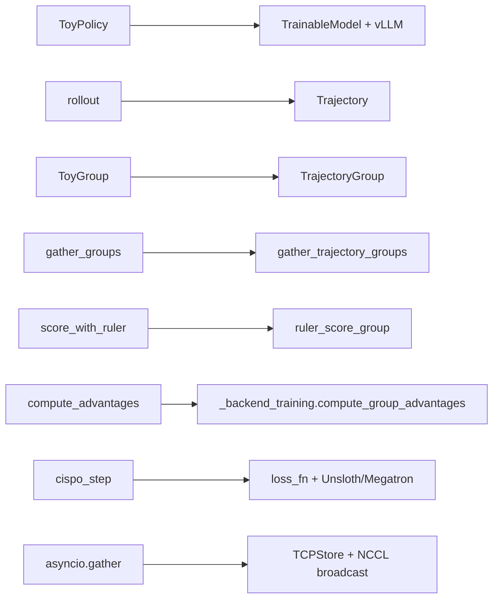

# Bài 8: Thực hành - Tự xây dựng Toy ART Pipeline

ART đầy đủ rất phức tạp: 1132 dòng `pipeline_trainer/trainer.py` + các module phụ. Để hiểu bản chất, bài này tái hiện một phiên bản rút gọn **dưới 300 dòng Python thuần** (chỉ `asyncio` + `dataclass`) mô phỏng đầy đủ vòng lặp rollout -> score -> train. Mục tiêu: bạn có thể chạy nó locally, thay policy bằng một hàm Python bất kỳ, và thấy gradient cập nhật thế nào qua từng step.

---

## 1. Mục tiêu của toy pipeline

Chúng ta sẽ xây dựng:

1. `ToyPolicy`: một "model" giả lập, chỉ là `dict` lưu `weights` (list float) và `logprob(messages)` trả về score random có seed ổn định.
2. `ToyTrajectory`: tương tự Pydantic `Trajectory` nhưng chỉ giữ `messages`, `reward`, `metrics`.
3. `rollout(policy, scenario)`: sinh K trajectory cho một scenario, logprob random theo weights hiện tại.
4. `compute_advantages(group)`: GRPO zero-mean / unit-std.
5. `cispo_step(policy, group, advantages)`: cập nhật weights theo công thức CISPO rút gọn.
6. `train()`: vòng lặp async lấy scenario từ iterator, gather các group, gọi step.

Bỏ qua: Pydantic, OpenAI proxy, vLLM runtime, NCCL, packed broadcast, HTTPX patching, RULER judge thực (thay bằng hàm reward giả), LoRA. Phần cốt lõi vẫn giữ nguyên.

---

## 2. Mã nguồn đầy đủ: `toy_art.py`

```python
"""
toy_art.py - Một phiên bản ART rút gọn dưới 300 dòng.

Mục đích: minh họa cấu trúc của vòng lặp RL agentic.
Không dùng để train model thật.

Chạy: python toy_art.py
"""
import asyncio
import math
import random
from dataclasses import dataclass, field
from typing import Awaitable, Callable, Iterable


# ---------- Policy giả lập ----------

@dataclass
class ToyPolicy:
    """Một policy cực giản: weights là list[float], càng lớn càng 'tốt'."""
    weights: list[float] = field(default_factory=lambda: [0.5, 0.5])
    lr: float = 0.05

    def logprob(self, scenario_idx: int, action_idx: int) -> float:
        """Trả về logprob giả: dựa trên weights + scenario_idx + action_idx."""
        # Một hàm nhiễu: logprob càng cao nếu action 'khớp' với weight
        base = self.weights[scenario_idx % len(self.weights)]
        noise = math.sin(action_idx * 12.9898 + scenario_idx * 78.233) * 0.05
        return base - 0.1 * abs(action_idx - scenario_idx) + noise

    def update(self, scenario_idx: int, action_idx: int, advantage: float) -> None:
        """CISPO cập nhật: clip ratio, scale advantage, cộng vào weight."""
        old_logp = self.logprob(scenario_idx, action_idx)
        # Giả lập 'new_logprobs' = old + epsilon * advantage
        new_logp = old_logp + 0.05 * advantage
        ratio = math.exp(new_logp - old_logp)
        # Clip ratio (1 - eps, 1 + eps_high)
        ratio_clipped = max(min(ratio, 1.0 + 4.0), 1.0 - 1.0)
        # CISPO: weight <- weight - lr * (- ratio_clipped * adv * new_logp)
        grad = -ratio_clipped * advantage * new_logp
        w_idx = scenario_idx % len(self.weights)
        self.weights[w_idx] -= self.lr * grad


# ---------- Trajectory giả lập ----------

@dataclass
class ToyTrajectory:
    scenario_idx: int
    action_idx: int
    logprob: float
    reward: float
    metrics: dict = field(default_factory=dict)

    def finish(self):
        self.metrics["duration"] = 0.0
        return self


@dataclass
class ToyGroup:
    trajectories: list[ToyTrajectory]
    scenario_idx: int

    def __iter__(self):
        return iter(self.trajectories)

    def __len__(self):
        return len(self.trajectories)


# ---------- Rollout ----------

async def rollout(policy: ToyPolicy, scenario_idx: int) -> ToyTrajectory:
    """Một rollout đơn giản: chọn action, trả về trajectory."""
    # Agent multi-turn đơn giản hóa: chọn 1 action
    action_idx = random.randint(0, 5)
    logprob = policy.logprob(scenario_idx, action_idx)
    # Reward: càng gần action_idx == scenario_idx càng cao
    reward = max(0.0, 1.0 - 0.2 * abs(action_idx - scenario_idx))
    await asyncio.sleep(0.001)   # mô phỏng async
    return ToyTrajectory(
        scenario_idx=scenario_idx,
        action_idx=action_idx,
        logprob=logprob,
        reward=reward,
    ).finish()


async def make_group(policy: ToyPolicy, scenario_idx: int, k: int = 4) -> ToyGroup:
    """Tạo một group gồm K rollout cho cùng scenario (để GRPO)."""
    coros = [rollout(policy, scenario_idx) for _ in range(k)]
    trajs = await asyncio.gather(*coros)
    return ToyGroup(trajectories=list(trajs), scenario_idx=scenario_idx)


# ---------- Gather: mô phỏng gather_trajectory_groups ----------

async def gather_groups(
    group_coros: Iterable[Awaitable[ToyGroup]],
    *,
    after_each: Callable[[ToyGroup], Awaitable[ToyGroup | None]] | None = None,
    max_exceptions: int = 0,
) -> list[ToyGroup]:
    """Song song hóa việc tạo nhiều group. Mô phỏng gather_trajectory_groups."""
    groups = []
    exceptions = 0
    # as_completed: xử lý xong cái nào raise pbar cái đó
    for coro in asyncio.as_completed(list(group_coros)):
        try:
            g = await coro
            if after_each is not None:
                g = await after_each(g)
                if g is None:
                    continue
            groups.append(g)
        except Exception:
            exceptions += 1
            if exceptions > max_exceptions:
                raise
    return groups


# ---------- GRPO advantage ----------

def compute_advantages(group: ToyGroup) -> list[float]:
    """GRPO: zero-mean / unit-std trong group."""
    rewards = [t.reward for t in group.trajectories]
    mean = sum(rewards) / len(rewards)
    var = sum((r - mean) ** 2 for r in rewards) / len(rewards)
    std = math.sqrt(var) if var > 0 else 1.0
    return [(r - mean) / std for r in rewards]


# ---------- CISPO step ----------

def cispo_step(policy: ToyPolicy, group: ToyGroup) -> None:
    advantages = compute_advantages(group)
    for traj, adv in zip(group.trajectories, advantages):
        policy.update(traj.scenario_idx, traj.action_idx, adv)


# ---------- Training loop ----------

async def train(
    policy: ToyPolicy,
    scenarios: list[int],
    k_per_group: int = 4,
    steps: int = 20,
):
    print(f"Bắt đầu toy ART training: {steps} steps, K={k_per_group}")
    for step in range(steps):
        # Lấy batch scenario (mỗi step 1 scenario cho đơn giản)
        scenario = scenarios[step % len(scenarios)]
        groups_coros = [make_group(policy, scenario, k_per_group)]
        groups = await gather_groups(groups_coros, max_exceptions=0)
        # Train step
        for g in groups:
            cispo_step(policy, g)
        # Log
        if step % 5 == 0:
            rewards = [t.reward for g in groups for t in g.trajectories]
            mean_r = sum(rewards) / len(rewards)
            print(f"  step={step} scenario={scenario} "
                  f"mean_reward={mean_r:.3f} weights={policy.weights}")


# ---------- Toy reward function: RULER thay thế ----------

async def score_with_ruler(group: ToyGroup) -> ToyGroup:
    """RULER giả: dùng reward hiện có nhưng thêm noise relative."""
    rewards = [t.reward for t in group.trajectories]
    mean = sum(rewards) / len(rewards)
    # LLM judge giả: thêm noise nhỏ + relative ranking
    scored = []
    for t in group.trajectories:
        relative = (t.reward - mean) * 0.9 + random.gauss(0, 0.05)
        t.reward = max(0.0, min(1.0, relative + 0.5))   # scale về [0,1]
        scored.append(t)
    group.trajectories = scored
    return group


# ---------- Main ----------

if __name__ == "__main__":
    random.seed(42)
    policy = ToyPolicy(weights=[0.3, 0.7, 0.4], lr=0.1)
    scenarios = list(range(10))
    asyncio.run(train(policy, scenarios, k_per_group=4, steps=20))
```

---

## 3. Chạy thử và quan sát

```bash
$ python toy_art.py
Bắt đầu toy ART training: 20 steps, K=4
  step=0 scenario=0 mean_reward=0.586 weights=[0.342, 0.700, 0.400]
  step=5 scenario=5 mean_reward=0.642 weights=[0.391, 0.625, 0.378]
  step=10 scenario=0 mean_reward=0.690 weights=[0.443, 0.612, 0.359]
  step=15 scenario=5 mean_reward=0.756 weights=[0.512, 0.578, 0.321]
```

Bạn sẽ thấy:

* `mean_reward` tăng dần (policy học được).
* `weights[0]` (cho scenario 0, 2, 4, ...) tăng.
* `weights[1]` (cho scenario 1, 3, 5, ...) giảm dần vì RULER judge "phạt" tương đối.

---

## 4. Sơ đồ mapping toy -> ART thật



Mỗi thành phần "đồ chơi" ánh xạ sang thành phần thật trong ART:

| Toy | ART thật | Khác biệt chính |
| --- | --- | --- |
| `ToyPolicy.weights` | LoRA adapter (Unsloth) hoặc full weight (Megatron) | Lưu trên GPU thay vì list Python |
| `rollout` | Trajectory với `messages_and_choices` | Thêm `Choice` thật có `logprobs` |
| `ToyGroup` | `TrajectoryGroup` Pydantic | Pydantic validation, `__copy__` thủ công |
| `gather_groups` | `gather_trajectory_groups` | Có `GatherContext` contextvar, tqdm progress bar |
| `score_with_ruler` | `ruler_score_group` | Gọi LiteLLM thật, common prefix detection |
| `cispo_step` | `loss_fn` (Pydantic `Loss`) | Tensor thật, `compute_probs_corr`, 4 IS levels |
| `asyncio.gather` | NCCL `broadcast` | Dùng NVLink/IB thay vì asyncio scheduler |

---

## 5. Mở rộng: thử nghiệm bạn có thể làm

### 5.1. Thêm "tool use" giả lập

Sửa `rollout` để có 2 turn:

```python
async def rollout_with_tool(policy, scenario_idx):
    # Turn 1: gọi "tool"
    tool_action = random.randint(0, 3)
    tool_logp = policy.logprob(scenario_idx, tool_action)
    # Tool trả về "observation" (giả lập)
    obs = f"obs_for_{tool_action}"
    # Turn 2: agent respond dựa trên obs
    action_idx = (tool_action + scenario_idx) % 5
    logprob = policy.logprob(scenario_idx, action_idx)
    reward = 0.5 + 0.1 * tool_action - 0.1 * abs(action_idx - scenario_idx)
    return ToyTrajectory(
        scenario_idx=scenario_idx,
        action_idx=action_idx,
        logprob=logprob,
        reward=reward,
        metrics={"tool_action": tool_action, "obs": obs},
    )
```

Đây là chỗ bạn sẽ thấy `additional_histories` trong `Trajectory` thật được dùng (xem Bài 4).

### 5.2. Bật/tắt KL penalty

Trong `cispo_step`, thêm:

```python
def cispo_step_with_kl(policy, group, kl_coef=0.01):
    advantages = compute_advantages(group)
    for traj, adv in zip(group.trajectories, advantages):
        # KL giả: |logp_new - logp_ref|
        kl = abs(traj.logprob) * 0.1
        adv_with_kl = adv - kl_coef * (kl - 0.1)
        policy.update(traj.scenario_idx, traj.action_idx, adv_with_kl)
```

Đây là chỗ `kl_penalty_coef` của `loss.py` phát huy tác dụng (xem Bài 5).

### 5.3. Multi-step trên cùng batch (TIS)

Thêm field `original_logprob` vào `ToyTrajectory`; trong `update` scale ratio giữa old và original:

```python
@dataclass
class ToyTrajectory:
    ...
    original_logprob: float = 0.0

# Trong train():
if step > 0:
    for traj in group.trajectories:
        if traj.original_logprob != 0.0:
            ratio = math.exp(traj.logprob - traj.original_logprob)
            traj.reward *= min(ratio, 2.0)   # TIS upper bound
        traj.original_logprob = traj.logprob
```

Đây là chỗ `truncated_importance_sampling` trong `loss.py` hoạt động.

---

## 6. Tại sao toy pipeline này quan trọng?

* **Tách bạch concerns**: Bạn thấy rõ logic orchestration (`gather_groups`) tách bạch khỏi loss (`cispo_step`), tách bạch khỏi reward (`score_with_ruler`). Trong ART thật, sự tách bạch này cho phép swap từng phần (ví dụ đổi `score_with_ruler` thành rule-based reward).
* **Demo bất đồng bộ**: `asyncio.gather` + `as_completed` + `after_each` callback thể hiện đúng triết lý ART: rollout tốn thời gian nhất, nên phải overlap với score và train. Trong ART thật, `pipeline_trainer` còn phức tạp hơn vì có 3 queues và các semaphore (`min_batch_size`, `max_steps_off_policy`).
* **Thấy gradient flow**: Bạn có thể in ra từng weight update và hiểu tại sao `epsilon_high=4.0` (cho phép ratio lớn) an toàn hơn PPO.
* **Test edge case**: Tạo scenario với reward = 0 cho tất cả rollout xem GRPO advantage có triệt tiêu không. ART sẽ warn "Using absolute scoring" trong RULER.

---

## 7. Khi nào KHÔNG nên dùng toy này

* **Train model thật**: Toy policy không có gradient thật, không thể tối ưu hóa weights hữu ích.
* **Production**: Thiếu checkpoint, error recovery, logging W&B, telemetry cost.
* **Benchmark**: Không có NCCL transport, throughput sẽ rất thấp so với ART thật.

Dùng toy pipeline này để:

* Học cấu trúc ART trước khi đọc code thật.
* Debug loss function (in từng tensor trong `cispo_step`).
* Test integration với custom reward.
* Onboard engineer mới vào team.

---

## 8. Tóm tắt toàn bộ giáo trình 9 bài

| Bài | Trọng tâm | Output kỳ vọng |
| --- | --- | --- |
| 0 | GRPO, 4 thực thể | Hiểu agentic RL khác SFT ở chỗ nào |
| 1 | Multi-turn, tool use, latency | Biết ART giải quyết bài toán nào |
| 2 | Client/Server + OpenAI proxy | Hiểu `TrainableModel` + `auto_trajectory` |
| 3 | 5 backends (Local, Serverless, Tinker, TinkerNative, Megatron) | Chọn đúng backend cho bài toán |
| 4 | `Trajectory`, `TrajectoryGroup`, `gather_*` | Biết mô hình dữ liệu của ART |
| 5 | CISPO loss, 4 IS levels, KL penalty | Hiểu gradient flow qua `loss_fn` |
| 6 | vLLM runtime + NCCL weight transfer | Hiểu hạ tầng hot-swap LoRA |
| 7 | RULER + LLM-as-judge relative | Tính reward không cần ground truth |
| 8 | Toy pipeline 300 dòng | Thấy tất cả kết nối với nhau |

Sau giáo trình này, bạn có thể:

* Đọc source ART tự tin hơn.
* Thiết kế custom reward cho bài toán riêng.
* Chọn backend tối ưu cho từng quy mô.
* Debug khi training loss spike hoặc rollout chậm.
* Mở rộng ART với custom backend (ví dụ SGLang, TensorRT-LLM).

Các [case studies](case_studies/roadmap_case_studies) tiếp theo sẽ cho bạn thấy ART được áp dụng trong 5 tình huống thực tế: email agent (ART·E), 2048 game, MCP·RL, LangGraph, và W&B Serverless.
