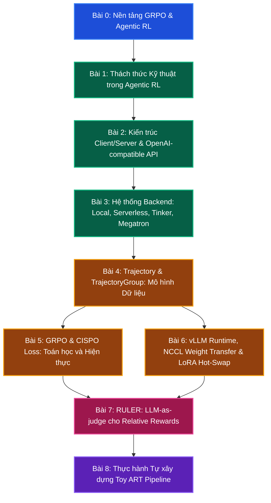

# Lộ trình học tập & Phân tích cấu trúc thư viện ART

Chào mừng bạn đến với tài liệu phân tích chuyên sâu về kiến trúc và hiện thực của thư viện **ART (Agent Reinforcement Trainer)** do OpenPipe phát triển và mã nguồn mở hóa.

ART là một framework học tăng cường (RL) mã nguồn mở được thiết kế để cải thiện độ tin cậy của các tác nhân (agent) LLM bằng cách cho phép chúng học từ trải nghiệm. ART cung cấp một harness tiện dụng để tích hợp GRPO vào bất kỳ ứng dụng Python nào, với sự hỗ trợ đặc biệt cho các agent đa lượt (multi-turn) sử dụng tool và MCP server. Khác với các framework đào tạo RL nặng nề khác, ART nhấn mạnh sự đơn giản, ergonomics cho nhà phát triển, và khả năng tích hợp liền mạch vào các ứng dụng Python hiện có thông qua giao diện OpenAI-compatible.

Dưới đây là giáo trình tự học gồm 9 bài học đi từ lý thuyết nền tảng đến chi tiết hiện thực và tối ưu hiệu năng của ART.

---

---

## Tóm tắt Giáo trình 9 Bài học

### Phần 1: Kiến thức nền tảng & Thách thức Hệ thống (Background)
* **[Bài 0: Nền tảng GRPO & Agentic RL](lesson_0_agent_rl_fundamentals)**
  * Tổng quan về ART: lý do ra đời, kiến trúc tổng thể, vòng lặp inference-then-train cốt lõi.
  * So sánh GRPO với PPO: vì sao ART mặc định dùng GRPO mà không cần Critic.
  * Giới thiệu 4 thực thể dữ liệu: Client, Server, Trajectory, Reward.
* **[Bài 1: Thách thức Kỹ thuật trong Agentic RL](lesson_1_agentic_rl_challenges)**
  * Phân tích sự phức tạp của chu kỳ multi-turn, tool use, stateful execution.
  * Tại sao các framework SFT/RL truyền thống không đáp ứng tốt agentic RL.
  * Chi phí bộ nhớ và độ trễ mạng giữa inference (vLLM) và training (Unsloth/Megatron).

### Phần 2: Kiến trúc cốt lõi của ART (Core Theory)
* **[Bài 2: Kiến trúc Client/Server & OpenAI-compatible API](lesson_2_client_server_architecture)**
  * Triết lý thiết kế Client/Server: Client chạy trên máy của nhà phát triển, Server chạy trên GPU.
  * Phân tích `TrainableModel`, `AsyncOpenAI` proxy, `Backend` Protocol.
  * Cơ chế HTTPX patching và `auto_trajectory` context để capture trajectory trong suốt.
* **[Bài 3: Hệ thống Backend: Local, Serverless, Tinker, Megatron](lesson_3_backends_zoo)**
  * So sánh `LocalBackend` (Unsloth + vLLM), `ServerlessBackend` (W&B), `TinkerBackend`, `TinkerNativeBackend` và Megatron.
  * Khi nào nên dùng backend nào? Tối ưu chi phí, tốc độ iteration và quy mô mô hình.

### Phần 3: Phân tích sâu mã nguồn & Tích hợp (Deep Dive & Integration)
* **[Bài 4: Trajectory & TrajectoryGroup: Mô hình Dữ liệu Cốt lõi](lesson_4_trajectory_data_model)**
  * Khảo sát cấu trúc `Trajectory` (`messages_and_choices`, `additional_histories`, `metrics`, `metadata`).
  * Cách `gather_trajectory_groups` thu thập kết quả từ hàng nghìn rollout song song.
* **[Bài 5: GRPO & CISPO Loss: Toán học và Hiện thực](lesson_5_grpo_cispo_loss)**
  * Đi sâu vào `loss.py`: GRPO advantage, Clipped IS-weight Policy Optimization.
  * 4 cấp importance sampling: token, sequence, average, geometric_average.
  * KL penalty với estimator `(new_logprobs - ref_logprobs) * mask`.
* **[Bài 6: vLLM Runtime, NCCL Weight Transfer & LoRA Hot-Swap](lesson_6_vllm_runtime_and_weight_transfer)**
  * Cơ chế `ManagedVllmRuntime` và `VllmRuntimeManifest` với SHA256 verification.
  * `TrainerNcclCommunicator` và packed broadcast tensor giúp đồng bộ LoRA cực nhanh.

### Phần 4: Tối ưu nâng cao & Thực hành (Optimization & Practice)
* **[Bài 7: RULER: Relative Universal LLM-Elicited Rewards](lesson_7_ruler_and_reward_design)**
  * Cơ chế LLM-as-judge tương đối, common prefix token savings, judge rubric mặc định.
  * Tích hợp với `after_each` callback trong `gather_trajectory_groups`.
* **[Bài 8: Thực hành - Tự xây dựng Toy ART Pipeline](lesson_8_pipeline_trainer_toy)**
  * Tái hiện pipeline 3 giai đoạn (rollout, train, eval) bằng Python thuần với asyncio.
  * Mô phỏng `TrainableModel` rút gọn, `gather_trajectory_groups` và chạy cập nhật CISPO loss.
