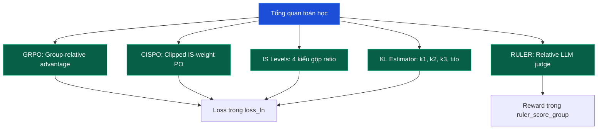

# Lộ trình Theory Deep Dive: Toán học đằng sau ART

Phần này dành cho bạn đọc muốn hiểu **tại sao** GRPO, CISPO, RULER hoạt động thay vì chỉ biết **cách dùng**. Mỗi bài đi sâu vào một công thức toán, kèm pseudocode mapping sang code ART thật (`src/art/loss.py`, `src/art/rewards/ruler.py`, `src/art/utils/group_aggregate.py`).

---

## 5 bài học trong phần này

| # | Bài | Trọng tâm toán | Source code |
| --- | --- | --- | --- |
| 1 | [GRPO Math](theory_1_grpo_math) | Group-relative advantage, Schulman unbiased estimator | `_backend_training.compute_group_advantages` |
| 2 | [CISPO Math](theory_2_cispo_math) | Clipped IS-weight PO, decoupling ratio and gradient | `loss.loss_fn` (nhánh `if ppo: ... else: ...`) |
| 3 | [IS Levels](theory_3_is_levels) | Token/sequence/average/geometric_average ratio aggregation | `loss.loss_fn` (nhánh `if importance_sampling_level != "token"`) |
| 4 | [KL Estimators](theory_4_kl_penalty) | k1, k2, k3, tito; ART's `(new - ref) * mask` form | `loss.loss_fn` (khối `if kl_penalty_coef > 0`) |
| 5 | [RULER Math](theory_5_ruler_math) | Relative scoring > absolute; common prefix; GRPO invariance | `rewards.ruler.ruler` |

---

## Công thức chung

ART loss có dạng tổng quát:

$$
L(\theta) = -\mathbb\{E\}_\{(s,a)\sim\pi_\{\theta_\{\text\{old\}\}\}\} \left[ \text\{weight\}(s,a) \cdot A(s,a) \cdot \log \pi_\theta(a|s) \right]
$$

Trong đó:

* $A(s,a)$ là advantage (Bài 1).
* $\text\{weight\}(s,a)$ là importance-sampling weight (Bài 2, 3).
* KL penalty (Bài 4) thêm vào advantage.
* Reward (Bài 5) cung cấp tín hiệu cho advantage.

Mục tiêu của 5 bài này: hiểu rõ từng thành phần, khi nào nên tăng/giảm hyperparameter, và ánh xạ sang code.

---

## Quan hệ với policy gradient cổ điển

REINFORCE (Williams 1992):

$$
\nabla L = -\mathbb\{E\}_\tau \left[ R(\tau) \nabla \log \pi_\theta(\tau) \right]
$$

REINFORCE với baseline $b$:

$$
\nabla L = -\mathbb\{E\}_\tau \left[ (R(\tau) - b) \nabla \log \pi_\theta(\tau) \right]
$$

PPO (Schulman 2017) thêm clip:

$$
L^\{PPO\} = -\mathbb\{E\} \left[ \min(\rho A, \text\{clip\}(\rho, 1-\varepsilon, 1+\varepsilon) A) \right]
$$

GRPO (DeepSeek 2024) thay baseline bằng group statistics:

$$
A_i = \frac\{r_i - \mu_G\}\{\sigma_G\}
$$

CISPO (đề xuất trong Mixture-of-Experts paper) thay clip trong PPO bằng clip ngoài:

$$
L^\{CISPO\} = -\mathbb\{E\} \left[ \text\{clip\}(\rho, 1-\varepsilon, 1+\varepsilon) A \log \pi \right]
$$

ART mặc định dùng GRPO + CISPO.

---

## Điều kiện tiên quyết

Bạn cần biết:

* **Policy gradient theorem**: $\nabla J(\theta) = \mathbb\{E\}[\nabla \log \pi_\theta(a|s) \cdot A(s,a)]$.
* **Importance sampling**: $\mathbb\{E\}_\{p\}[f] = \mathbb\{E\}_\{q\}[f \cdot p/q]$.
* **Stochastic gradient descent**: $\theta \leftarrow \theta - \eta \nabla L$.
* **Replay buffer / on-policy vs off-policy**: GRPO thuộc về on-policy (sampling mỗi step).
* **PyTorch cơ bản**: tensor ops, autograd.

Nếu chưa vững, đọc [Bài 0](../lesson_0_agent_rl_fundamentals) trước.

---

## Notation

* $\pi_\theta$: policy hiện tại (model parameters $\theta$).
* $\pi_\{\theta_\{\text\{old\}\}\}$: policy lúc rollout (snapshot).
* $\pi_\{\text\{ref\}\}$: reference policy (thường là base model).
* $\rho = \pi_\theta / \pi_\{\theta_\{\text\{old\}\}\}$ (token) hoặc aggregated (sequence, etc.).
* $A_i$: advantage của rollout $i$.
* $r_i$: reward của rollout $i$.
* $\mu_G, \sigma_G$: mean, std reward trong group $G$.
* $\beta$: KL penalty coefficient.
* $\varepsilon, \varepsilon_H$: clip thấp, clip trên cho $\rho$.

---

Bắt đầu với [Theory 1: GRPO Math](theory_1_grpo_math) - nền tảng cho toàn bộ hệ thống.
